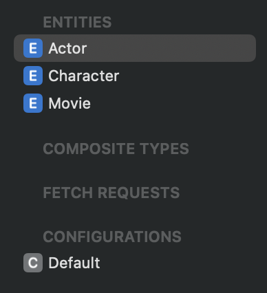

```swift
let movie = Movie(context: persistentContainer.viewContext)
```
Chú giải:
- `viewContext` trong `persistentContainer` thuộc về main thread. 
- `movie` là 1 managed object được gắn liền với `viewContext`. Mỗi 1 managed object sẽ chỉ được liên kết với 1 `context`.
- Không nên sử dụng managed object ngoài thread mà `context` của object đó thuộc về. VD: không nên sử dụng `movie` object trong background thread vì nó được gắn liền với `viewContext` thuộc về main thread.  

```swift
func saveMovie(with name: String) {
	let movie = Movie(context: persistantContainer.viewContext)
	movie.name = "Interstaller"

	do {
		if persistantContainer.viewContext.hasChanges {
			try persistantContainer.viewContext.save()
			print("Save movie successfully")
		}
	} catch {
		persistantContainer.viewContext.rollback()
		print("Failed to save movie: \(error)")
	}
}
```

Chú giải:
- Hình dung việc tạo object trong context và lưu nó vào persistant stores, giống hệt việc sử dụng git.
- Những thay đổi trong files khi `git add` sẽ được lưu vào 1 layer trung gian (stage). Tạo object giống với thay đổi file, layer trung gian ở đây chính là `context`.
- Để lưu lại thay đổi trên local repo thì cần phải gọi `git commit`. Ở đây, `persistantContainer.viewContext.save()` chính là việc lưu lại thay đổi trong context vào underlying stores.
- Nếu có bất kỳ lỗi nào xảy ra, thì chúng ta sẽ gọi `rollback()` để huỷ bỏ mọi thay đổi chưa được lưu từ context vào stores.

# Chương 2: Understanding Core Data's building blocks (Core Data stack)

## Breaking down the persistent container


Kể từ iOS10, để setup core data stack chỉ cần khởi tạo instance của class `NSPersistentContainer`. Container sẽ có nhiệm vụ như là wrapper của 3 thành phần: `NSManagedObjectModel`, `NSManagedObjectContext` và `NSPersistentStoreCoordinator`.

```swift
class StorageProvider {

	let persistantContainer: NSPersistentContainer

	init() {
		persistantContainer = NSPersistentContainer(name: "Model")

		persistantContainer.loadPersistentStores { description, error in
			if let error = error {
				fatalError("\(error)")
			}
		}
	}
	
}
```

Để tìm hiểu sâu hơn về Core Data Stack, chúng ta cùng xem ví dụ về việc setup Core Data trước iOS10:
  
  
```swift
class CoreDataStack {
	lazy var managedObjectModel: NSManagedObjectModel = {
		guard let url = Bundle.main.url(forResource: "MyModel", withExtension: "momd") else {
			fatalError("Failed to locate momd file for MyModel")
		}
		guard let model = NSManagedObjectModel(contentsOf: url) else { 
			fatalError("Failed to load momd file for MyModel")
		}
		return model
	}()


	lazy var coordinator: NSPersistentStoreCoordinator = {
		let coordinator = NSPersistentStoreCoordinator(managedObjectModel: managedObjectModel)
		let documentsDirectory = FileManager.default.urls(for: .documentDirectory, in: .userDomainMask).first!
		let sqlitePath = documentsDirectory.appendingPathComponent("MyModel.sqlite")

		do {
			try coordinator.addPersistentStore(ofType: NSSQLiteStoreType,
											   configurationName: nil,
											   at: sqlitePath,
											   options: nil)
		} catch {
			fatalError("Something went wrong while setting up the coordinator \(error)")
		}

		return coordinator
	}()

	lazy var viewContext: NSManagedObjectContext = {
		let context = NSManagedObjectContext(concurrencyType: .mainQueueConcurrencyType)
		context.persistentStoreCoordinator = coordinator
		return context
	}()
}
```

### Managed object model

`Managed object model` là trái tim và linh hồn của Core Data store. Nó là nơi `object graph` được định nghĩa, nơi fetch request template được lưu trữ, nơi các entity, relationship và property của nó được định nghĩa.

Theo đoạn code trên `Managed object model` được khởi tạo từ file `.xcdatamodeld` trong main Bundle

### Persistent store coordinator

Theo đoạn code trên `Persistent store coordinator` được khởi tạo từ `managedObjectModel` sau đó nó thêm *persistent store* (SQLite file) vào `Persistent store coordinator`.

`Persistent store coordinator` dùng để cung cấp 1 interface cho *persistent store* thực tế. Trong trường hợp này, persistent store chính là SQLite, nhưng persistent store cũng có thể là file XML, Binary, In-memory.

`Persistent store coordinator` dùng để tương tác của lớp persistent store bên dưới thông qua thông tin được cung cấp bởi `managedObjectModel`.
   
### Managed object contexts

Mỗi `managed object` đều thuộc duy nhất 1 `managed object contexts`. Context là nơi create, load, manipulate managed object. Có thể có đồng thời nhiều context khác nhau (đọc ở chương sau để biết).

Dựa theo đoạn code trên, mỗi `managed object contexts` đều liên kết với 1 `persistent store coordinator`. Mỗi khi bạn gọi `save()` hoặc `fetch(_:)` trên context, nó sẽ chuyển tiếp sang cho store coordinator, sau đó coordinator chuyển tiếp sang persistent store để tương tác với data. 

`Managed objects` nên được sử dụng trên cùng thread với context của nó. Do đó, `managed object context` trên main queue có thể truy xuất các objects để hiển thị lên UI 1 cách an toàn. Vì vậy, context trên main queue được gọi là `viewContext`. 

Bạn có thể tạo ra các `managed object context` chạy trên background thread để thực thi các tác vụ nặng.

Hơn nữa, 1 context có thể có child context. Khi bạn `save()` thay đổi trên child context, nó sẽ không lưu vào persistent store. Mà thay vào đó, nó sẽ được lưu vào parent context. Child context có thể được sử dụng như 1 temporary context, cho phép bạn cô lập những thay đổi của `managed objects` (save hoặc discard change). 

# Chương 3: Defining entities using the model editor

Topic trong chương này:
- Defining entities and their properties in the model editor
- Writing and generating NSManagedObject subclasses 
- Managing relationships
- Using fetched properties
- Understanding abstract entities

## Adding properties with arbitrary types to your model

Core Data hỗ trợ các kiểu dữ liệu: undefined, Integer16, Integer32, Integer64, Decimal, Double, Float, String, Boolean, Date, Binary Data, UUID, URI, Transformable. 

Các kiểu dữ liệu khác đều là primitive. Tuy nhiên, nếu bạn muốn lưu data kiểu UIImage, CLLocationCoordinate2D thì phải làm thế nào? 

Transformable chính là câu trả lời. Kiểu `transformable` sẽ cho phép chúng ta lưu trữ các kiểu dữ liệu khác standard mà Core Data cung cấp.

Các attribute thuộc kiểu `transformable` được lữu trữ trong persistent store dưới dạng binary data. Data này có thể convert ngược lại kiểu dữ liệu ban đầu, nó cho phép bạn lưu trữ gần như toàn bộ custom type trong model. Tuy nhiên, custom type phải representable in Objective-C.

Ví dụ về lưu trữ UIImage trong Core Data:

1.Tạo ra 1 subclass của `ValueTransformer`

```swift
class UIImageTransformer: ValueTransformer {
	/// Dùng để convert `Type` sang `Data`.
	override func transformedValue(_ value: Any?) -> Any? {
		guard let image = value as? UIImage else { return nil }
		do {
			let data = try NSKeyedArchiver.archivedData(withRootObject: image, requiringSecureCoding: true)
			return data
		} catch {
			return nil
		}
	}

	/// Dùng để convert `Data` sang `Type`.
	override func reverseTransformedValue(_ value: Any?) -> Any? {
		guard let data = value as? Data else { return nil }
		do {
			let image = try NSKeyedUnarchiver.unarchivedObject(ofClass: UIImage.self, from: data)
			return image
		} catch {
			return nil
		}
	}
}
```

2. Register transformer trước khi dùng

```swift
class StorageProvider {
	// properties...

	init() {
		ValueTransformer.setValueTransformer(UIImageTransformer(), forName: NSValueTransformerName("UIImageTransformer"))
		persistentContainer = NSPersistentContainer(name: "Chapter3")
		....
	} 
}
```

3. Chỉnh sửa attribute trong model editor file


## Managing relationships

Có 3 entity trong ví dụ: Movie, Actor, Character.



Có 3 kiểu relationship giữa các entity:
- one-to-one: 1 vợ - 1 chồng
- one-to-many: 1 bộ phim - nhiều review
- many-to-many: nhiều bô phim - nhiều diễn viên

Ví dụ: *Movie* có to-many relationship với *Actor* thông qua property `cast`.
*Actor* cũng có to-many relationship với *Movie* thông qua property `movies`


Mục cần chú ý trong inspector **Delete Rule**:


Có 4 loại delete rule: No action, Nullify, Cascade, Deny.

Loại thứ 1 là **No action**. Nếu sử dụng loại này thì khi xoá target của relationship sẽ không được thông báo. Trong ví dụ này, khi *movie* bị xoá thì toàn bộ cast (*actor*) sẽ không biết điều này và các actors vẫn chỉ đến movie không tồn tại. Gần như chả bao giờ dùng đến kiểu này.

Loại thứ 2 là **Nullify**. Nó sẽ xoá reference của record ở đầu bên kia của relationship. Trong ví dụ này, khi *movie* bị xoá thì *actor* sẽ xoá thằng movie đó trong list `movies`.

Loại thứ 3 là **Cascade**. Ví dụ, tạo relationship one-to-many giữa actor và character. 1 *actor* có thể đóng nhiều *character*, nhưng 1 *character* chỉ có thể được đóng bởi 1 actor. Nếu dùng **Nullify** thì khi xoá actor, các character sẽ không bị xoá mà nó chỉ reference đến non-existent actor (nil). Ngược lại, nếu dùng **Casade**, khi xoá actor thì toàn bộ character được đóng bởi actor này cũng sẽ bị xoá (make sense). 

> Chú ý: **Cascade** không phù hợp với many-to-many relationship. Ví dụ, khi bạn xoá 1 movie bạn không muốn xoá toàn bộ các actors trong đó, bởi vì các actors này có thể góp mặt trong các movies khác.  

Loại thứ 4 là **Deny**. Loại này không cho phép xoá record nếu như tồn tại ít nhất 1 record thuộc relationship vẫn đang chỉ đến nó. Ví dụ, chúng ta sẽ không được phép xoá bất kỳ *actor* này nếu như nó vẫn còn tồn tại trong list `cast` của ít nhất 1 *movie* nào đó. 

Core Data sử dụng `inverse relationship` và `delete rule` để bảo vệ tính toàn vẹn của data (data integrity).

## Using fetched properties (đọc sau, ít dùng)

## Understanding abstract entities (đọc sau, ít dùng)

# Chương 4: Fetching and displaying data from a Core Data store

Topic trong chương này:
- Understanding how Core Data executes a fetch request
- Understanding what faulting is, and why it’s important
- Filtering and sorting results with Predicates and sortdescriptors
- Fetching data using NSFetchedResultsController

## Understanding how Core Data executes a fetch request

Như bạn đã biết, fetch request trong Core Data phải được thực thi bởi 1 managed object context. Ví dụ:

```swift
let request: NSFetchRequest<Movie> = Movie.fetchRequest() 
let movies: [Movie] = try viewContext.fetch(request) ?? []
```

Cùng tìm hiểu xem context thực thi fetch request như thế nào:

Như đã nói trong chương 2, `persistent container` sẽ chứa 3 components: `managed object context`, `managed object model`, `persistent store coordinate`.

Khi `context` thực thi fetch request nó sẽ convert request này thành `NSPersistentStoreRequest`. Request này được truyền cho `store coordinate` qua method `execute(_ request: NSPersistentStoreRequest, with context: NSManagedObjectContext)`.

Dựa trên underlying storage, `store coordinate` sẽ convert `persistent store request` thành SQLite query hoặc query khác sao cho phù hợp với underlying storage.

Chú ý rằng `persistent store request` không chỉ dùng cho mỗi fetch request (lấy data). Nó còn dùng để lưu data trong context (save data), batch insert object, batchUpdate, batchDelete. (đọc thêm docs về `NSPersistentStoreRequestType`)

```swift
enum NSPersistentStoreRequestType{
    case fetchRequestType 
    case saveRequestType 
    case batchInsertRequestType 
    case batchUpdateRequestType 
    case batchDeleteRequestType 
}
```

Sau khi convert request thành query phù hợp, `store coordinator` sẽ lấy các records, tạo thành `managed objects` và kết nối chúng với `managed context` phù hợp.

Biểu đồ minh hoạ cho quá trình trên:


Điều đặc biệt ở đây là `managed object` lấy được từ fetch request chưa hoàn chỉnh. Core Data gọi nó là *`faults`*. 

*`Fault`* là một placeholder object cho data. Có nghĩa là nó cũng có `objectID`, underlying data có thể đã tồn tại trong memory (đọc thêm chương 5 để hiểu). Tuy nhiên, @NSManaged properies chưa được set giá trị (polulated). Core Data làm vậy để tối ưu hoá việc sử dụng memory của app khi không giữ lại những data chưa dùng đến.

Cùng tìm hiểu sâu hơn về *`Fault`*

### Exploring Core Data’s faulting behavior

Fetch request mặc định sẽ fetch các object dưới dạng *faults*. Khi bạn truy cập vào các property của *faults*, managed context sẽ set giá trị cho chúng. Quá trình này được gọi là *firing a fault*.

Khi bạn *fire fault* có thể có 2 trường hợp:
- TH1: các trường request đã tồn tại trong Core Data cache. Lúc này thì các faults sẽ được fulfill data ngay lập tức.
- TH2: các trường request không tồn tại trong Core Data cache. Trường hợp này xảy ra khi bạn truy cập vào 1 property là relationship. Lúc này, 1 fetch request sẽ được tự động thực thi để lấy về data cần thiết từ *underlying store* và *faults* sẽ được fulfill.

Bạn có thể fetch result dưới dạng object đầy đủ thông qua việc set property của fetch request `returnsObjectsAsFaults = false` 

Trong trường hợp bạn chắc chắn sẽ truy cập vào property của 1 entity thuộc relationship. Ví dụ, bạn có entity `Movie` và `Director`, trong đó movie có trường `directors` biểu diễn to-many relationship. Lúc này nếu bạn muốn hiển thị 1 list movies cùng với director của nó thì việc fetch trước `directors` sẽ giúp UI mượt mà hơn. Để làm được điều này bạn cần configure property `relationshipKeyPathsForPrefetching` của fetch request. Ví dụ:

```swift
myFetchRequest.relationshipKeyPathsForPrefetching = ["directors"]
```

> Chú ý: Việc optimization như này chỉ nên áp dụng khi bạn nhận thấy app có vấn đề về performance do *faulting*. Diễn giả khuyên bạn nên để default hết nhé =)).

## Filtering and sorting results with Predicates and Sort Descriptors

### Filtering with NSPredicate

Để có thể `filter` fetch result chúng ta sẽ sử dụng đến class `NSPredicate`

```swift
NSPredicate(format predicateFormat: String, _ args: CVarArg...)
```

Ví dụ 1: 

```swift
let oldDate = Date()

// Cách 1
let oldMoviesPredicate1 = NSPredicate(
	format: "%K < %@",
	#keyPath(Movie.releaseDate),
	oldDate as NSDate)

// Cách 2
let oldMoviesPredicate2 = NSPredicate(
	format: "%releaseDate < %@",
	oldDate as NSDate)
```

- Lọc ra những bộ phim có `releaseDate` nhỏ hơn 1 ngày nhất định `oldDate`.
- Do argument phải conform `CVarArg` nên phải cast date sang NSDate.
- `%K`: là *keyPath* placeholder.
- `%@`: là *object* placeholder. 
- Nên sử dụng cách keyPath.

Ví dụ 2:

```swift
let moviesPredicate = NSPredicate(
	format: "(%K < %@ AND %K > %@) OR %K > %@",
	#keyPath(Movie.releaseDate), lowererBound as NSDate,
	#keyPath(Movie.releaseDate), uppperBound as NSDate,
	#keyPath(Movie.rating), minRating)
```

- Tạo compound predicate với logical operatores (`AND`, `OR`, `NOT`).
- Thứ tự của arguments tương ứng với vị trí xuất hiện của placeholder trong `format`.

Ví dụ 3:

```swift
let starPredicate = NSPredicate(
	format: "%K BEGINSWITH[cd] %@",
	#keyPath(Character.movie.title), "Star")
```

- Lọc ra tất cả các vai diễn trong bộ phim được bắt đầu bằng "Star".
- "c": case insensitive, không phân biệt ký tự hoa hay thường.
- "d":  diacritic insensitive, ký tự đặc biệt (có dấu) được coi là ký tự thường.

Ví dụ 4:

```swift
let notStarPredicate = NSPredicate(
	format: "NOT %K BEGINSWITH[cd] %@",
	#keyPath(Character.movie.title), "Star")
```

- Ngược lại với VD3.

Ví dụ 5:

```swift
let dateBetween: NSCompoundPredicate?
var dateClauses = [NSPredicate]()

if let lowerBound = lowerBound {
	let minDatePredicate = NSPredicate(
		format: "%K >= %@",
		#keyPath(Movie.releaseDate),
		lowerBound as NSDate)
	dateClauses.append(minDatePredicate)
}
if let upperBound = upperBound {
	let maxDatePredicate = NSPredicate(
		format: "%K <= %@",
		#keyPath(Movie.releaseDate),
		upperBound as NSDate)
	dateClauses.append(maxDatePredicate)
}

if !dateClauses.isEmpty {
	dateBetween = NSCompoundPredicate(andPredicateWithSubpredicates: dateClauses)
} else {
	dateBetween = nil
}
```

- Dùng `NSCompoundPredicate` để kết hợp các sub-predicate.
- `NSCompoundPredicate` kết hợp các sub-predicate bằng logical operation `AND`, `OR`, `NOT`. Ví dụ trên là toán tử `AND`.

### How to limit fetch result

Sử dụng `fetchLimit` và `fetchOffset` sẽ tạo ra pagination data.

```swift
let fetchRequest: NSFetchRequest<Movie> = Movie.fetchRequest()
fetchRequest.fetchLimit = 5
fetchRequest.fetchOffset = 10
```

- `fetchOffset`: bỏ qua `n` phần tử.
- `fetchLimit`: fetch tối đa `n` phần tử.
- Trong ví dụ trên, fetch tối đa 5 movies từ 11-15.

```swift
func fetchPage<T: NSManagedObject>(_ pageIndex: Int,
								   pageSize: Int,
								   request: NSFetchRequest<T>,
								   using context: NSManagedObjectContext) throws -> [T] {
	request.fetchLimit = pageSize
	request.fetchOffset = pageSize * pageIndex
	return try context.fetch(request)
}
```

### fetchBatchSize

Sử dụng `fetchBatchSize` để giảm memory. Nó thường được sử dụng cùng với `NSFetchedResultsController`.

```swift
let fetchRequest: NSFetchRequest<Movie> = Movie.fetchRequest()
fetchRequest.fetchBatchSize = 100
```

Giải thích:
- `fetchBatchSize` không giống `fetchLimit`, nó không giới hạn số lượng object có thể được fetch.
- Giả dụ core data có chứa *50000 objects* và `fetchBatchSize = 100`.
- Khi này, ta vẫn sẽ fetch được tất cả *50000 objects* đó. Tuy nhiên, số lượng object mà core data fetch từ *persistent store* rồi đẩy lên *memory* chỉ giới hạn *100 objects*. Khi chúng ta scroll table view cần thêm object thì core data sẽ tự động tạo *SQLite query* để lấy object.
- Việc sử dụng `fetchBatchSize` sẽ chỉ load 1 số lượng nhỏ objects lên *momery*, điều này giúp app giảm *memory* không cần thiết.

Cùng nhìn qua 2 ảnh dưới đây để thấy sự khác biệt:

|**fetchBatchSize = 100**| **fetchBatchSize = 0 (infinity)** |
| :----------: | :-----------: |
|  |  |

### Sorting with NSSortDiscriptor

Nếu bạn không sort fetch requests thì thứ tự các items trả về sẽ không xác định. Để sort result chúng ta sử dụng `NSSortDescriptor`.

Sort movies theo rating từ cao đến thấp.

```swift
let fetchRequest: NSFetchRequest<Movie> = Movie.fetchRequest()
fetchRequest.sortDescriptors = [
	NSSortDescriptor(keyPath: \Movie.rating, ascending: false)
]
```

Nếu như 2 movies trùng rating thì sort theo releaseDate mới hơn.

```swift
let fetchRequest: NSFetchRequest<Movie> = Movie.fetchRequest()
fetchRequest.sortDescriptors = [
	NSSortDescriptor(keyPath: \Movie.rating, ascending: false),
	NSSortDescriptor(keyPath: \Movie.releaseDate, ascending: true)
]
```

> Chú ý: 
>
> `sortDescriptors` sẽ áp dụng theo thứ tự của mảng. Tức là, sẽ sort movies theo `rating` trước sau đó mới sort theo `releaseDate`.
> 
> Nếu không sort thì result sẽ trả về 1 cách ngẫu nhiên. Nếu bạn sử dụng `fetchLimit` và `fetchOffset` mà không sort thì có thể dính duplicate data do nó random result.


## Fetching data using NSFetchedResultsController

Việc configure fetch request với `fetchLimit`, `fetchOffset`, `sortDescritors` để tạo 1 list items là một ý tưởng hay nếu như bạn có 1 lượng lớn data. Tuy nhiên để quản lý pagination, sorting, update list khi có item mới thêm vào, xoá đi là công việc không hề đơn giản. Do đó, Apple cung cấp class `NSFetchedResultsController` (không phải `view controller`) giúp chúng ta quản lý dễ dàng hơn. Class này sẽ tự động thông báo mỗi khi result của fetch request thay đổi và update UI dựa theo.
 

```swift
class MovieListController: UIViewController {
	// Properties...
	let storageProvider: StorageProvider

	lazy var fetchedResultsController: NSFetchedResultsController<Movie> = {
		let fetchRequest: NSFetchRequest<Movie> = Movie.fetchRequest()

		let controller = NSFetchedResultsController(
			fetchRequest: fetchRequest,
			managedObjectContext: storageProvider.persistantContainer.viewContext,
			sectionNameKeyPath: nil,
			cacheName: nil)

		return controller
	}()

	override func viewDidLoad() {
        super.viewDidLoad()

		do {
			try fetchedResultsController.performFetch()
		} catch {
			print("Fetching error: \(error)")
		}
    }
}
```

- `NSFetchedResultsController` được coi là 1 wrapper của results từ `NSFetchRequest`. 
- `managedObjectContext`: context dùng để fetch managed object.
- `sectionNameKeyPath`: dùng để phân chia result thành các section (phần sau sẽ rõ).
- `cacheName`: enable khả năng cache data của `NSFetchedResultsController`.
- Trong `viewDidLoad` gọi `performFetch()` để fetch results. Tuy nhiên, nếu bạn để ý thì method này không return gì cả. Vậy result của fetch request nằm ở đâu. Nó nằm trong property `fetchedObjects` hoặc method `object(at:)` được wrap trong `fetchedResultsController`.

Tiếp theo, bạn chỉnh sửa datasource của table view để hiển thị result. (UI thì chỉ cần có table view, các bạn tự tạo UI đơn giản thôi nhoé)

```swift
extension MovieListController: UITableViewDataSource {
	func numberOfSections(in tableView: UITableView) -> Int {
		return fetchedResultsController.sections?.count ?? 0
	}

	func tableView(_ tableView: UITableView, numberOfRowsInSection section: Int) -> Int {
		guard let sectionInfo = fetchedResultsController.sections?[section] else {  return 0 }
		return sectionInfo.numberOfObjects
	}

	func tableView(_ tableView: UITableView, cellForRowAt indexPath: IndexPath) -> UITableViewCell {
		let cell = tableView.dequeueReusableCell(
			withIdentifier: MovieItemTBCell.cellId,
			for: indexPath) as! MovieItemTBCell

		let movie = fetchedResultsController.object(at: indexPath)
		cell.movie = movie

		cell.onTapPlus = { [weak self] choosenCell in
			self?.increaseRating(cell: choosenCell)
		}
		cell.onTapMinus = { [weak self] choosenCell in
			self?.decreaseRating(cell: choosenCell)
		}

		return cell
	}
}
```

Giờ thì build thử project và xem kết quả.

```swift
*** Terminating app due to uncaught exception
'NSInvalidArgumentException', reason: 'An instance of
NSFetchedResultsController requires a fetch request with sort
descriptors'
```

OK app bị crash!!! Nhưng tại sao lại vậy. Nếu bạn nhìn vào error log thì *An instance of
NSFetchedResultsController requires a fetch request with sort
descriptors*. Tức là, `NSFetchedResultsController` cần fetch request có ít nhất 1 sort descriptor.

```swift
lazy var fetchedResultsController: NSFetchedResultsController<Movie> = {
	let fetchRequest: NSFetchRequest<Movie> = Movie.fetchRequest()
	let ratingSort = NSSortDescriptor(keyPath: \Movie.rating, ascending: false)
	let genresSort = NSSortDescriptor(keyPath: \Movie.genres, ascending: false)
	fetchRequest.sortDescriptors = [ratingSort, genresSort]

	let controller = NSFetchedResultsController(
		fetchRequest: fetchRequest,
		managedObjectContext: storageProvider.persistantContainer.viewContext,
		sectionNameKeyPath: nil,
		cacheName: nil)

	return controller
}()
```

### Grouping results into sections

Entity `Movie` có property `genres` chia ra làm 3 loại: *Superhero*, *Anime*, *Cartoon*, *Horror*.

Nếu giờ bạn muốn fetch toàn bộ movies và hiển thị nó trên table view thành 4 section tương ứng với genres thì phải làm thế nào. Nếu làm thủ công, bạn sẽ phải tạo dictionary để map toàn bộ movies vào các genres tương ứng, sau đó sort nó theo rating. Nhưng với `NSFetchedResultsController` vấn đề này được giải quyết một cách dễ dàng với `sectionNameKeyPath`.

```swift
lazy var fetchedResultsController: NSFetchedResultsController<Movie> = {
	let fetchRequest: NSFetchRequest<Movie> = Movie.fetchRequest()
	let ratingSort = NSSortDescriptor(keyPath: \Movie.rating, ascending: false)
	let genresSort = NSSortDescriptor(keyPath: \Movie.genres, ascending: false)
	fetchRequest.sortDescriptors = [ratingSort, genresSort]

	let controller = NSFetchedResultsController(
		fetchRequest: fetchRequest,
		managedObjectContext: storageProvider.persistantContainer.viewContext,
		sectionNameKeyPath: #keyPath(Movie.genres), // tách section theo movie genres
		cacheName: nil)

	return controller
}()
```

Trong ví dụ trên, có 4 loại genres unique nên `NSFetchedResultsController` sẽ nhóm fetch result thành 4 section 

> Chú ý:
`sectionNameKeyPath` có thể nhận được các property sâu trong relationship của entity chẳng hạn như #keyPath(Actor.character.name)

```swift
// Thêm method này để thấy được title của các section
func tableView(_ tableView: UITableView, titleForHeaderInSection section: Int) -> String? {
	guard let sectionInfo = fetchedResultsController.sections?[section] else { return nil }
	return sectionInfo.name
}
```

Tuy nhiên nếu bạn để ý kĩ thì table view đang hiển thị kết quả không đúng, các movie không nằm trong đúng genres group của nó. Vậy vấn đề ở đâu? Nó nằm ở sort descriptors của fetch request. 

```swift
let ratingSort = NSSortDescriptor(keyPath: \Movie.rating, ascending: false)
let genresSort = NSSortDescriptor(keyPath: \Movie.genres, ascending: false)
fetchRequest.sortDescriptors = [ratingSort, genresSort]
```

Ở đây, chúng ta dùng genres keyPath cho `sectionNameKeyPath`. Vì vậy, sort descriptor **đầu tiên** bắt buộc phải là `genresSort` (đọc docs hàm init của `NSFetchedResultsController` để tìm hiểu thêm).

```swift
fetchRequest.sortDescriptors = [genresSort, ratingSort]
```

### Cache mechanism (đọc sau)

Nói chung là nó sẽ khởi tạo `NSFetchedResultsController` với `cacheName`.

```swift
let controller = NSFetchedResultsController(
		fetchRequest: fetchRequest,
		managedObjectContext: storageProvider.persistantContainer.viewContext,
		sectionNameKeyPath: #keyPath(Movie.genres), // tách section theo movie genres
		cacheName: "MovieList")
```

## Monitoring changes

Chương này đã cover 2/3 lợi ích của việc sử dụng NSFetchedResultsController: *section* và *caching*. Lợi ích cuối cùng là con dao 2 lưỡi *handle changes*.

```swift
extension MovieListController: NSFetchedResultsControllerDelegate {
	func controllerWillChangeContent(_ controller: NSFetchedResultsController<NSFetchRequestResult>) {
		moviesTbv.beginUpdates()
	}

	func controllerDidChangeContent(_ controller: NSFetchedResultsController<NSFetchRequestResult>) {
		moviesTbv.endUpdates()
	}

	func controller(_ controller: NSFetchedResultsController<NSFetchRequestResult>,
					didChange anObject: Any,
					at indexPath: IndexPath?,
					for type: NSFetchedResultsChangeType,
					newIndexPath: IndexPath?) {
		moviesTbv.performBatchUpdates {
			switch type {
				case .insert:
					print("Insert cell")
					moviesTbv.insertRows(at: [newIndexPath!], with: .automatic)
				case .delete:
					print("Delete cell")
					moviesTbv.deleteRows(at: [indexPath!], with: .automatic)
				case .move:
					print("Move cell")
					moviesTbv.deleteRows(at: [indexPath!], with: .automatic)
					moviesTbv.insertRows(at: [newIndexPath!], with: .automatic)
				case .update:
					print("Update cell")
					moviesTbv.reloadRows(at: [indexPath!], with: .fade)
				@unknown default:
					print("Unknow default")
			}
		}
	}

	func controller(_ controller: NSFetchedResultsController<NSFetchRequestResult>,
					didChange sectionInfo: NSFetchedResultsSectionInfo,
					atSectionIndex sectionIndex: Int,
					for type: NSFetchedResultsChangeType) {
		let indexSet = IndexSet(integer: sectionIndex)

		moviesTbv.performBatchUpdates {
			switch type {
				case .insert:
					moviesTbv.insertSections(indexSet, with: .automatic)
				case .delete:
					moviesTbv.deleteSections(indexSet, with: .automatic)
				default:
					break
			}
		}
	}
}
```


## Chương 5: Core Data in multi-threading environment


# Reference

1. Practical Core Data by Donny Wals.
2. Core Data by Tutorials by Kodeco.