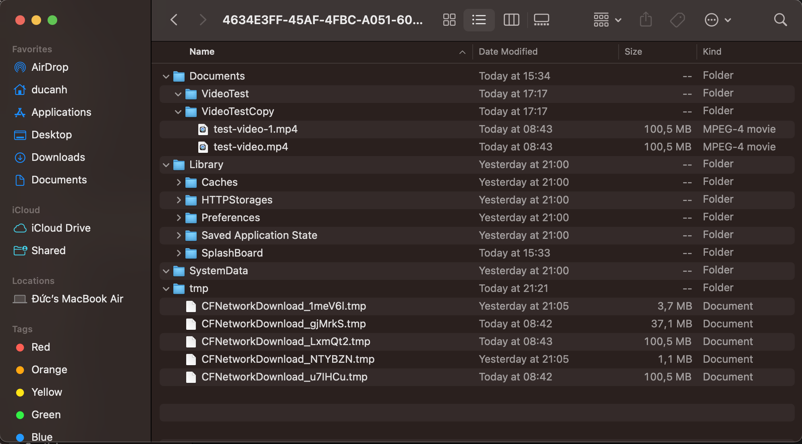

# I. File Size

## 1.1 How to get the file size?

```swift
if let fileAttributes = try? FileManager.default.attributesOfItem(atPath: fileURL.path) {

}
```

`attributesOfItem(atPath:)` sẽ trả về 1 dictionary thuộc kiểu `[FileAttributeKey : Any]`, có chứa các key để lấy được các attributes tại `atPath`.

```swift
if let bytes = fileAttributes[.size] as? Int64 {

}
```

Để lấy được size của file ta sẽ sử dụng tới key `FileAttributeKey.size` (đọc thêm tại [đây](https://developer.apple.com/documentation/foundation/fileattributekey)), nó sẽ trả về value dưới dạng `bytes`.


```swift
extension FileManager {
    func getSizeOfFile(atPath path: String) -> Int64? {
        guard let attrs = try? attributesOfItem(atPath: path) else {
            return nil
        }

        return attrs[.size] as? Int64
    }
}
```

### Format size for human-readable

Chúng ta có thể sử dụng class `ByteCountFormatter` để format byte count sang string.

```swift
let formatter = ByteCountFormatter()
formatter.allowedUnits = [.useMB, .useKB]
formatter.countStyle = .file
let dataStr = formatter.string(fromByteCount: bytes)
```

### Example:

```swift
//get the url of video in document directory
let document = FileManager.default.urls(for: .documentDirectory, in: .userDomainMask)[0]
let url = document
    .appendingPathComponent("VideoEditor")
    .appendingPathComponent("Reverse_video_6E1EA317-E99E-4EE1-BCDB-3E4F309ADE1A.mp4")

//create a formatter
let formatter = ByteCountFormatter()
formatter.countStyle = .file
formatter.allowedUnits = [.useMB, .useKB

//get the file size in bytes and convert to MB
let bytes = FileManager.default.getSizeOfFile(atPath: url.path)!
let megaBytes = formatter.string(fromByteCount: bytes)

print("Size file in bytes: \(bytes)")
print("Size file in MB: \(megaBytes)")

// console 
// Size file in bytes: 7194113
// Size file in MB: 7.2 MB
```

## 1.2. How to get a folder size

CHỊU LUÔN D*O HIỂU CODE CM GÌ!!!

```swift
extension URL {
    /// check if the URL is a directory and if it is reachable
    func isDirectoryAndReachable() throws -> Bool {
        guard try resourceValues(forKeys: [.isDirectoryKey]).isDirectory == true else {
            return false
        }
        return try checkResourceIsReachable()
    }

    /// returns total allocated size of a the directory including its subFolders or not
    func directoryTotalAllocatedSize(includingSubfolders: Bool = false) throws -> Int? {
        guard try isDirectoryAndReachable() else { return nil }

        if includingSubfolders {
            guard let urls = FileManager.default.enumerator(at: self, includingPropertiesForKeys: nil)?.allObjects as? [URL] else { return nil }
            return try urls.lazy.reduce(0) {
                (try $1.resourceValues(forKeys: [.totalFileAllocatedSizeKey]).totalFileAllocatedSize ?? 0) + $0
            }
        }

        return try FileManager.default.contentsOfDirectory(at: self, includingPropertiesForKeys: nil).lazy.reduce(0) {
            (try $1.resourceValues(forKeys: [.totalFileAllocatedSizeKey])
                .totalFileAllocatedSize ?? 0) + $0
        }
    }

    /// returns the directory total size on disk
    func sizeOnDisk() throws -> String? {
        guard let size = try directoryTotalAllocatedSize(includingSubfolders: true) else { return nil }
        URL.byteCountFormatter.countStyle = .file
        guard let byteCount = URL.byteCountFormatter.string(for: size) else { return nil}
        return byteCount + " on disk"
    }

    private static let byteCountFormatter = ByteCountFormatter()
}
```

# II. Compress file

File compression is a technique used to reduce the size of one or more files to save storage space and enable faster transmission over networks. 

Compression works by encoding data in a more efficient way so that it takes up less space than its original form.

## 2.1. How compress file work?

If you download many programs and files off the Internet, you've probably encountered ZIP files before. This compression system is a very handy invention, especially for Web users, because it lets you reduce the overall number of bits and bytes in a file so it can be transmitted faster over slower Internet connections, or take up less space on a disk. Once you download the file, your computer uses a program such as WinZip or Stuffit to expand the file back to its original size. If everything works correctly, the expanded file is identical to the original file before it was compressed.

At first glance, this seems very mysterious. How can you reduce the number of bits and bytes and then add those exact bits and bytes back later? As it turns out, the basic idea behind the process is fairly straightforward. In this article, we'll examine this simple method as we take a very small file through the basic process of compression.

Tóm lại:

Do file có nhiều thông tin bị lặp lại, nên các compressor sẽ chỉ list ra những infor này 1 lần. Khi tái tạo lại (decompress) nó sẽ refer lại những info này khi chúng xuất hiện trong file gốc.

Compress file có 2 kiểu: lossless (không mất data) và lossy (mất data)


The process of compressing files generally involves the following steps:

- Analyzing the data: The compression algorithm examines the data to identify patterns, repetitions, or redundancies that can be exploited for compression.
- Encoding: Based on the analysis, the algorithm assigns shorter codes to frequently occurring patterns and longer codes to less frequent ones.
- Storing or transmitting the compressed data: The compressed data is stored in a compressed file format or transmitted over a network.
- Decompression: When the compressed file is accessed or opened, it is decompressed using the reverse process, which involves using the same compression algorithm but in reverse. This allows the original data to be reconstructed from the compressed data.

#### Nén video

Nén video được xử lý bởi thuật toán gọi là `codecs` (video codecs format). `codec = coder + decoder`. 

Cách mà video compression ảnh hưởng tới video:
- Bit rate: là số lượng bit được xử lý trong 1s của video (bps, Kbps, Mbps). Video compression sẽ giảm thiểu số lượng bit cần thiết để tạo thành 1 video. Do đó, compression tools sẽ giảm số lượng bit không cần thiết.
- Rendering quality: lossy compression sẽ làm video bị giảm chất lượng, do nó làm mất 1 số lượng bit nên không thể tái tạo lại được video nguyên bản. Ngược lại, lossless compression không làm giảm chất lượng video.


Một vài common codec như: `H.264 (AVC)`, `H.265 (HEVC)`, `AV1`

Sau khi encoding (hoặc decoding), video sẽ được nhóm thành các components: `image frames`, `audio codes`, `subtitles` và `video metadata`. Các components này bắt buộc phải được đóng gói thành 1 `video container` (chính là video file format). 

Một vài common file format như: `MP4`, `MOV`, `.WMV`, `.AVI`

Trong khi các video file format khác nhau có thể support cùng một kiểu codec, nhưng không phải tất cả các video file format được support trên các nền tảng khác nhau như Windows, MacOS, Linux...

Điều này có nghĩa, user có thể lựa chọn codec format phù hợp để compress video, sau đó họ cần lựa chọn video file format phù hợp để có thể play trên các nền tảng.

Tóm lại:

Video compression tools hoạt động bằng cách sử dụng thuật toán để encoding và decoding, hay còn gọi là `codecs`. Codecs, khi encode video sequences, nó sẽ giảm tổng số lượng bits của video. Sau khi encode, video sequences sẽ được gói lại trong 1 video container (như là MP4, AVI), sau đó xuất ra dưới dạng compressed video.

#### Nén audio

Đĩa CD:
- CD chứa digital information của audio.
- CD chứa data dưới dạng un-compressed và high-resolution.

Do đó 1 bài hát trên đĩa CD có thể chứa tới 34Mb (ví dụ thế), mất vài phút để tải 1 bài hát.

Do đó, chúng ta cần sử dụng tới thuật toán compress audio. `MP3` format là 1 compression system cho music. Mục đích việc sử dụng MP3 là để compress 1 CD-quality song giảm tới 10-14 lần mà không làm ảnh hưởng quá nhiều tới chất lượng âm thanh, từ đó giảm file size xuống ~ 3Mb.

Is it possible to compress a song without hurting its quality? We use compression algorithms for images all the time. For example, a .gif file is a compressed image. So is a .jpg file. We create .zip files to compress text. So we're familiar with compression algorithms for images and words and we know they work.

MP3 Bitrate

MP3 thuộc kiểu lossy compress. Bạn có thể chọn giữ lại bao nhiêu information trong quá trình encoding và compression. Bạn có thể tạo được 2 file MP3 với chất lượng khác nhau hoàn toàn từ 1 source file. Vấn đề mấu chốt ở đây là `bit rate`.

Most MP3 encoding software allows the user to select the bit rate when converting files into the MP3 format. The lower the bit rate, the more information the encoder will discard when compressing the file. Bit rates range from 96 to 320 kilobits per second (Kbps). Using a bit rate of 128 Kbps usually results in a sound quality equivalent to what you'd hear on the radio. Many music sites and blogs urge people to use a bit rate of 160 Kbps or higher if they want the MP3 file to have the same sound quality as a CD.

#### Zip file


# III. File Manager

## 3.1. How iOS file system works?

### Sandboxing


Để tăng tính bảo mật, iOS's app khi tương tác với file system bị giới hạn với các directory bên trong app's sandbox directory. 

Các container directories được khởi tạo và giới hạn trong sandbox directory khi app được tạo mới. Mỗi container directory lại có 1 chức năng riêng. 
- `Bundle container` giữ app's bundle.
- `Data container` giữ data cho app và user, bên trong nó còn có các sub-directories khác như `Documents`, `Library`, `Temp`...
- `iCloud container` app có thể request access tới các container khác như iCloud trong runtime.




Tìm hiểu sơ qua về chức năng của các directories trong `Data Container`:
- `Documents`: Use this directory to store user-generated content. The contents of this directory can be made available to the user through file sharing; therefore, his directory should only contain files that you may wish to expose to the user.
- `tmp`: Use this directory to write temporary files that do not need to persist between launches of your app. Your app should remove files from this directory when they are no longer needed; however, the system may purge this directory when your app is not running.

Where You Should Put Your App’s Files?
- Put user data in Documents/. User data generally includes any files you might want to expose to the user—anything you might want the user to create, import, delete or edit. For a drawing app, user data includes any graphic files the user might create. For a text editor, it includes the text files. Video and audio apps may even include files that the user has downloaded to watch or listen to later.
- Put temporary data in the tmp/ directory. Temporary data comprises any data that you do not need to persist for an extended period of time. Remember to delete those files when you are done with them so that they do not continue to consume space on the user’s device. The system will periodically purge these files when your app is not running; therefore, you cannot rely on these files persisting after your app terminates.
- Put data cache files in the Library/Caches/ directory. Cache data can be used for any data that needs to persist longer than temporary data, but not as long as a support file. Generally speaking, the application does not require cache data to operate properly, but it can use cache data to improve performance. Examples of cache data include (but are not limited to) database cache files and transient, downloadable content. Note that the system may delete the Caches/ directory to free up disk space, so your app must be able to re-create or download these files as needed.

### Absolute path - Relative path

```swift
// Absolute path
/Users/ducanh/Library/Developer/CoreSimulator/Devices/8B4AB7EE-83C6-4DDE-A6C0-EB8AC8896F55/data/Containers/Data/Application/4634E3FF-45AF-4FBC-A051-60EEB01F2A5B/Documents/VideoTest/test-video.mp4

// Relative path
VideoTest/test-video.mp4
```

Bởi vì cơ chế sandbox nên mỗi lần app được run lại nó sẽ tạo ra 1 sandbox directory. Do đó, absolute path sẽ luôn luôn bị thay đổi. Vì vậy cần lưu lại relative path sau đó construct lại absolute path sau. 

```swift
let relativePath: String = "" // your relative path
let documentDir = FileManager.default.urls(for: .documentDirectory, in: .userDomainMask)[0]
let absolutePath = documentDir.appendingPathComponent(relativePath)
```

## 3.2. Manipulate file

### Atomic operation

Atomic operation tức là operation chỉ có 2 trạng thái: *hoàn thành hoàn toàn* (wholly), hoặc *không có gì* (no at all). Nó có thể bị interrupted hoặc stopped hoặc resumed, nhưng nó sẽ *không thay đổi state* của system cho đến khi nó *complete*.

Khi write file atomically, system sẽ writing vào 1 temporary file sau đó mới replace original file bằng temp file khi writting hoàn thành.


# Reference
1. [How To Get Directory Size With Swift](https://stackoverflow.com/questions/32814535/how-to-get-directory-size-with-swift-on-os-x)
2. [What is video compression](https://marketing.istockphoto.com/blog/what-is-video-compression/)
3. [How MP3 work](https://computer.howstuffworks.com/mp3.htm)
4. [8 audio file formats](https://routenote.com/blog/audio-file-formats-explained/)
5. [What is a zip file](https://experience.dropbox.com/resources/what-is-a-zip-file#:~:text=How%20do%20ZIP%20files%20work,the%20original%20data%20is%20intact.)
6. [iOS file management with FileManager in protocol-oriented Swift 4](https://iosbrain.com/blog/2018/04/22/ios-file-management-with-filemanager-in-protocol-oriented-swift-4/)
7. [Apple documentation File System](https://developer.apple.com/library/archive/documentation/FileManagement/Conceptual/FileSystemProgrammingGuide/AccessingFilesandDirectories/AccessingFilesandDirectories.html#//apple_ref/doc/uid/TP40010672-CH3-SW7)
