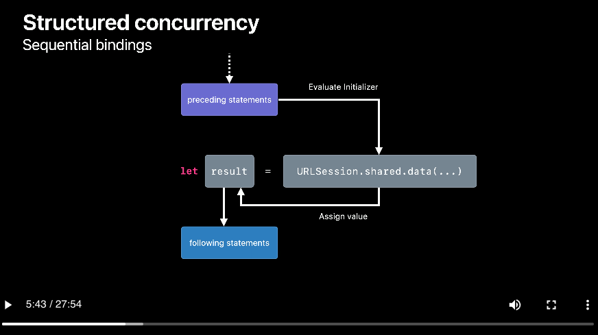
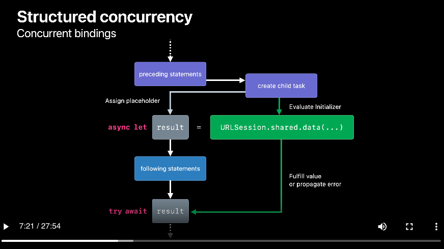

FFFFFFFFFF 


# Format dựa trên sách sách: Modern Concurrency in Swift
   

## Chương 1. Tại sao lại sử dụng modern concurrency

1. `Thread Pool`: GCD cho phép tạo ra các queue hay thread, dẫn đến việc mất kiểm soát khi có quá nhiều thread được sinh ra trong 1 thời điểm. Với modern concurrency nó sẽ tạo ra `Coporative Thread Pool` tức là nó sẽ tạo ra 1 bể chứa giới hạn số lượng các thread. Hệ thống không phải khởi tạo và huỷ các thead vô tội vạ, hoặc phải chuyển context giữa các thread. Thay vào đó, đoạn code có thể được dừng lại và thread đó sẽ thực thi đoạn code khác, sau 1 khoảng thời gian đoạn code được dừng lại sẽ được chạy tiếp ở `1 trong các thread của Thread Pool` (không nên đoán chính xác thread nào).

2. `Newer Syntax`: Syntax mới hơn không cần sử dụng đến closure và quản lý weak, strong capture.

3. `Structured Concurrency`: mỗi 1 async task đều thuộc 1 hierarchy, có parent task và priority riêng. Hierarchy này cho phép cancel toàn bộ các child tasks khi parent cancel.

## Chương 2. Làm quen với async-await


### Async let

`Asynnc let` gần giống với `Promise` so với các ngôn ngữ khác.

```swift
let result1 = await serverCall1()
let result2 = await serverCall2()
```

Trong VD trên `result2` không phụ thuộc vào `result1`, tuy nhiên nếu chúng ta dùng await bình thường thì `serverCall2` sẽ chỉ được gọi khi `serverCall1` đã trả về kết quả. Trường hợp này có thể sử dụng `async let` để giải quyết vấn đề.

```swift
async let call1 = serverCall1()
async let call2 = serverCall2()

// đoạn code khác

let (result1, result2) = await (call1, call2)

// đoạn code khác
```


`Async let` cho phép ta *binding* một biến local vào một task async. Nếu muốn đọc giá trị thì chúng ta sử dụng đến `await`. Nếu như giá trị đã được fetch xong thì đoạn code sẽ chạy tiếp mà không dừng lại, nếu không đoạn code sẽ dùng lại tại `await` cho đến khi trả về giá trị.

### Task (tìm hiểu sơ qua)

`Task` đại diện cho `top-level asynchronous task`. Tức là nó có khả năng **tạo ra** async context. Cơ bản thì bất kỳ khi nào bạn muốn chạy async code trong sync context thì sẽ phải tạo ra 1 `Task` mới.

- `Task(priority:operation)`: Schedules operation for asynchronous execution with the given priority. It inherits defaults from the current synchronous context.
- `Task.detached(priority:operation)`: Similar to Task(priority:operation), except that it doesn’t inherit the defaults of the calling context.
- `Task.value`: Waits for the task to complete, then returns its value, similarly to a promise in other languages.
- `Task.isCancelled`: Returns true if the task was canceled since the last suspension point. You can inspect this boolean to know when you should stop the execution of scheduled work.
- `Task.checkCancellation()`: Throws a CancellationError if the task is canceled. This lets the function use the error-handling infrastructure to yield execution.
- `Task.sleep(for:)`: Makes the task suspend for at least the given duration and doesn’t block the thread while that happens.”

`Task(priority:operation)` sẽ khởi tạo ra 1 task mới được kế thừa context của thằng cha nó. Ví dụ, `task` được khởi tạo trong `View` thì nó sẽ kế thừa `global actor context` hay được chạy trên *main thread*.

`Task.detached(priority:operation)` sẽ khởi tạo 1 task mà không được kế thừa context của thằng actor cha (không ba). 

### Actor (tìm hiểu sơ qua)

Sử dụng `MainActor` để vứt 1 đoạn code chạy trên main thread. Nó gần giống với `DispatchQueue.main`

Tìm hiểu thêm về async-await thông qua ví dụ sau:

```swift
struct ContentView: View {
    @ObservedObject var viewModel: ViewModel

    var body: some View {
        Text("Kho vai lin \(viewModel.text)")
            .task {
                // đoạn code trước điểm await này chắc chắn sẽ được gọi trên Main Thread
                try await viewModel.networkCall()
            }
    }
}

struct ViewModel: ObservableObject {
    @Published var text: String = ""

    func networkCall() async throws {
        // gọi async task ở đây
        self.text = await network()
    }
}
```

Oke giờ nếu bạn run thử code thì sẽ gặp lỗi `"Publishing changes from background threads is not allowed; make sure to publish values from the main thread (via operators like receive(on:)) on model updates."`

Nhưng tại sao lại như vậy? Vì theo lý thuyết phần [Task](#task-tìm-hiểu-sơ-qua) thì chúng ta đã tạo ra 1 task trên `MainActor` thì nó phải chạy trên main thread chứ.

Bởi vì sau mỗi suspension point `await` thì code của chúng ta sẽ được resume trên 1 thread bất kỳ nào đó. Trong trường hợp trên, đoạn code đầu vẫn được chạy trên main thread cho đến khi nó gặp `await` đầu tiên. Nhưng sau đó phần code trong method `networkCall()` được gọi trên 1 thread bất kỳ nào đó.

 Vì vậy nếu muốn update UI trên main thread chúng ta có thể sử dụng:

 ```swift
// Cách 1
@MainActor func networkCall() async throws {
    self.text = await network()
}

// Cách 2
func networkCall() async throws {
    await MainActor.run {
        self.text = await network()
    }
}
```

## Chương 3. AsyncSequence và Intermediate Task

## Chương 7. TaskGroup

# Phần 2. Format dựa trên WWDC

## 2.1. Meet async/await in Swift

`async` keyword dùng để đánh dấu `function`, `property(get-only)`, `initializers` đoạn code chạy asynchronous.

`await` keyword dùng để đánh dấu những đoạn mà `async` function có thể suspended.

Suspension là gì?
- Khi 1 function gặp keyword `await` nó *`có thể`* suspended (hoặc không).
- Đối với `sync` function, khi được gọi, nó sẽ chiếm quyền kiểm soát thread gọi nó. Nên thread sẽ bị độc chiếm cho tới khi nó xử lý xong toàn bộ function.
- Đối với `async` function, khi được gọi, nó có thể nhường quyền điều khiển thread bằng cách `suspending`. Nhưng thay vì trả quyền điều khiển ngược cho function, nó trả lại quyền cho hệ thống. Khi này hệ thống sẽ tự do sử dụng thread đó cho những công việc khác.
- Một function có thể `suspend` tuỳ ý nhiều lần nếu cần. Tức là nó có thể *suspend ... -> resume -> suspend ... -> resume*.
- Sau khi function `resume`, nó có thể được gọi trên 1 thread khác hoàn toàn so với thread ban đầu. Vì vậy không nên giả định thread nào sẽ xử lý.

Lưu ý:
- Khi `async` function `suspend` nó cũng `suspend` thằng caller, do đó caller cũng phải là async.
- `await` đánh dấu nơi mà function *có thể* suspend.
- Trong khi function suspend, những việc khác có thể diễn ra - thread không bị block.
- Một khi awaited async call hoàn thành, function sẽ thực thi tiếp đoạn code ngay sau nơi nó `suspend`.

## 2.2. Structured concurrency

### Async-let tasks

Ví dụ về structured code:



- Đầu tiên, `URLSession.shared.data` sẽ được gọi và tính toán giá trị
- Sau đó, giá trị sẽ được gán cho biến `result`

Ví dụ về `structured concurrency`: concurrency binding



- Đầu tiên, hệ thống sẽ tạo ra 1 `child task`.
- Sau đó *child task* sẽ ngay lập tức download data từ `URLSession.shared.data`.
- Cùng lúc đó, *parent task* sẽ gán 1 placeholder value cho biến `result` (là thằng *parent task* thực thi đoạn *preceding statements*). Và tiếp tục thực thi đoạn code *following statements*.
- Ở 1 thời điểm sau đó, khi chúng ta cần truy cập giá trị của `result` (await result), *parent task* sẽ đợi cho đến khi *child task* trả về giá trị.

```swift
func fetchOneThumbnail(withID id: String) async throws -> UIImage {
    let imageReq = imageRequest(for: id), metadataReq = metadataRequest(for: id)
    async let (data, _) = URLSession.shared.data(for: imageReq) // 👈🏻 async
    async let (metadata, _) = URLSession.shared.data(for: metadataReq) // 👈🏻 async
    
    guard let size = parseSize(from: try await metadata), // 👈🏻 await
          let image = try await UIImage(data: data)?.byPreparingThumbnail(ofSize: size) // 👈🏻 await
    else {
      throw ThumbnailFailedError()
    }

    return image
}
```

Task Tree
- Theo dõi task và các child task của nó.
- Ảnh hưởng đến các attributes của các task như `cancellation`, `priority`, `task-local` variable.
- Child/sub task sẽ kế thừa toàn bộ attributes của thằng parent task.
- Khi bạn gọi 1 async func từ 1 thằng async func khác, cùng 1 thằng Task sẽ xử lý.
- 1 task parent-child link sẽ phải tuân thủ quy tắc: parent chỉ được phép hoàn thành khi toàn bộ thằng con của nó đã hoàn thành.
    - VD có 1 parent và 2 child tasks. Nếu như thằng con 1 quẳng ra 1 error sẽ khiến thằng parent quẳng ra errror. Task tree có trách nhiệm *cancel*
toàn bộ các child task còn lại và await chúng hoàn thành trước khi thằng parent có thể exit/throw.
    - 1 task được đánh dấu là `cancel` không đồng nghĩa với việc nó sẽ ngay lập tức stop. Nó chỉ đơn giản là result của nó sẽ không được dùng đến.
    - Khi 1 task bị `cancel`, toàn bộ các subtasks cũng tự động bị cancel.

Task Cancellation is cooperative
- Task sẽ không dừng ngay lập tức khi bị *cancel*.
- *Cancellation* có thể được check từ mọi nơi (sync và async).

```swift
// Cách 1 
func fetchThumbnails(for ids: [String]) async throws -> [String: UIImage] {
    var thumbnails: [String: UIImage] = [:]
    for id in ids {
      try Task.checkCancellation() // 👈🏻 cancellation check, this call throws an error if the current task has been canceled
      thumbnails[id] = try await fetchOneThumbnail(withID: id)
    }
    return thumbnails
}

// Cách 2
func fetchThumbnails(for ids: [String]) async throws -> [String: UIImage] {
    var thumbnails: [String: UIImage] = [:]
    for id in ids {
      if Task.isCancelled { break } // 👈🏻 cancellation check
      thumbnails[id] = try await fetchOneThumbnail(withID: id)
    }
    return thumbnails // 👈🏻 In case of cancellation, we return a partial result
}
```


### Group tasks


## 2.4. Swift concurrency: Behind the scenes


# REFERENCE
1. [Meet async/await in Swift WWDC Notes](https://www.wwdcnotes.com/notes/wwdc21/10132/)
2. [Meet async/await in Swift WWDC](https://developer.apple.com/videos/play/wwdc2021/10132)
