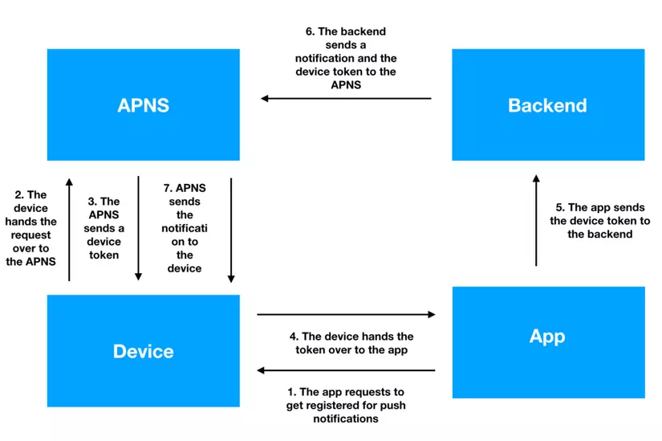

PUSH NOTIFICATIONS TRÊN IOS VỚI FIREBASE MESSAGING

Giới thiệu sơ qua về `Push notifications` (từ giờ gọi tắt là `Push noti`)

What are push notifications? They are messages sent to your app through the Apple Push Notification service (APNs) even if your app isn’t running or the phone is sleeping. What can you use push notifications for?

- Display a short text message, called an alert, that draws attention to something new in your app.
- Play a notification sound.
- Set a badge number on the app’s icon to let the user know there are new items.
- Provide actions the user can take without opening the app.
- Show a media attachment.
- Be silent, allowing the app to perform a task in the background.
- Group notifications into threads.
- Edit or remove delivered notifications.
- Run code to change your notification before displaying it.
- Display a custom, interactive UI for your notification.
- And probably more.


### 

```swift
// Register for remote notifications

func application(_ application: UIApplication, didFinishLaunchingWithOptions launchOptions: [UIApplication.LaunchOptionsKey: Any]?) -> Bool {
    // ...

    // register for remote notifications
    Messaging.messaging().delegate = self
    UNUserNotificationCenter.current().delegate = self
    
    // Request permission for notifications
    let authOptions: UNAuthorizationOptions = [.alert, .badge, .sound]
    UNUserNotificationCenter.current().requestAuthorization(
        options: authOptions,
        completionHandler: {_, _ in })
    UIApplication.shared.registerForRemoteNotifications()

    // ...
    return true
}
```
Đoạn code này sẽ hiển thị *permission dialog* khi user lần đầu chạy app. Nếu như bạn muốn show dialog ở 1 thời điểm khác thì sử dụng lại đoạn code này ở chỗ khác. 

## Push notifications hoạt động như thế nào?

4 bên tham gia vào push noti:
-  App của chúng ta.
-  Điện thoại iphone.
-  Backend server or Cloud service (Firebase Messaging).
-  APNS: Apple push notification service.



1. Đầu tiên, app gửi request để đăng ký remote notifications.
2. Device (iphone) sẽ chuyển request cho thằng APNS.
3. Sau khi đăng ký thành công, APNS sẽ gửi lại 1 token cho thằng device.
4. Device sẽ gửi token ngược lại cho App.
5. App gửi device token cho bên backend (hoặc clould service như Firebase Messaging), để backend có thể phân biệt được các device và bắn noti.
6. Khi backend muốn gửi noti cho 1 thiết bị, nó sẽ gửi message và device token tương ứng tới APNS.
7. APNS sẽ gửi noti tới device.


## Các kiểu `Push notifications`

Có 2 kiểu push noti là: `Alert notification` và `Background notification` (Slient notification)

- `Alert Notification`:
    - Hiển thị đối với người dùng.
    - Có thể hiển thị alert, phát tiếng và update app badge.
    - Người dùng có thể tương tác trực tiếp với noti.

- `Background Notification`:
    - Không hiển thị alert, không có tiếng hay update app badge.
    - Dùng để kích hoạt các background tasks trong app.
    - Cho phép app thực hiện task silently trong background mà không ảnh hưởng đến tương tác người dùng.

## Notification Service Extension

`Notification Service` extension cho phép dev chỉnh sửa content của 1 remote notification trước khi nó được hiển thị tới người dùng. Nó cho phép download và đính kèm addtional content cho 1 notification ví dụ như ảnh, media, và customize the notification content dynamically.

1 số chức năng chính của service extension:
- Cho phép chỉnh sửa content của noti.
- Có thể download ảnh và đính kèm với noti.
- Asynchronous processing, như download ảnh hoặc additional data mà không block 
main thread của app. Sau timeout sẽ có callback để xử lý trường hợp download fail.


# REFERENCE
1. [Push notifications local notifications tutorial](https://www.thomashanning.com/push-notifications-local-notifications-tutorial/)
2. [Firebase Cloud Messaging for iOS: Push Notifications](https://www.kodeco.com/20201639-firebase-cloud-messaging-for-ios-push-notifications/)
3. [Handling alert and background push notifications](https://developer.apple.com/videos/play/wwdc2020/10095/)
4. [](https://developer.apple.com/documentation/usernotifications/asking-permission-to-use-notifications)
5. [](https://www.kodeco.com/11395893-push-notifications-tutorial-getting-started?page=3#toc-anchor-012)
6. [](https://developer.apple.com/library/archive/documentation/NetworkingInternet/Conceptual/RemoteNotificationsPG/index.html#//apple_ref/doc/uid/TP40008194-CH3-SW1)