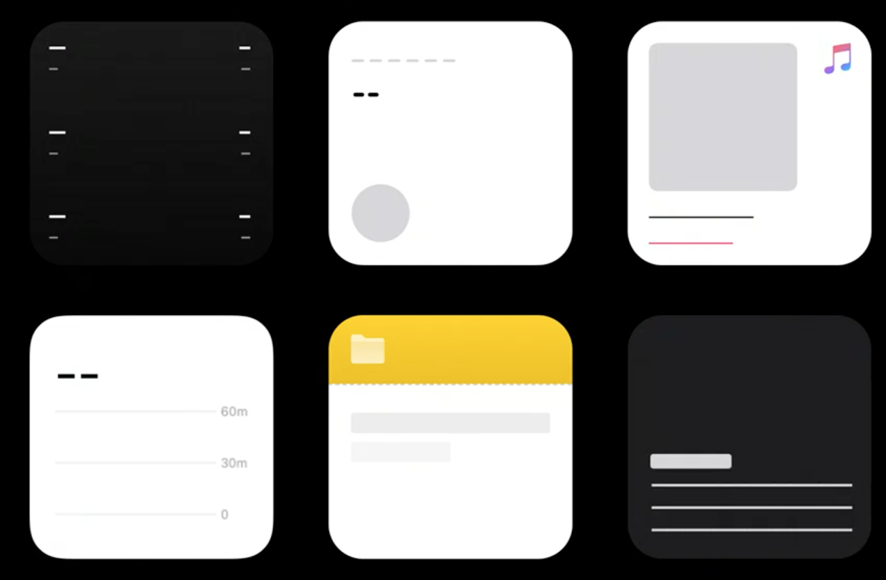

```swift
struct Lean_Widget: Widget {
    let kind: String = "Lean_Widget"

    var body: some WidgetConfiguration {
        StaticConfiguration(kind: kind, provider: Provider()) { entry in
            if #available(iOS 17.0, *) {
                Lean_WidgetEntryView(entry: entry)
					.containerBackground(.blue, for: .widget)
            } else {
                Lean_WidgetEntryView(entry: entry)
                    .padding()
					.background(Color.red, alignment: .center)
            }
        }
        .configurationDisplayName("My Widget")
        .description("This is an example widget.")
		.supportedFamilies([.systemSmall, .systemMedium])
    }
}
```


`kind`:
- Dùng để phân biệt các widget khác nhau (e.g: cùng là widget stock nhưng có loại *details* và *lits*).

`WidgetConfiguration`: 
- StaticConfiguration: không cho phép user tuỳ chỉnh widget (e.g: apple music)
- IntentConfiguration: cho phép user tuỳ chỉnh widget (e.g: apple notes)
- ActivityConfiguration: dùng cho live activity trên iOS 16

`supportedFamilies`:
- Kích thước của widget, ví dụ: small, medium, large, accessoryCircular... (đọc thêm về `WidgetFamily`).

`deepLink` (`widgetURL()`):
- Khi user tap vào widget (sau iOS17 widget có thể interactive), nó sẽ mở ra app.
- Nếu support medium size, widget có thể chứa các sub-link mở thẳng vào mục đó trong app (e.g: music widget chứa các albums).

## Tìm hiểu về UI trong widget

```swift
struct HeadlineEntry: TimelineEntry {
	let date: Date
	let articles: [Article]
	let size: CGSize
}

struct HeadlineProvider: TimelineProvider {
	func placeholder(in context: Context) -> HeadlineEntry {

	}

	func getSnapshot(in context: Context, completion: @escaping (HeadlineEntry) -> Void) {

	}

	func getTimeline(in context: Context, completion: @escaping (Timeline<HeadlineEntry>) -> Void) {
		
	}	
}
```

Có 3 loại cần chú ý: `Placeholder`, `Snapshot`, `Timeline`

- *Placeholder*: là 1 view tạm thời, dùng để render ra widget lần đầu tiên. Nó giống như bộ khung của widget và không chứa bất kỳ user data nào.



- *Snapshot*: system hiển thị 1 `entry` nhanh nhất có thể, nó là real widget.

- *Timeline*: về cơ bản là tập hợp của các snapshot gắn liền với date. Nó giúp system quyết định xem thời điểm nào (date) sẽ hiển thị snapshot tương ứng.

## Reloads

- Đây là cơ chế khi system đánh thức các *widget* và yêu cầu một *timeline* mới, giúp cho content của widget luôn up-to-date.

- Timeline(entries: [EntryType], policy: TimelineReloadPolicy): `TimelineReloadPolicy` giúp system quyết định khi nào sẽ reload timeline
    - `atEnd`: `WidgetKit` sẽ request timeline mới sau khi date của entry cuối cùng đã qua.
    - `never`: `WidgetKit` sẽ không bao giờ tự động request timeline mới.
    - `after(_ date: Date)`: `WidgetKit` sẽ request timeline mới sau 1 date nhất định.

- Chúng ta có thể reload widget thủ công thông qua `WidgetCenter`:
    - `WidgetCenter.shared.reloadAllTimelines()`
    - `WidgetCenter.shared.reloadTimelines(ofKind:)`


## Deeplinks

[Deep link url scheme](https://blogs.halodoc.io/deep-linking-using-url-scheme-in-ios/)
[Swift deep link](https://www.youtube.com/watch?v=WmM4ryGcmSg)


## Sharing data between App and Widget

[Sharing object data between an iOS app and its widget](https://michael-kiley.medium.com/sharing-object-data-between-an-ios-app-and-its-widget-a0a1af499c31)

