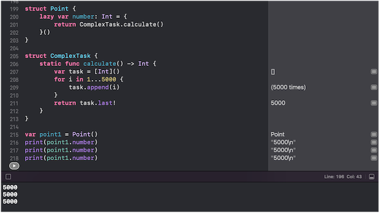

# 1. Stored Property

Có 2 loại stored property là variable (var) và constant (let)

```swift
struct Point {
  var x: Int
  let y: Int
}

var point1 = Point(x: 5, y: 10)
point1.x = 8  // valid
point1.y = 15 // error

let point2 = Point(x: 10, y: 15)
point2.x = 8  // error
point2.y = 15 // error
```

> Note:
>
> Đối với `struct` nếu instance được khai báo là constant thì mọi properties của nó đều là constant.

# 2. Lazy Stored Property

Có đặc điểm là sẽ không được khởi tạo cho đến khi lần đầu tiên được truy cập.

Khác biệt lớn nhất giữa `Computed property` và `Lazy property` là: computed sẽ luôn được *tính toán lại* mỗi khi được gọi và nó sẽ không lưu trữ bất cứ giá trị nào. Ngược lại, lazy có thể lưu trữ được giá trị và nó sẽ được tính toán *1 lần duy nhất* khi được truy cập lần đầu.


  

# 3. Computed Property

# 4. Observer Property

# 5. Property Wrapper

```swift
@propertyWrapper
class Truncate {
  private var value: String = ""
  
  var wrappedValue: String {
    get { truncate(string: value) }
    set { value = truncate(string: newValue) }
  }
  
  private func truncate(string: String) -> String {
    string.count <= 10 ?
      : string
      : string.prefix(10) + "..."
  }
}
```

## 5.1. Synthesized storage property

Khi 1 property wrapper được khai báo, complier sẽ làm 3 điều sau để chuyển đổi code:
- Tạo ra 1 private stored property thuộc kiểu Wrapper.
- Biến property đó thành computed property với getter, setter.
- Khởi tạo private stored property với 1 trong 3 cách (phần sau).

```swift
class Blog {
  // property wrapper
  @Truncate var title: String
 
  // Synthesized code (compiler sẽ dịch thành)
  private var _title = Truncate()
  var title: String {
    get { _title.wrappedValue }
    set { _title.wrappedValue = newValue }
  }
}
```

# 5.2. Khởi tạo property wrapper

Cách 1: 
