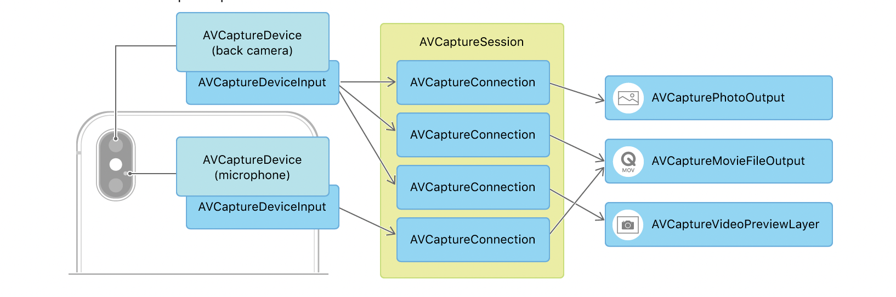
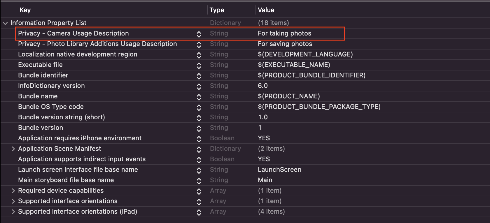

# AVFoundation

Là framework dùng để làm việc với audio và video trên IOS.

## Capture 

Theo Apple Documents: 
`AVFoundation Capture` là một sub-system cung cấp high-level API để thao tác với video, audio, photo. Dùng với mục đích: 
- Build custom camera UI.
- Cung cấp cho user nhiều quyền kiểm soát output (photo, video) hơn như: focus, exposure, stabilization.
- Cung cấp output ở định dạng khác so với system Camera như: RAW format photos, depth maps, videos với custom timed metadata.
- Có quyền truy cập trực tiếp vào pixel hoặc audio data streaming từ thiết bị đầu vào (camera sau của iphone,...).

> Note:
Nếu như chỉ muốn dùng system Camera UI để chụp ảnh hoặc quay video thì nên sử dụng `UIImagePickerController`.  



Các thành phần chính:
- Session (AVCaptureSession): là thành phần cốt lõi, nó sẽ điều khiển flow của media capture. Nó nhận vào input, xử lý data và xuất ra ouput.
- Input: là 1 object thuộc subclass của `AVCaptureInput`, thường là `AVCaptureDeviceInput` (có thể là camera sau và trước, micro).
- Output: là 1 object thuộc subclass của `AVCaptureOutput`, có thể là `AVCapturePhotoOutput` dùng để xử lý image, `AVCaptureVideoDataOutput` hoặc `AVCaptureMovieFileOutput` dùng dể xử lý video, audio.
- Ngoài ra còn có Capture Device, dùng để truy cập đến physical device (camera, mic của iphone) và dùng nó để tạo ra input. 
 
Sau đây là những bước cần thiết để setup custom Camera để chụp ảnh (record video thì khó vl nên để sau này bổ sung thêm =)))
 
```swift
class ViewController: UIViewController {

  var captureSession: AVCaptureSession?
  var frontCamera: AVCaptureDevice?
  var backCamera: AVCaptureDevice?
  var frontCameraInput: AVCaptureDeviceInput?
  var backCameraInput: AVCaptureDeviceInput?
  var photoOutput: AVCapturePhotoOutput?
  var previewLayer: AVCaptureVideoPreviewLayer?
  var flashMode = AVCaptureDevice.FlashMode.off
  var currentCameraPosition: CameraPosition?
  var capturedPhoto: UIImage?
  
  override func viewDidLoad() {
    super.viewDidLoad()
    checkAuthorization()
  }
  
  ...
  
  enum CameraPosition {
    case front
    case back
  }
  
}
```
 
### Bước 1: Authorization

Trước khi muốn truy cập vào camera trên thiết bị của user thì cần phải được user xác nhận cho phép:
- Cần phải thêm key `NSCameraUsageDescription` vào file `Info.plist`   



- Check xem app đã được authorized chưa, nếu chưa thì request 

```swift
func checkAuthorization() {
  switch AVCaptureDevice.authorizationStatus(for: .video) {
    case .notDetermined:
      self.requestAuthorization()
    case .authorized:
      self.setupAndStartCaptureSession()
    case .restricted, .denied:
      break
    @unknown default:
      break
  }
}

func requestAuthorization() {
  AVCaptureDevice.requestAccess(for: .video) { granted in
    if granted {
      DispatchQueue.main.async {
        self.setupAndStartCaptureSession()
      }
    }
  }
}
```

### Bước 2: Create và config `AVCaptureSession`

Để create và config `Capture Session` sẽ cần qua các bước:
1. Khởi tạo 1 session mới
2. Tìm kiếm và config những capture devices phù hợp
3. Tạo inputs từ capture device, kết nối tới session
4. Tạo và config ouput, kết nối tới session
5. Start session

```swift
func setupAndStartCaptureSession() {
  // Khởi tạo background concurrent queue
  let sessionQueue = DispatchQueue(label: "concurrent.session.queue")
  
  sessionQueue.async {
    // Khởi tạo 1 capture session mới
    self.captureSession = AVCaptureSession()
    
    // Config preset của session
    if self.captureSession.canSetSessionPreset(AVCaptureSession.Preset.photo) {
      self.captureSession.sessionPreset = AVCaptureSession.Preset.photo
    }
    
    // Kết nối input
    
    // Kết nối output
    
    // Start session
    self.captureSession.startRunning()
  }
}
```

Giải thích:
- Tại sao lại phải khởi tạo background queue? Vì `captureSession.startRunning()` sẽ bắt đầu flow của session và nó sẽ block thread hiện tại cho đến khi hoàn thành hoặc throw error. Do đó, cần start session ở queue khác main.
- Property `sessionPreset` sẽ quyết định chất lượng và độ phân giải của media (image, video, audio). Do đó việc set preset sẽ giúp tối ưu performance cũng như dung lượng lưu trữ. Note: `AVCaptureSession.Preset.photo` dùng cho high-quality image, nếu như cố tình record video sẽ dẫn đến lỗi, do đó có thể `preset` khác phù hợp cho cả photo và video.

> Important
Gọi `beginConfiguration()` trước khi thay đổi input hay output của session, và gọi `commitConfiguration()` sau khi đã thay đổi.

### Bước 3: Setup Input

Đầu tiên để setup input thì cần phải setup device.

```swift
func setupInputs() {
  // Setup device
  // 1
  let discoverySession = AVCaptureDevice.DiscoverySession(deviceTypes: [AVCaptureDevice.DeviceType.builtInWideAngleCamera],
                                                          mediaType: AVMediaType.video,
                                                          position: AVCaptureDevice.Position.unspecified)
  let devices = discoverySession.devices
  
  // 2
  for device in devices {
    if device.position == .back {
      self.backCamera = device
    }
    else if device.position == .front {
      self.frontCamera = device
    }
  }
  
  // Setup inputs
  // 3
  if let backCamera = self.backCamera {
  // 4
    self.backCameraInput = try? AVCaptureDeviceInput(device: backCamera)
    
    if let backCameraInput = self.backCameraInput, self.captureSession.canAddInput(backCameraInput) {
      // 5
      self.backCameraInput = backCameraInput
      self.captureSession.addInput(backCameraInput)
      self.currentCameraPosition = .back
    }
  }
  
  // 6
  else if let frontCamera = self.frontCamera {
    self.frontCameraInput = try? AVCaptureDeviceInput(device: frontCamera)
    
    if let frontCameraInput = self.frontCameraInput, self.captureSession.canAddInput(frontCameraInput) {
      self.frontCameraInput = frontCameraInput
      self.captureSession.addInput(frontCameraInput)
      self.currentCameraPosition = .front
    }
  }    
}
```

Giải thích:
1. Tìm những device phù hợp cho media type `video` (bao gồm cả image).
Init từ `DiscoverySession(deviceTypes:mediaType:position:)` sẽ return lại tất cả device phù hợp (`positon`bao gồm cả front và back camera, nhiều `deviceType` khác nhau).
Ngược với nó `default(_:for:position:)` chỉ return lại 1 device phù hợp duy nhất. 
2. Lặp qua tất cả các device phù hợp và xác định cái nào là front, cái nào là back camera.
3. Config `backCameraInput` nếu có `backCamera` 
4. Khởi tạo input từ device cụ thể `backCamera`.
5. Check xem `captureSession` có thể add được input không, nếu được thì kết nối input với session.
6. Vì session chỉ cho phép 1 input (dựa theo loại camera, front hoặc back) trong 1 thời điểm. Nên nếu back camera phù hợp thì sẽ sử dụng input từ back camera còn không sẽ sự dụng front camera để lấy input. 

### Bước 4: Setup Output

Có nhiều loại output khác nhau. Ví dụ:
- AVCapturePhotoOutput: dùng để capture ouput cho still photo, live photos
- AVCaptureMovieFileOutput: dùng để capture output cho records video và audio để lưu vào file QuickTime.
- AVCaptureVideoDataOutput: dùng để capture output cho records video và cung cấp quyền truy cập và xử lý từng frame của video dưới dạng data. 

```swift
func setupOutputs() {
  self.photoOutput = AVCapturePhotoOutput()
  if self.captureSession.canAddOutput(self.photoOutput) {
    self.captureSession.addOutput(self.photoOutput)
  }
}
```

### Bước 5: Tạo PreviewLayer

Sau 4 bước trên chúng ta đã có input, output và session. Bây giờ điều cần làm là làm sao để hiển thị hình ảnh từ camera lên màn hình điện thoại. Để làm được điều này chúng ta sẽ thao tác với class `AVCaptureVideoPreviewLayer` (subclass của CALayer).

```swift
func setupPreviewLayer() {
  self.previewLayer = AVCaptureVideoPreviewLayer(session: captureSession)
  self.previewLayer.videoGravity = AVLayerVideoGravity.resizeAspectFill
  view.layer.insertSublayer(previewLayer, at: 0)
  self.previewLayer.frame = view.frame
}
``` 

### Bước 6: Chụp ảnh

```swift
@objc func capturePhoto() {
  let settings = AVCapturePhotoSettings()
  settings.flashMode = self.flashMode
  self.photoOutput.capturePhoto(with: settings, delegate: self)
}

extension ViewController: AVCapturePhotoCaptureDelegate {
  func photoOutput(_ output: AVCapturePhotoOutput, didFinishProcessingPhoto photo: AVCapturePhoto, error: Error?) {
    guard let imageData = photo.fileDataRepresentation(),
          let image = UIImage(data: imageData) else { return }
    self.capturedPhoto = image
  }
}
```
Kết hợp các bước trên chúng ta sẽ có func `setupAndStartCaptureSession`

```swift
func setupAndStartCaptureSession() {
  // Khởi tạo background concurrent queue
  let sessionQueue = DispatchQueue(label: "concurrent.session.queue")
  
  sessionQueue.async {
    // Khởi tạo 1 capture session mới
    self.captureSession = AVCaptureSession()
    
    // Config preset của session
    if self.captureSession.canSetSessionPreset(AVCaptureSession.Preset.photo) {
      self.captureSession.sessionPreset = AVCaptureSession.Preset.photo
    }
    
    // Kết nối input
    self.setupInputs()
    
    // Kết nối output
    self.setupOutputs()
    
    // Setup preview layer
    DispatchQueue.main.async {
      self.setupPreviewLayer()
    }
    
    // Start session
    self.captureSession.startRunning()
  }
}
```

### Chuyển đổi camera

```swift
@objc func switchCameraPosition() {
  self.captureSession.beginConfiguration()
  
  guard let currentCameraPosition = currentCameraPosition else { return }
  
  switch currentCameraPosition {
    case .front:
      if let backCameraInput = backCameraInput, let frontCameraInput = frontCameraInput {
        self.captureSession.removeInput(frontCameraInput)
        self.captureSession.addInput(backCameraInput)
        self.currentCameraPosition = .back
      }
    case .back:
      if let backCameraInput = backCameraInput, let frontCameraInput = frontCameraInput {
        self.captureSession.removeInput(backCameraInput)
        self.captureSession.addInput(frontCameraInput)
        self.currentCameraPosition = .front
      }
  }
  
  self.captureSession.commitConfiguration()
}
```

Giải thích:
- Để thay đổi camera thì chúng ta cần remove `camera input` cũ và add `camera input` mới.
- Nhớ đặt đoạn code thay đổi input giữa `beginConfiguration()` và `commitConfiguration()`

### Reference:
- [Making a custom Camera](https://medium.com/@barbulescualex/making-a-custom-camera-in-ios-ea44e3087563)
- [Building a fullscreen camera app](https://www.appcoda.com/avfoundation-swift-guide/)
- [AVFoundation Apple Documents](https://developer.apple.com/documentation/avfoundation/capture_setup)
