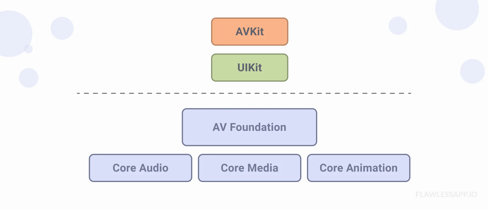
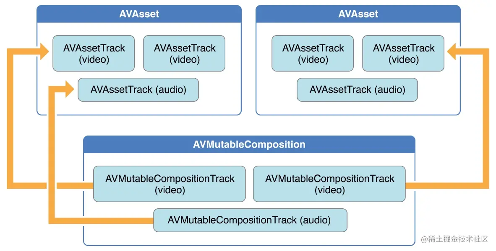

# Play Video



Để xử lý video chúng ta sẽ cần tìm hiểu về các class sau: `AVAsset`, `AVPLayerItem`, `AVPlayer`, `AVPLayerLayer`

### **1. AVAsset**

#### **1.1. Tổng quan**

- `AVAsset` là tập hợp của các data khác nhau, bao gồm: audio tracks, videos tracks, title, length, video size. Nó support hầu hết các media file format.

- `AVAsset` có thể chứa 1 hoặc nhiều `AVAssetTrack`. `AVAssetTrack` có `mediaType` property xác định type của track như video tracks, audio tracks, subtitle tracks, text tracks...

Ví dụ: 1 AVAsset (video) lấy từ Library chứa video track và audio track.

### **2. Playing media**


#### **2.1. AVPlayer**

Là central cotroller class dùng để phát media asset và kiểm soát thời gian. Nó có thể phát media cả local và streaming.

> Note: `AVPlayer` chỉ cho phép phát 1 media duy nhất. Nếu muốn phát media liên tiếp thì phải dùng tới subclass `AVQueuePlayer`.

`AVPlayer` có những property và method dùng để control video như:

- `rate: Float`: the current playback rate. Zero means to pause, 1 means the video plays at regular speed, 2 means double-speed, and etc. Setting rate to a negative number instructs playback to begin at that number times regular speed in reverse.
- `status: AVPlayer.Status`: a status that indicates whether the player can be used for playback.
- `currentItem: AVPlayerItem?`: the player’s current player item.
- `func play()`: begins playback of the current item.
- `func pause()`: pauses playback of the current item.
- `func seek(to: CMTime)`: sets the current playback time to the specified time.
- `func currentTime() -> CMTime`: returns the current time of the current player item.
- `func replaceCurrentItem(with: AVPlayerItem?)`: replaces the current player item with a new player item.

#### **2.2. AVPlayerItem**

Bởi vì `AVAsset` chỉ chứa những thuộc tính static của media, nên không phù hợp để phát playback media với `AVPlayer`. Thay vào đó, cần sử dụng tính dynamic của `AVPlayerItem`. Class này sẽ chỉ ra playback state của một asset được sử dụng bởi `AVPlayer`. `AVPlayerItem` chứa những property và method dùng để lấy được: time zone, screen size, thời gian phát hiện tại,...

Những property thông dụng:
- `asset: AVAsset`: the asset provided during initialization.
- `duration: CMTime`: the duration of the item.
- `status: AVPlayerItem.Status`: the status of the player item.
- `forwardPlaybackEndTime: CMTime`: the time at which forward playback ends.
- `reversePlaybackEndTime: CMTime`: the time at which reverse playback ends.

#### **2.3. AVKit và AVPlayerLayer**

Do `AVPlayer` và `AVPlayerItem` là các object không hiển thị trên màn hình, vì vậy cần phải sử dụng tới class khác để giúp chúng hiển thị media lên screen:

- `AVKit`: cách đơn giản nhất dùng để hiện thị nội dung của video là sử dụng class `AVPlayerViewController` trong `AVKit` framework. Nó sẽ cung cấp các method dùng để quản lý và điều khiển playback.

- `AVPlayerLayer`: nếu như bạn muốn custom player thì cần phải custom `AVPlayerLayer` (subclass của `CALayer`). Lớp layer này có thể được add như là sublayer của 1 view dùng để hiển thị nội dung video. Tuy nhiên, layer này chỉ có chức năng hiển thị, việc quản lý và điều khiển những tính năng playback (dừng, phát, tua,...) sẽ phải tự triển khai.

#### **2.4. Tổng kết**

Để chạy playback chúng ta cần khởi tạo và config các class sau:
- Khởi tạo AVAsset.
- Khởi tạo AVPlayerItem từ .init(asset:) hoặc .init(url:) 
- Khởi tạo AVPlayer từ .init(), và gọi method `replaceCurrentItem(_:)` để gán 1 item mới cho player.
- Khởi tạo AVPlayerLayer từ .init(player:), gán `frame` cho layer và config `videoGravity`, add sublayer vào view để display content.

#### **2.5. Observering playback state**

Vì `AVPlayers` và `AVPlayerItems` là các dynamic objects nên state của nó luôn luôn thay đổi. Nếu bạn muốn phản ứng và xử lý trước những thay đổi này thì cần sử dụng tới KVO (Key-value Observing). Với KVO, bạn có thể theo dõi sự thay đổi của state của player và item từ đó đưa ra hướng xử lý.

Một trong những property thông dụng nhất của `AVPlayerItem` là `status`. Nó thường được sử dụng để xác định xem `AVPlayerItem` có thể play không.

```swift
var playerItemStatusObserver: NSKeyValueObservation?

func addPlayerStatusObserver() {
    playerItemStatusObserver = player.currentItem?.observe(\.status, options: .new) { [weak self] playerItem, _ in
        switch playerItem.status {
            case .unknown:                    
                // Player item chưa sẵn sàng.
            case .readyToPlay:
                // Player item sẵn sàng để phát.
            case .failed:
                // Player item failed, kiểm tra error.
        }
    }
}

deinit {
    // Remove observer
    playerItemStatusObserver?.invalidate()
}
```

#### **2.6. Observering playback time**

#### **2.6.1. CMTime**

Media playback là hoạt động dựa trên thời gian (time-based activity). Rất nhiều core functions của `AVPlayers` và `AVPlayerItems` liên quan đến control timing của media. Do đó `AVFoundation` sử dụng 1 kiểu dữ liệu riêng `CMTime` để quản lý time.

`CMTime` là kiểu dữ liệu thuộc `Core Media` framework, nó mô tả thời gian bằng cách chia nhỏ ra nhiều phần.

```swift
public struct CMTime {
    public var value: CMTimeValue
    public var timescale: CMTimeScale
    public var flags: CMTimeFlags
    public var epoch: CMTimeEpoch
}

// 0.25 seconds
let quarterSecond = CMTime(value: 1, timescale: 4)
 
// 10 second mark in a 44.1 kHz audio file
let tenSeconds = CMTime(value: 441000, timescale: 44100)
 
// 3 seconds into a 30fps video
let cursor = CMTime(value: 90, timescale: 30)
```

#### **2.6.2. Observing time**

Để quan sát thời gian một cách định kỳ (preodic timing), sử dụng method của `AVPlayer` `addPeriodicTimeObserver(forInterval:queue:using:)`. Nó có thể được sử dụng để update UI trong custom player.

Method này nhận 1 `CMTime` value đại diện cho time interval, 1 `serial queue` nơi callback được gọi, và 1 callback block được gọi lại sau mỗi 1 khoảng time interval.

```swift
var player: AVPlayer!
var playerItem: AVPlayerItem!
var timeObserverToken: Any?

func addPeriodicTimeObserver() {
    // Notify every half second
    let timeScale = CMTimeScale(NSEC_PER_SEC)
    let time = CMTime(seconds: 0.5, preferredTimescale: timeScale)

    timeObserverToken = player.addPeriodicTimeObserver(forInterval: time, queue: .main) {
        [weak self] time in
        // update player transport UI
    }
}

func removePeriodicTimeObserver() {
    if let timeObserverToken = timeObserverToken {
        player.removeTimeObserver(timeObserverToken)
        self.timeObserverToken = nil
    }
}
```

### **3. Custom video player**

### **4. Export Video**

`AVAssetExportSession` cho phép export media asset như là videos, audio files sang format hoặc compression settings khác. Nó cho phép bạn custom các tham số khác nhau và thực hiện các task như transcoding, resizing và applying filters cho media.

Để có thể export media chúng ta sẽ thực hiện các bước sau:

- Tạo `outputURL: URL`: là url mà export session sẽ write đến.

- Tạo `timeRange: CMTimeRange`: là khoảng thời gian của media sẽ được export.

- Tạo `exportSession: AVAssetExportSession`: config export session để export instance của AVAsset bằng việc setting `export preset`, `output file type`, `output URL`.

- Export bằng method `exportAsynchronously(completionHandler:)`.

```swift
  func trimmingVideo(asset: AVURLAsset, fileName: String, startTime: Float, endTime: Float) {
        let fileManager = FileManager.default
        let fileName = "Trimming_video_\(fileName).mp4"

        // Tạo outputURL
        guard let outputURL = createVideoEditorFolder()?.appendingPathExtension(fileName) else { return }

        // Xoá file tại outputURL
        _ = try? fileManager.removeItem(at: outputURL)

        // Tạo time range
        let start: CMTime = CMTime(seconds: Double(startTime), preferredTimescale: 1000)
        let end: CMTime = CMTime(seconds: Double(endTime), preferredTimescale: 1000)
        let timeRange = CMTimeRange(start: start, end: end)

        // Tạo và config exportSession
        guard let exportSession = AVAssetExportSession(asset: asset, presetName: AVAssetExportPresetHighestQuality) else { return }
        exportSession.outputURL = outputURL
        exportSession.outputFileType = AVFileType.mp4
        exportSession.timeRange = timeRange

        // Export asynchronously media 
        exportSession.exportAsynchronously {
            switch exportSession.status {
                case .completed:
                    // Export thành công
                    print("exported success")
                case .failed:
                    // Export thất bại
                    print("failed \(String(describing: exportSession.error))")
                case .cancelled:
                    // Export bị cancel
                    print("cancel \(String(describing: exportSession.error))")
                default:
                    break
            }
        }
    }

    func createVideoEditorFolder() -> URL? {
        let fileManager = FileManager.default
        let rootFolderURL = fileManager.urls(for: .documentDirectory, in: .userDomainMask)[0]
        let nestedFolderURL = rootFolderURL.appendingPathComponent("videoEditor")

        if !fileManager.fileExists(atPath: nestedFolderURL.path) {
            do {
                try fileManager.createDirectory(at: nestedFolderURL, withIntermediateDirectories: true)
            } catch {
                return nil
            }
        }
        return nestedFolderURL
    }
```

### **5. Generate thumbnail**

`AVAssetImageGenerator` cho phép tạo ra ảnh tĩnh từ media assets như video hoặc audio. Nó cung cấp phương thức đơn giản để trích xuất frames từ asset trong 1 thời điểm cụ thể hoặc trong các khoảng thời gian đều đặn.

Synchronously generate thumbnail

```swift
func generateThumbnail(path: URL) -> UIImage? {
    do {
        let asset = AVURLAsset(url: path, options: nil)
        let imgGenerator = AVAssetImageGenerator(asset: asset)
        imgGenerator.appliesPreferredTrackTransform = true
        let cgImage = try imgGenerator.copyCGImage(at: CMTimeMake(value: 0, timescale: 1), actualTime: nil)
        let thumbnail = UIImage(cgImage: cgImage)
            return thumbnail
        } catch let error {
            print("*** Error generating thumbnail: \(error.localizedDescription)")
            return nil
        }
    }
```

Asynchronously generate thumbnail

```swift
func generateThumbnail(path: URL, identifier: String,
                       completion: @escaping (_ thumbnail: UIImage?, _ identifier: String) -> Void) {

      let asset = AVURLAsset(url: path, options: nil)
      let imgGenerator = AVAssetImageGenerator(asset: asset)
      imgGenerator.appliesPreferredTrackTransform = true

      imgGenerator.generateCGImagesAsynchronously(forTimes: [NSValue(time: .zero)]) { _,image, _, _, _ in
          if let image = image {
              DispatchQueue.main.async {
                  completion(UIImage(cgImage: image), identifier)
              }
          }
      }
    }
```

### **6. Merge video**

Để có thể merge được videos trước tiên chúng ta cần tìm hiểu tổng quan về các class sau:
- AVComposition/AVMutableComposition
- AVMutableCompositionTrack 
- AVAssetExportSession



#### **6.1. AVComposition/AVMutableComposition**

`AVComposition` là subclass của `AVAsset`, nó có chứa nhiều track là instance của `AVCompositionTrack` (subclass của `AVAssetTrack`). Cho phép kết hợp và xử lý media từ nhiều asset khác nhau tạo thành 1 composition asset.

`AVComposition` là immutable do đó chúng ta cần sử dụng `AVMutableComposition` để có thể thêm, xoá, chỉnh sửa các track trong composition asset. 

#### **6.2. Merge video**

Tổng quan các bước:
- Tạo 1 instance `AVMutableComposition` để chứa các track.
- Tạo và thêm 2 track rỗng `AVMutableCompositionTrack` vào `AVMutableComposition`, 1 track chứa `mediaType` là audio và 1 track chứa `mediaType` là video.
- Lấy ra 2 source track `AVAssetTrack` từ `AVAsset` thuộc kiểu video và audio.
- Insert time range từ source track vào composition track.
- Tạo instance của `AVAssetExportSession` để có thể export media.

```swift
func mergeVideos(videoAssets: [AVURLAsset], outcome: @escaping (Result<URL, Error>) -> Void) {
        // Tạo mutable composition
        let mixComposition = AVMutableComposition()

        // Tạo 2 composition track rỗng chứa video track và audio track
        guard let videoTrack = mixComposition.addMutableTrack(withMediaType: .video,
                                                              preferredTrackID: kCMPersistentTrackID_Invalid),
              let audioTrack = mixComposition.addMutableTrack(withMediaType: .audio,
                                                              preferredTrackID: kCMPersistentTrackID_Invalid)
        else { return }

        var insertTime: CMTime = .zero

        // Insert time range cho video track và audio track từ source track
        for sourceAsset in videoAssets {
            guard let videoAssetTrack = sourceAsset.tracks(withMediaType: .video).first,
                  let audioAssetTrack = sourceAsset.tracks(withMediaType: .audio).first
            else { return }

            do {
                let timeRange = CMTimeRange(start: .zero, duration: sourceAsset.duration)
                try videoTrack.insertTimeRange(timeRange, of: videoAssetTrack, at: insertTime)
                try audioTrack.insertTimeRange(timeRange, of: audioAssetTrack, at: insertTime)
                videoTrack.preferredTransform = videoAssetTrack.preferredTransform
            } catch {
                DispatchQueue.main.async {
                    outcome(.failure(error))
                }
            }

            insertTime = CMTimeAdd(insertTime, sourceAsset.duration)
        }

        // Tạo export session
        let outputURL = FileManager.default.urls(for: .documentDirectory, in: .userDomainMask)[0].appendingPathExtension("merge_movies.mp4")

        guard let exportSession = AVAssetExportSession(asset: mixComposition, presetName: AVAssetExportPresetHighestQuality) else { return }
        exportSession.outputURL = outputURL
        exportSession.outputFileType = .mp4
        exportSession.shouldOptimizeForNetworkUse = true

        // Export media
        exportSession.exportAsynchronously {
            switch exportSession.status {
                case .failed:
                    if let error = exportSession.error {
                        DispatchQueue.main.async {
                            outcome(.failure(error))
                        }
                    }
                case .cancelled:
                    if let error = exportSession.error {
                        DispatchQueue.main.async {
                            outcome(.failure(error))
                        }
                    }
                default:
                    DispatchQueue.main.async {
                        outcome(.success(outputURL))
                    }
            }
        }
    }
```