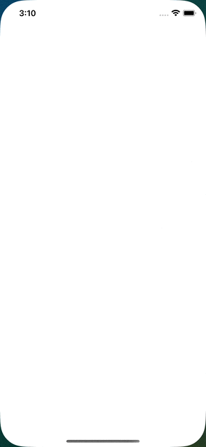

# 1. Animation cho View

## 1.1. UIView.animate() method

Một số property có thể animate bao gồm: `frame`, `bounds`, `center`, `transform`, `alpha`, `backgroundColor`, `contentMode`, `isHidden`,

```swift
    // Method 1
    class func animate(withDuration duration: TimeInterval,
                       delay: TimeInterval,
                       options: UIView.AnimationOptions = [], 
                       animations: @escaping () -> Void,
                       completion: ((Bool) -> Void)? = nil)
    
    // Method 2
    class func animate(withDuration duration: TimeInterval,
                       delay: TimeInterval,
                       usingSpringWithDamping dampingRatio: CGFloat,
                       initialSpringVelocity velocity: CGFloat,
                       options: UIView.AnimationOptions = [],
                       animations: @escaping () -> Void,
                       completion: ((Bool) -> Void)? = nil)
```

### 1.1.1. Method 1:
 
- `duration`: khoảng thời gian chạy của animation.
- `delay`: khoảng thời gian delay trước khi animation thực sự bắt đầu.
- `options` xem enum `UIView.AnimationOptions`. 1 vài case thông dụng:
  - `.curveEaseIn`: xuất phát chậm sau đó tăng tốc dần dần.
  - `curveEaseOut`: xuất phát nhanh sau đó giảm tốc dần dần về cuối.
  - `.curveEaseInOut`: kết hợp của 2 case trên, xuất phát chậm, tăng tốc ở giữa và chậm dần ở cuối.
- `animations`: là 1 closure dùng để chứa những animation chúng ta muốn thực hiện.
- `completion`: là 1 closure nhận vào 1 boolean value xác định xem animation đã finished chưa, được gọi sau khi animation chạy xong.

Minh hoạ

```swift
UIView.animate(withDuration: 1.5,
                delay: 0.5,
                options: .curveEaseInOut,
                animations: {
  // 1
  self.redView.frame.size.width -= 50
  // 2
  self.redView.center.y += 200
  // 3
  self.redView.center.x = self.view.center.x
  // 4
  self.redView.alpha = 0.4
}, completion: { finished in
  // 5
  self.redView.backgroundColor = .systemBlue
})
```

Giải thích:
1. Giảm `width` của view đi 50 px
2. Tăng toạ độ `y` của view lên 200px -> di chuyển xuống dưới 200px 
3. Set `center.x` của view bằng `center.x` của superView -> view di chuyển xuống dưới nhưng vẫn giữ nguyên toạ độ trên trục x (không bị di chuyển lệch trái)
4. Giảm `alpha` xuống 0.4
5. Sau khi kết thúc `animation` thì chuyển `backgroundColor` sang blue.


> Note: 
>
> Thứ tự của code sẽ ảnh hưởng đến kết quả của animation. Nếu như trong Minh hoạ trên, nếu (3) xảy ra trước (1) thì coi như (3) sẽ không có tác dụng và khi đó view sẽ di chuyển lệch về bên trái (`center.x` bị thay đổi) 

### 1.1.2. Method 2: sử dụng thêm `spring`
                   
Minh hoạ

```swift
UIView.animate(withDuration: 1.5,
                delay: 0.5,
                usingSpringWithDamping: 0.2,
                initialSpringVelocity: 1,
                options: .curveEaseInOut,
                animations: {
  // 1
  self.redView.frame.size.width -= 50
  // 2
  self.redView.center.y += 200
  // 3
  self.redView.center.x = self.view.center.x
  // 4
  self.redView.alpha = 0.4
}, completion: { finished in
  // 5
  self.redView.backgroundColor = .systemBlue
})
```

Giải thích:
- Giống hệt với minh hoạ trên nhưng lần này method `animate` có thêm 2 property là `usingSpringWithDamping`, `initialSpringVelocity`.
- `usingSpringWithDamping`:
  - Có thể tưởng tượng nó như 1 cái `lò xo` làm cho animation bật nảy ở cuối animation.
  - Giá trị của nó giao động từ 0.0 -> 1.0. Giá trị càng nhỏ thì độ dao động càng lớn.
- `initialSpringVelocity`: là vận tốc ban đầu của `spring` (cái này test chả hiểu gì luôn :)) )



## 1.2. UIView.animateKeyFrames() method

## 1.3. UIViewProppertyAnimator

# 2. Animate Transition View Controller

[Demo App](https://github.com/ducanh2211/IOS-Docs/tree/main/UIKit/Animation/DemoApp)

## 2.1. Convert coordinate system

- Coordinate system là gì? Có thể hiểu đây là hệ toạ độ của 1 view so với 1 object khác (có thể là chính nó, super view, window,...).
- Tại sao lại cần Coordinate system? Giả sử bây giờ chúng ta cần biết được vị trí của 1 `collection view cell` so với screen. Chúng ta không thể lấy CGReact thông qua frame vì nó là toạ độ so với `collection view` vì vậy chúng ta cần convert hệ toạ độ này sang window của screen.

```swift
class ViewController: UIViewController {
  override viewDidLoad() {
    super.viewDidLoad()
  
    let rootView = UIView(frame: CGRect(x: 25, y: 25, width: 100, height: 100))
    view.addSubview(rootView)
    
    let subView = UIView(frame: CGRect(x: 25, y: 25, width: 50, height: 50))
    rootView.addSubview(subView)
    
    let convertedReact1 = subView.convert(subView.bounds, to: view)
    let convertedReact2 = subView.superview!.convert(subView.frame, to: view)
    let convertedReact3 = rootView.convert(subView.frame, to: view)
    
    print(convertedReact1) // { x: 50, y: 50, width: 50, height: 50 }
    print(convertedReact2) // { x: 50, y: 50, width: 50, height: 50 }
    print(convertedReact3) // { x: 50, y: 50, width: 50, height: 50 }
  }
}
```

Giải thích:
- `subView` có một coordinate system của riêng nó, chính là `bounds`. 
- `subView` có coordinate system so với `superView` (`rootView`) của nó là `frame`.
- Chúng ta muốn convert toạ độ của `subView` sang `view` (ở đây chính là window) có thể thực hiện các cách sau:
  1. `subView.convert(subView.bounds, to: view)`: rectangle là `subView` sẽ được chuyển đổi từ hệ toạ độ của chính nó `bounds` sang hệ toạ độ mong muốn là `view`
  2. `subView.superview!.convert(subView.frame, to: view)`: rectangle vẫn là `subView` nhưng hệ toạ độ là so với superview (`subView.superView!`) nên rectangle phải là `frame` của `subView` (có thể hiểu chúng ta đang so sánh toạ độ của `subView` so với `superView` sau đó so sánh `superView` với `view`)
  3. Tương tự với (2) chỉ khác ở cách viết `superView`

> Note:
>
> Method `convert(_ react:, to view: UIView) -> CGReact` và `convert(_ rect: CGRect, to coordinateSpace: UICoordinateSpace)`
> Dùng để convert coordinate system (hệ toạ độ) của một rectangle (`react` parameter) sang một coordinate system khác.
> Khi pass `nil` vào parameter `view` hoặc `coordinateSpace` thì UIKit sẽ coi là method đang convert sang coordinate system của `window`

## 2.2. How Transitioning work

- Bạn có tự hỏi khi chúng ta chuyển qua lại giữa các ViewController thì điều gì xảy ra? Để trả lời cho câu hỏi này thì chúng ta sẽ đi tìm hiểu về `transitioning`.
- Dưới đây là các bước để thực hiện custom transition, nhưng chỉ áp dụng cho `present` và `dismiss`. `Navigation` và `TabBar` đều có thể custom được thông qua `UINavigationControllerDelegate` và `UITabBarControllerDelegate` (chưa tìm hiểu @@ để sau nhoé)

### 2.2.1. Tìm hiểu về transitioning API

 

Giả sử chúng ta có 2 controller: 1 là `master controller`, 2 là `detail controller`.

1. Transitioning Delegate: Mọi `ViewController` đều có một property `transitioningDelegate: UIViewControllerTransitioningDelegate?`. Mỗi khi `present` hoặc `dismiss` thì UIKit sẽ hỏi transitioning delegate của nó về 1 animation controller object. Nếu muốn custom transition thì `master controller` phải conform `UIViewControllerTransitioningDelegate` protocol và set mình là `transitioningDelegate` của `detail controller`.
2. Animation Controller: hay còn được gọi là `animator object`. Đây là class được return từ `transitioningDelegate`. Nhiệm vụ của nó là mấu chốt trong chuỗi, nó sẽ cung cấp animation cho transition. Animator object conform `UIViewControllerAnimatedTransitioning` protocol.
3. Transitioning Context: transitioning context conform `UIViewControllerContextTransitioning` protocol và đóng vai trò quan trọng trong quá trình transitioning. Nó cung cấp thông tin về `view`, `view controller` sẽ tham gia vào transitioning. Transitioning Context sẽ được UIKit config và đưa cho chúng ta sử dụng.

> Note:
>
> Làm theo các bước trên chỉ cho ta non-interactive transition. Nếu muốn user tương tác được với transition thì chúng ta còn phải implement 1 protocol khác `UIViewControllerInteractiveTransitioning`.

### 2.2.2. Quá trình Transitioning

```swift
protocol UIViewControllerTransitioningDelegate : NSObjectProtocol {
    func animationController(forPresented presented: UIViewController, presenting: UIViewController, source: UIViewController) -> UIViewControllerAnimatedTransitioning?
    func animationController(forDismissed dismissed: UIViewController) -> UIViewControllerAnimatedTransitioning?
}

protocol UIViewControllerAnimatedTransitioning : NSObjectProtocol {
    func transitionDuration(using transitionContext: UIViewControllerContextTransitioning?) -> TimeInterval
    func animateTransition(using transitionContext: UIViewControllerContextTransitioning)
}
```

1. Kích hoạt transition present hoặc dismiss
2. Nếu `present` UIKit sẽ hỏi "to viewcontroller" (`detail controller`), hoặc `dismiss` thì UIKit sẽ hỏi "from viewcontroller" (vẫn là `detail controller`) xem nó có `transitionDelegate` không. Nếu không có thì UIKit sẽ dùng built-in transition.
3. UIKit tiếp đó sẽ hỏi transition delegate object thông qua method `animationController(forPresented:presenting:source)`. Nếu method return nil thì UIKit lại dùng built-in transition, nếu không nó sẽ dùng tới animator object.
4. UIKit tạo ra transitioning context.
5. UIKit gọi method `transitionDuration(using:)` để xác định được thời gian animation.
6. UIKit gọi `animateTransition(using:)` để thực hiện animation cho transition.
 
Đối với `dismiss` thì cũng tương tự là như vậy chỉ bước (3) UIKit sẽ gọi `animationController(forDismissed:)`.

### 2.2.3. Các bước thực hiện custom transitioning

Okay concept của demo lần này là khi tap vào tableview cell trên màn `HomeViewController` sẽ present màn `DetailsViewController`.

#### a. Implement transitioning delegate 

Demo dùng storyboard nên trông hơi "đần" ae chịu khó tý.

```swift
class HomeViewController: UIViewController {
  ...

  override func prepare(for segue: UIStoryboardSegue, sender: Any?) {
    if let detailsViewController = segue.destination as? DetailsViewController,
      let recipe = sender as? Recipe {
      detailsViewController.transitioningDelegate = self
      detailsViewController.recipe = recipe
    }
  }
  
  ...
}

extension HomeViewController: UIViewControllerTransitioningDelegate {
  func animationController(forPresented presented: UIViewController,
                           presenting: UIViewController,
                           source: UIViewController) -> UIViewControllerAnimatedTransitioning? {
    return nil
  }
  
  func animationController(forDismissed dismissed: UIViewController) -> UIViewControllerAnimatedTransitioning? {
    return nil
  }
}
```

Giải thích:
- Đầu tiên chúng ta cần gán `HomeViewController` là `transitioningDelegate` của `DetailsViewController` để khi nào có transition thì UIKit sẽ hỏi tới thằng `HomeViewController` (vì là thằng delegate) xem quyết định animation khi transitioning như thế nào.
- Sau đó `HomeViewController` sẽ phải conform `UIViewControllerTransitioningDelegate` và implement 2 function (tạm thời return nil).

#### b. Tạo anmation controller

Okay giờ là tới phần nặng nhất trong quá trình. Chúng ta sẽ phải khởi tạo animation controller, class conform `UIViewControllerAnimatedTransitioning` để custom cung cấp những thông tin quan trọng như thời gian và cách thức transitioning.

```swift
class PopAnimator: NSObject, UIViewControllerAnimatedTransitioning {
  let duration: TimeInterval = 0.5
  var isPresenting = true
  var originFrame = CGRect.zero
  
  func transitionDuration(using transitionContext: UIViewControllerContextTransitioning?) -> TimeInterval {
    return duration
  }
  
  ...
}
```

Giải thích:
- `duration`: là thời gian transition cần thực hiện.
- `isPreseting`: giống hệt như cái tên của nó, nó dùng để xác định xem transition là `present` hay `dismiss` vì chúng ta dùng chung cả 2 process này trong 1 class (hoàn toàn có thể tách ra 2 class riêng biệt).
- `originFrame`: là frame của `selected cell` để giúp chúng ta keep track cell nào được user lựa chọn, phục vụ cho quá trình `dismiss`.
- `transitionDuration(using:)`: chỉ đơn giản là return lại `duration`.

#### c. Settings Transition context

Như lý thuyết đã nói, chúng ta sẽ sử dụng transition context để truy cập tới view và view controller tham qua vào quá trình transition.

Đầu tiên thì chúng ta cùng tìm hiểu transition context thực sự làm gì (khi `present`):
- Khi transition diễn ra thì transition context sẽ có 1 property `containerView` là superview của `fromView` (aka "old view") và `toView` (aka "new view") 
- Khi bắt đầu `present` thì `fromView` đã được add sẵn vào `containerView` còn `toView` tuy đã được khởi tạo nhưng nó vẫn chưa add vào `containerView`, cũng như chưa thể được nhìn thấy (hình dưới).


- Nhiệm vụ của chúng ta là ***bắt buộc*** phải add `toView` (view mà chưa visible). Trong quá trình `present`, containerView sẽ kiểm soát animation và khi kết thúc trasition nó sẽ remove "old view" (hình dưới).


- Đối với `dismiss` thì quá trình cũng tương tư nhưng `fromView` và `toView` được đổi chỗ cho nhau (hình minh hoạ trong docs của Apple).


Okay phần trên là lý thuyết, giờ ta sẽ viết code cho method `animateTransition(using:)`

```swift
  func animateTransition(using transitionContext: UIViewControllerContextTransitioning) {
    let containerView = transitionContext.containerView
    let toView = transitionContext.view(forKey: .to)!
    let fromView = transitionContext.view(forKey: .from)!
  }
```

Transition context cung cấp cho ta 2 phương thức: 
- view(forKey:): Cho phép ta truy cập vào các views của new view và old view thông qua argument UITransitionContextViewKey.from or UITransitionContextViewKey.to
- viewController(forKey): Cho phép ta truy cập vào new controller và old controller thông qua argument UITransitionContextViewKey.from or UITransitionContextViewKey.to 

> Note:
>
> Nếu sử dụng UIModalPresentationStyle.automatic thì `toView` sẽ bằng nil (chả hiểu mợ gì luôn @@).

Sau khi đã lấy được `toView` thì nhiệm vụ của chúng ta là add nó vào `containerView`:

```swift
  func animateTransition(using transitionContext: UIViewControllerContextTransitioning) {
    ...
    containerView.addSubview(toView)
    toView.transform = CGAffineTransform(scaleX: 0, y: 0)
    
    UIView.animate(
      withDuration: duration, 
      animations: {
        toView.transform = CGAffineTransform(scaleX: 1, y: 1)
      },
      completion: {
        transitionContext.completeTransition(true)
      }
    ) 
  }
```

> Note:
>
> `transitionContext.completeTransition(_:)` phải luôn luôn được gọi để thông báo transition đã kết thúc vì UIKit sẽ không tự động biết được điều này.

#### d. Present + Dismiss transition

*Thứ nhất*, trước khi tiếp tục chúng ta cùng tìm hiểu qua về method `snapshotView(afterScreenUpdates:)` của UIView:
- Method sẽ trả về 1 snapshot view dựa trên content đã được render của view hiện tại.
- Snapshot có thể hiểu như là 1 ***image*** của view tại 1 thời điểm nhất định. Nó là 1 phiên bản light-weight-baby của view thực tế và không chứa các subview.
- `afterScreenUpdates: Bool`: dùng để xác định thời điểm mà snapshot nên capture lại view. Nếu `false` thì snapshot sẽ capture lại ngay thời điểm hiện tại, nếu `true` thì nó sẽ đợi sau khi view đã update xong những thay đổi gần đây rồi mới capture.
- ***Tại sao lại cần đến snapshot view trong khi bạn có thể animate toàn bộ view? Yeah bạn cũng có cùng câu hỏi giống mình đấy. Việc animate cả 1 view đôi khi sẽ khá là expensive, để tăng hiệu năng và làm cho transition muợt hơn thì người ta sẽ ưu tiên animate snapshot :)).*** 

*Thứ hai*, tiếp tục với transition, chúng ta sẽ viết lại code trong method `animateTransition(using:)`:

```swift
  let containerView = transitionContext.containerView
  let toView = transitionContext.view(forKey: .to)!
  let fromView = transitionContext.view(forKey: .from)!
  let transitionedView = isPresenting ? toView : fromView
  let snapshotView = isPresenting ?
    transitionedView.snapshotView(afterScreenUpdates: true)! :
    transitionedView.snapshotView(afterScreenUpdates: false)!
```

Giải thích:
- `toView`: khi `present` là `DetailsViewController.view` và khi `dismiss` là `HomeViewController.view`.
- `fromView`: khi `present` là `HomeViewController.view` và khi `dismiss` là `DetailsViewController.view`.  
- `transitionedView`: là view sẽ được transit và nó ***luôn luôn*** là `DetailsViewController.view` (là view mà được presented và dismissed).
- `snapshotView`: nếu `present` thì chúng ta cần capture lại snapshot của `transitionedView` sau khi change vì ở thời điểm này `transitionedView` (lúc này là `toView`) chưa được render ra màn hình nên sẽ pass `true`. Nếu `dismiss` thì `transitionedView` (lúc này là `fromView`) đã render ra màn hình nên chúng ta sẽ capture luôn snapshot và pass `false`.

*Thứ ba*, chúng ta sẽ tính toán scale factor để transform view sao cho khớp với frame: 

```swift
  let initialFrame = isPresenting ? originFrame : recipeView.frame
  let finalFrame = isPresenting ? recipeView.frame : originFrame
  let xScaleFactor = isPresenting ? (initialFrame.width / finalFrame.width) : (finalFrame.width / initialFrame.width)
  let yScaleFactor = isPresenting ? (initialFrame.height / finalFrame.height) : (finalFrame.height / initialFrame.height)
  let scaleTransform = CGAffineTransform(scaleX: xScaleFactor, y: yScaleFactor)
```

*Thứ tư*, chúng ta sẽ setup trạng thái ban đầu cho `transitionedView` và `snapshotView`:

```swift
  if isPresenting {
    snapshotView.transform = scaleTransform
    snapshotView.center = CGPoint(x: initialFrame.midX, y: initialFrame.midY)
    snapshotView.clipsToBounds = true
  }
  snapshotView.layer.cornerRadius = 20
  snapshotView.layer.masksToBounds = true
  transitionedView.alpha = 0
  
  containerView.addSubview(toView)
  containerView.addSubview(snapshotView)
```

Giải thích: 
- `snapshotView.transform = scaleTransform`: vì `snapshotView` sẽ là view của `DetailsViewController` nên khi `present` chúng ta sẽ muốn `snapshotView` khớp với frame của tableview cell.
- `snapshotView.layer.cornerRadius = 20`: để khi `dismiss` thì `snapshotView` sẽ có `cornerRadius` giống với cell.
- `transitionedView.alpha = 0`: chúng ta sẽ ẩn đi `transitionedView` vì `snapshotView` mới thực sự được animate, khi nào animation xong thì chúng ta sẽ hiện thị lại `transitionedView`.
- Add `snapshotView` sau khi add `toView` để cho `snapshotView` sẽ hiển thị bên trên `toView` (`addSubView(_:)` sẽ add view vào hierarchy và xếp nó ở lớp trên cùng) để thực hiện animation.

> Note:
>
> ***Luôn luôn*** add `toView` vào `containerView` bất kể là `present` hay `dismiss`.   

*Thứ năm*, thêm animation:

```swift
  UIView.animate(withDuration: duration, delay: 0, animations: {
    snapshotView.transform = self.isPresenting ? .identity : scaleTransform
    snapshotView.center = CGPoint(x: finalFrame.midX, y: finalFrame.midY)
    snapshotView.layer.cornerRadius = !self.isPresenting ? 20.0 : 0.0
  }, completion: { _ in
    transitionedView.alpha = 1
    snapshotView.removeFromSuperview()
    transitionContext.completeTransition(true)
  })
```

Giải thích:
- `CGAffineTransform.identity` là khi object đó giữ nguyên và không transform gì.
- `transitionedView.alpha = 1`: hiển thị lại `transitionedView` (chỉ có ý nghĩa khi `present` vì khi `dismiss` thì kiểu gì `transitionedView` cũng sẽ bị remove)
- Remove `snapshotView` khỏi superview khi xong animation
- Thông báo cho UIKit biết transition đã xong `transitionContext.completeTransition(true)`.

#### e. Hoàn thiện nốt transitioning delegate

```swift
class HomeViewController: UIViewController {
  let animator = PopAnimator()
  ...
}

extension HomeViewController: UIViewControllerTransitioningDelegate {
  func animationController(forPresented presented: UIViewController,
                           presenting: UIViewController,
                           source: UIViewController) -> UIViewControllerAnimatedTransitioning? {
    guard let selectedIndexPathCell = tableView.indexPathForSelectedRow,
          let selectedCell = tableView.cellForRow(at: selectedIndexPathCell) as? RecipeTableViewCell
    else { return nil }
    
    let convertedFrame = selectedCell.convert(selectedCell.bounds, to: nil)
    let originFrame = CGRect(
      x: convertedFrame.origin.x + 20,
      y: convertedFrame.origin.y + 20,
      width: convertedFrame.size.width - 40,
      height: convertedFrame.size.height - 40
    )
    
    animator.originFrame = originFrame
    animator.isPresenting = true
    return animator
  }
  
  func animationController(forDismissed dismissed: UIViewController) -> UIViewControllerAnimatedTransitioning? {
    animator.isPresenting = false
    return animator
  }
}
```

Cũng không cần giải thích quá nhiều: ở đây chúng ta sẽ lấy cell được lựa chọn, và convert nó sang hệ coordinate window, tính toán 1 chút (do constraints trong demo app này) và truyền `originFrame` cùng với `isPresenting` cho `animator`.

# Reference
1. [Animations in Swift](https://medium.com/doyeona/animations-in-swift-f1ee069e21a7)
2. [Converting frames between view coordinate systems](https://medium.com/hyperoslo/converting-frames-between-view-coordinate-systems-46af928ba6c0)
3. [iOS Animation Tutorial: Custom View Controller Presentation Transitions](https://www.kodeco.com/2925473-ios-animation-tutorial-custom-view-controller-presentation-transitions#toc-anchor-007)
4. [Custom UIViewController transitions in Swift](https://medium.com/@tungfam/custom-uiviewcontroller-transitions-in-swift-d1677e5aa0bf)
5. [Introduction to Custom View Controller Transitions and Animations](https://www.appcoda.com/custom-view-controller-transitions-tutorial/)
6. BONUS [Tao hieu ung xem anh giong voi Facebook](https://viblo.asia/p/tao-hieu-ung-xem-anh-voi-uiviewcontrolleranimatedtransitioning-jvEla62d5kw)
7. [Su dung CATransform3D](https://stackoverflow.com/questions/347721/how-do-i-apply-a-perspective-transform-to-a-uiview)
