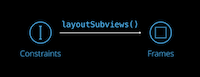
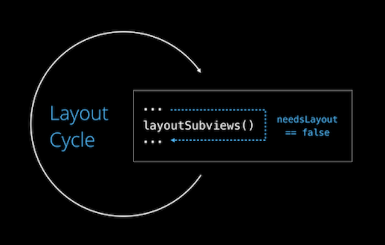

# 1. Fundamentals

- `Layout` và `Drawing` là 2 khái niệm riêng biệt:
  - `Layout` chỉ ra vị trí (position) và kích thước (size) của 1 view trên màn hình.
  - `Drawing` cụ thể view sẽ được render như thế nào.
- `Position` và `size` của 1 view thì được xác định tương đối so với `superview` của nó thông qua `frame`:
  - `Position`: frame.origin.x, frame.origin.y
  - `Size`: frame.size.width, frame.size.height
- Khi `Auto Layout` được kích hoạt thì việc set `frame` thủ công sẽ không có ý nghĩa.
  - Cụ thể hơn, thì view của bạn vẫn có thể set `frame`. Nhưng trong lần `layout pass` (chưa biết dịch sao lun) tiếp theo `frame` sẽ bị overridden.
- *Luôn nhớ* phải set `translatesAutoresizingMaskIntoConstraints = false` nếu muốn kích hoạt `auto layout`.

# 2. Layout Priorities

Mỗi constraints sẽ có 1 property `priority` thuộc kiểu `UILayoutPriority(_ rawValue: Float)`, nhận giá trị từ 1...1000. Giá trị càng cao thì constraints càng được ưu tiên.

Khi tạo mới 1 constraints bằng code hoặc interface builder thì nó sẽ được gán `rawValue = 1000`, tương đương với `UILayoutPriority.required`. `Required` có nghĩa là nó *phải* được đáp ứng, nếu như có conflict constraints thì nó làm layout bị break.

Để có thể giải quyết conflict thì bạn có thể giảm `priority` của constraint ít quan trọng hơn. Khi đó nó sẽ trở thành `optional` và được Interface buidler đại diện bằng những đường gạch chân. 


### Ví dụ

Chúng ta có 1 button với `width` là 300pt nhưng nó lại không được vượt quá `superview's width`. Chúng ta có thể tạo constraints như sau:

button.width = 300              // priority: 999
button.width &lt superview.width // priority: 1000

Vì `button.width = 300` là `optional constraints` nên nếu như xảy ra conflict (khi superview.width &lt 300) thì nó sẽ bị loại bỏ.

### Default priorities

Có một vài default priorities hay sử dụng:
- UILayoutPriority.requỉed      // 1000
- UILayoutPriority.defaultHigh  // 750
- UILayoutPriority.defaultLow   // 250

Theo nguyên tắc, khi thay đổi `priority` của constraint thì nên bắt đầu từ những default priorities này và chỉ tăng hoặc giảm nhẹ giá trị nếu cần. Để biết thêm về `defaultHigh` và `defaultLow` thì đọc phần *Content Hugging & Compression Resistance*.

# 3. Instrinsic Content Size

Nếu như chúng ta chỉ dùng constraints để tạo layout thì mỗi view sẽ cần ít nhất tới 4 constraints. Vì vậy, UIKit cung cấp cho chúng ta một số components với `instrinsic content size`. Có thể hiểu nó là size tự nhiên cho của view, `size` mà được system cung cấp và sẽ được ưu tiên sử dụng mà không cần chúng ta xác định cụ thể `size`. Nó là một property của UIView và có thể bị override.

### Ví dụ

Dưới đây là `instrinsic content size` của một số UIView phổ thông:


### Cách thức hoạt động

Không có gì quá đặc biệt dối với `intrinsic content size`. Thực tế là qua mỗi *layout pass* hệ thống sẽ tạo constraints cho `intrinsic content size`. Những constraints này đều là optional. Do đó, nó chỉ được áp dụng khi bạn không thêm bất kỳ constraints nào (với `priority` cao hơn).

Sức mạnh của `intrinsic content size`: nếu như bạn chỉ constraint `position` của view mà không có `size` thì hệ thống sẽ tự động áp dụng `intrinsic content size`. Nếu như bạn constraint thêm của `size` thì constraint của bạn sẽ được ưu tiên mà không gây ra bất cứ conflict nào. 

# 4. Content Hugging & Compression Resistance

Khi tôi nói rằng hệ thống sẽ tạo optional constraints cho `intrinsic content size`, bạn có thể nghĩ đến một constraint đơn giản như thế này chẳng hạn (chúng ta chỉ xét đến horizontal dimension):

 

Nhưng trên thực tế nó không hề đơn giản như vậy. Nếu chỉ có 1 constraint cho `intrinsic content size` nó không thể đáp ứng yêu cầu từ system và sẽ bị bị qua, khiến cho view có size không xác định. Vì vậy, trên thực tế `intrinsic content size` (đối với 1 dimension) sẽ được đại diện bởi 2 *inequality constraints*:


Constraint đầu tiên (lớn hơn hoặc bằng) được gọi là ***compression resistance***, vì nó chỉ ra rằng `width` của view sẽ không được phép nhỏ hơn `instrinsic content width` của chính nó. 

Constraint thứ hai (nhỏ hơn hoặc bằng) được gọi là ***content hugging***, vì nó chỉ ra rằng `width` của view sẽ không được phép lớn hơn `instrinsic content width` của chính nó. 

Có thể thấy ***Compression Resistance và Content Hugging*** có cái tên nói lên hết ý nghĩa của nó. Constraint đầu tiên thì sẽ "đẩy" bounds của view từ bên trong do đó nó chống lại mọi nỗ lực nén (compress) view nhỏ hơn, trong khi đó constraint thứ hai thì "kéo" bounds của view vào center của nó.

 

Trong hầu hết tình huống khi view lớn hơn `intrinsic content size` là bình thường vì mọi content của view vẫn được hiển thị đầy đủ. Nhưng trong trường hợp view nhỏ hơn `intrinsic content size` thì content có thể bị cắt xén.

Do đó mặc định `priority` của `compression resistance constraint` sẽ lớn hơn của `content hugging constraint`:
- Compression Resistance Default Priority = UILayoutPriority.defaultHigh  (750)
- Content Hugging Default Priority = UILayoutPriority.defaultLow  (250)

Để thay đổi `priority` của 1 view chúng ta có thể dùng:
- Interface Builder: vào `size inspector` 


- Code: `setContentHuggingPriority(_ priority: UILayoutPriority, for axis: NSLayoutConstraint.Axis)` và `setContentCompressionResistancePriority(_ priority: UILayoutPriority, for axis: NSLayoutConstraint.Axis)`

# 5. Layout Pass

### layoutSubviews()

Đây là method mà "magic" xảy ra: layoutSubviews() sẽ dựa trên tất cả constraints của view's subviews để tính toán và chuyển chúng thành `frame`.

Như đã nói từ trước, mỗi constraints được đại diện bằng 1 phương trình tuyến tính. Điều xảy ra "behind the scenes" là system sẽ giải một loạt các phương trình tuyến tính cho chúng ta. Đây được gọi là `layout pass`. Trong mỗi 1 `layout pass` method `layoutSubviews()` sẽ được gọi để tính toán `frame` cho subviews.



### Layout Algorithm

Bởi vì constraints còn bị phụ thuộc vào `priority` nên "layout engine" không thể giải quyết tất cả các phương trình tuyến tính cùng một thời điểm. Mà nó tuân thủ theo thuật toán:
1. Bắt đầu với `priority` cao nhất (1000)
2. Giải quyết tất cả các constraints có cùng `priority`
3. Kiểm tra xem layout có bị "ambigious" không?
 - Có: `priority -= 1` và quay lại step 2
 - Không: layout hoàn thành

Hiểu được thuật toán này là hiểu được cách hoạt động của `priority`. Nhiều developers nghĩ rằng những constraint mà `priorty` &lt 1000 vẫn có tác động lên layout ngay cả khi layout không bị ambigious (non-ambigious). Nhưng điều này không đúng, ngay khi layout không bị ambigious thì tất cả constraints có `priority` thấp hơn sẽ bị bỏ qua. 

Bạn luôn luôn nên cố gắng tạo nôn-ambigious layout với *required constraints* và chỉ thực sự giảm `priority` khi bạn muốn chúng bị phá vỡ trong một vài trường hợp cụ thể.

Một điều quan trọng nữa, nếu như không thể đáp ứng *optinal constraint*, *layout engine* sẽ cố đạt được sát nhất có thể kết quả mong muốn.  

### Invalidate and Force an intermediate layout pass (`setNeedsLayout()` và `layoutIfNeeded()`)

#### Invalidate layout

UIKit có cơ chế ngầm: nếu layout bị đánh dấu (gọi là *flag needsLayout* cho dễ nhoé, *tên này tác giả tự bịa ra cho nó dễ hình dung thôi nha*) là `invalid` thì nó sẽ tính toán lại layout (gọi lại `layoutSubviews()`). Chúng ta có thể thay đổi *flag* bằng method `setNeedsLayout()`, nó sẽ `invalid` layout. Tuy nhiên, layout sẽ không bị tính toán lại *ngay lập tức*, UIKit sẽ lên lịch cho nó được update trong lần `layout cycle` *tiếp theo*.



> Note:
>
> `setNeedsLayout()` sẽ không kích hoạt layout pass ngay lập tức. Nó chỉ invalidate layout và sẽ tự động tính toán lại layout trong lần "layout cycle" tiếp theo.

#### Force intermediate layout 

Vậy nếu như bạn muốn layout thay đổi ngay lập tức thì phải làm thế nào? Câu trả lời nằm ở method `layoutIfNeeded()`.

Khi gọi method này, nó giống như việc system kích hoạt lại layout cycle nên layout sẽ được tính toán lại *ngay lập tức*. Tuy nhiên layout chỉ được tính toán lại nếu như nó được đánh dấu là `invalid` trước đó. Vậy nên cặp đôi: `setNeedsLayout()` và `layoutIfNeeded()` cần được gọi để tính toán lại layout.

Trên thực tế, UIKit sẽ tự động gọi `setNeedsLayout()` mỗi khi chúng ta: thay đổi constraints hiện tại, xoá hoặc thêm constraints mới, xoá hoặc thêm view trong view hierarchy. Nên công việc của chúng ta là chỉ cần gọi `layoutIfNeeded()` nếu muốn thay đổi layout.

#### Ví dụ

Oke, ví dụ như sau: chúng ta có 1 view có sẵn size và position nằm giữa màn hình, khi bấm vào view nó sẽ thay đổi constraint `centerY`. Chúng ta sẽ cùng xem xét 2 trường hợp: A. không gọi `layoutIfNeeded()` và B. gọi `layoutIfNeeded()` 

A. 

```swift
  override func viewDidLayoutSubviews() {
    super.viewDidLayoutSubviews()
    print("recalculate")
  }

  @objc func redViewTapped() {
    self.redViewYConstraints.constant = 200
    
    UIView.animate(withDuration: 1.5, delay: 0, options: .curveEaseInOut) {
      
    } completion: { _ in
      print("complete")
    }
  }
```

Kết quả:


B. 

```swift
  override func viewDidLayoutSubviews() {
    super.viewDidLayoutSubviews()
    print("recalculate")
  }

  @objc func redViewTapped() {
    self.redViewYConstraints.constant = 200
    
    UIView.animate(withDuration: 1.5, delay: 0, options: .curveEaseInOut) {
      self.view.layoutIfNeeded()
    } completion: { _ in
      print("complete")
    }
  }
```

Kết quả:


Kết luận:

Dựa trên ảnh gif cùng với console ta có thể kết luận:
- `self.redViewYConstraints.constant = 200` sẽ invalid constraint cũ.
- (A) không có `layoutIfNeeded()` nên layout được tính toán lại (chứng tỏ `setNeedsLayout()` đã được gọi) sau khi animate kết thúc làm cho không có animation nào hết (theo console thì "recalculate" -> "complete" -> "recalculate").
- (B) Dựa trên console "recalculate" -> "recalculate" -> "complete" chứng tỏ ngay khi `setNeedsLayout()` được gọi thì `layoutIfNeeded()` đã bắt buộc layout engine tính toán lại ngay lập tức trước khi animate hoàn thành. Do đó, chúng ta có thể thấy được animation của view.

# Reference:
1. [Why calling setNeedsUpdateConstraints isn't needed for constraint changes or animations?](https://stackoverflow.com/questions/47823639/why-calling-setneedsupdateconstraints-isnt-needed-for-constraint-changes-or-ani)
2. [UIKonf 2017 – Day 2 – Mischa Hildebrand – Auto Layout: From Trailing to Leading](https://www.youtube.com/watch?v=xjArhdrqAn8&t=1200s&ab_channel=UIKonf)
3. [The Auto Layout Comprehendium](https://mischa-hildebrand.de/en/2017/11/the-auto-layout-comprehendium/)
