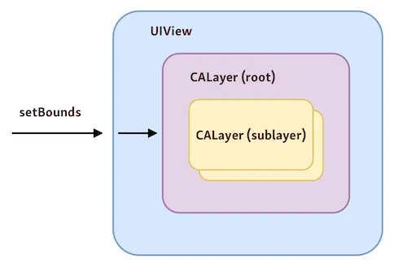

# CALayer

UIView được hỗ trợ (backed by) CALayer. Layers offer low-level interface để hiển thị nội dung trực quan. Khi chúng ta cần flexible hoặc performance, thì có thể settings layer.

### 1. Sự khác biệt giữa UIView vs CALayer

#### 1.1. UIView

Views có hierarchy layouts lằng nhằng hơn. Có thể sử dụng đến `Auto layout` để lay out (sắp xếp) trên screen.

Views có thể nhận sự kiện người dùng (user interactions) như tap, pinch,...

Views thì luôn luôn được xử lý trên main thread. Tức là nó sử dụng tới sức mạnh của CPU.

#### 1.2. CALayer

Layers thì có hierarchy đơn giản hơn. Đồng nghĩa với việc nó được ***draw*** trên màn hình nhanh hơn. 

Layers on other hand have simpler hierarchy. That means they are faster to resolve and quicker to draw on the screen.

CALayer không có custom logic theo mặc định. Tức là nó không flexible và có ít class để subclass hơn.

Layers được ***draw*** trực tiếp trên GPU. Nó được xử lý trên 1 thread khác mà không làm gánh nặng cho CPU

#### 1.3. Tóm lại

`UIView` xử lý nhiều thứ bao gồm layout và touch events. Tuy nhiên, views không trực tiếp kiểm soát *draw* hoặc *animation*. UIKit sẽ delegate task đó cho Core Animation bằng việc sử dụng `CALayer`. `UIView` chỉ là một vỏ bọc (wrapper) của `CALayer`.

Mỗi `UIView` thì có một root `CALayer` mà có thể chứa nhiều sublayer khác. Khi set bounds property trên 1 view thì nó sẽ set bounds cho layer đằng sau của nó. Nếu bạn call `layoutIfNeeded()` trên `UIView` thì nó sẽ chuyển call tới root `CALayer`.

### 2. 

# Reference

1. [CALayer Tutorial for iOS: Getting Started](https://www.kodeco.com/10317653-calayer-tutorial-for-ios-getting-started#toc-anchor-002)
2. [CALayer tutorial](https://viblo.asia/p/calayer-tutorial-for-ios-getting-started-ORNZqjyLl0n)
3. [A Beginner’s Guide to CALayer](https://www.appcoda.com/calayer-introduction/)

