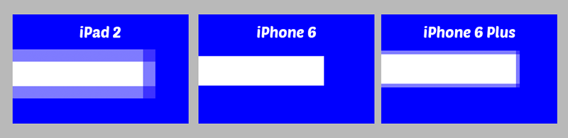
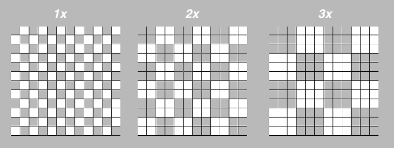
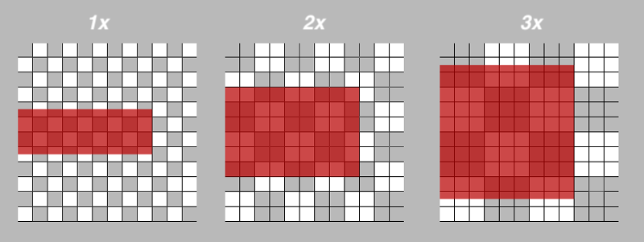

## Drawing a button

Để có thể vẽ shape trong Core Graphics, bạn cần tạo 1 `path` để cho `Core Grpahics` có thể trace và track.

3 điều cơ bản cần biết về path là:
- Path có thể thuộc kiểu `stroked` hoặc `filled`.
- Stroke path là path được tô màu đường viền (stroke). 
- Fill path là path được tô màu toàn bộ (fill).

1 cách dễ dàng để tạo 1 `Core Graphics` path là sử dụng class `UIBezierPath`. Path có thể được vẽ dự trên lines, curves, rectangles hoặc 1 chuỗi các connected points.

```swift
override func draw(_ rect: CGRect) {
  let path = UIBezierPath(ovalIn: rect)
  UIColor.green.setFill()
  path.fill()
}
```

Đoạn code trên tạo ra 1 hình *oval* có màu `green`. Và có size bằng `rect` `(100, 100)` (size của view) nên nó sẽ render ra hình tròn.

Do path không draw gì cả, nên có thể define chúng mà không cần dùng đến `drawing content`. To draw the path, you set a fill color on the current context and then fill the path.

## Under the hood

Mỗi `UIView` đều có 1 `graphic context`. *Drawing* trên 1 view sẽ được render trên `context` trước khi được chuyển sang phần cứng của device.

iOS updates `context` bằng cách gọi tới method `draw(_:)` mỗi khi views cần được update. Điều này xảy ra khi:
- View hiện tại lần đầu được xuất hiện trên screen.
- Other views nằm trên top của view hiện tại bị dịch chuyển.
- `isHidden` property thay đổi.
- Khi gọi tới `setNeedsDisplay()` hoặc `setNeedsDisplayInRect()`.

> Note: Mọi hành động draw tại method `draw(_:)` sẽ được lưu vào `graphic congtext`. Nếu như muốn draw bên ngoài method `draw(_:)`, bạn cần phải tự tạo ra `graphics context`.

Trong tutorial này, bạn sẽ chưa sử dụng tới `Core Graphics` bởi vì `UIKit` có rất nhiều wrappers cho `Core Graphics` functions. Ví dụ, `UIBezierPath` chính là wrapper cho `CGMutablePath`.

> Note: 
>
>- *Không bao giờ* được phép gọi `draw(_:)` trực tiếp. Nếu như view không update thì cần gọi `setNeedsDisplay()`. 
>
> - Method này sẽ không gọi tới `draw(_:)`, nhưng mà nó `flags` (đánh dấu) view cần được redrawn trong lần update screen cycle tiếp theo. Ngay cả khi bạn gọi `setNeedsDisplay()` 5 lần trong cùng 1 method, nó chỉ gọi `draw(_:)` 1 lần duy nhất.

## Drawing into the context

Core Graphics uses what’s called a “painter’s model”. When you draw into a context, it’s almost like making a painting. You lay down a path and fill it, and then lay down another path on top and fill it. You can’t change the pixels that have been laid down, but you can paint over them.

This image from Apple’s documentation shows how this works. Just like painting on a canvas, the order in which you draw is critical.

Việc *draw* vào `context` cũng giống như việc vẽ tranh. Tức là, bạn sẽ tạo ra 1 path vào fill màu, sau đó bạn tạo 1 path khác nằm trên và fill màu. Bạn không thể thay đổi pixel đã được vẽ trước đó nhưng có thể vẽ đề lên trên.

Hình ảnh minh hoạ từ Apple documentation. Cũng giống như việc vẽ tranh, *thứ tự vẽ* đóng vai trò cực kỳ quan trọng.


**Custsom Button class**

```swift
class PushButton: UIButton {

	private struct Constants {
		static let plusLineWidth: CGFloat = 4.0
		static let plusButtonScale: CGFloat = 0.6
		static let halfPointShift: CGFloat = 0.5
	}

	private var halfWidth: CGFloat {
		return bounds.width / 2
	}

	private var halfHeight: CGFloat {
		return bounds.height / 2
	}

	override func draw(_ rect: CGRect) {

		// 1. Draw circle
		let path = UIBezierPath(ovalIn: rect)
		UIColor.systemPink.setFill()
		path.fill()

		// 2. Draw plus sign
		//set up the width and height variables for the horizontal stroke
		let plusWidth = min(bounds.width, bounds.height) * Constants.plusButtonScale
		let halfPlusWidth = plusWidth / 2

		let plusPath = UIBezierPath()

		//set the path's line width to the height of the stroke
		plusPath.lineWidth = Constants.plusLineWidth

		//move the initial point of the path to the start of the horizontal stroke
		plusPath.move(to: CGPoint(x: halfWidth - halfPlusWidth, y: halfHeight))

		//add a point to the path at the end of the stroke
		plusPath.addLine(to: CGPoint(x: halfWidth + halfPlusWidth, y: halfHeight))

		UIColor.white.setStroke()
		plusPath.stroke()
	}

}
```

Đây là kết quả của line vừa draw trên các device khác nhau. Tại sao trên iPad và iphone 6 plus lại bị nhoè. Để giải thích thì đọc tiếp [phần sau](#analyzing-points-and-pixels)



## Analyzing Points and Pixels

Từ thời xưa khi chưa có màn hình retina thì `point` và `pixel` trong iPhone là tương đương nhau tức *1 point = 1 pixel*. Tuy nhiên sau này, màn hình retina có scale *1x, 2x, 3x* thì `1 point` có thể chứa nhiều hơn `1 pixel`.



Mỗi chấm trắng và xám đại diện cho 1 point
- Với 1x, 1 point = 1 pixel.
- Với 2x, 1 point = 4 pixels.
- Với 3x, 1 point = 9 pixels.

Line mà bạn vừa mới vẽ trong cusom button trên có height là *3 points*.
Vì draw sẽ vẽ tính từ *center line* tức là mỗi bên sẽ tương đương *1.5 points*



Nếu bạn có 1 line mà hơi dị thì bạn cần *position* line +- 0.5 point

Trong `draw(_:)`, chỉnh sửa `move(to:)` và `addLine(to:)` thành:

```swift
//move the initial point of the path
//to the start of the horizontal stroke
plusPath.move(to: CGPoint(
  x: halfWidth - halfPlusWidth + Constants.halfPointShift,
  y: halfHeight + Constants.halfPointShift))
    
//add a point to the path at the end of the stroke
plusPath.addLine(to: CGPoint(
  x: halfWidth + halfPlusWidth + Constants.halfPointShift,
  y: halfHeight + Constants.halfPointShift))

```

Thêm vertical line trong `draw(_):`

```swift
//Vertical Line
plusPath.move(to: CGPoint(
  x: halfWidth + Constants.halfPointShift,
  y: halfHeight - halfPlusWidth + Constants.halfPointShift))
      
plusPath.addLine(to: CGPoint(
  x: halfWidth + Constants.halfPointShift,
  y: halfHeight + halfPlusWidth + Constants.halfPointShift))

```

# REFERENCE
1. [Su dung CATransform3D](https://stackoverflow.com/questions/347721/how-do-i-apply-a-perspective-transform-to-a-uiview)
