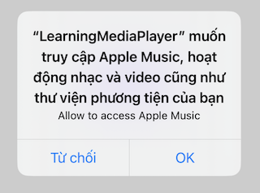

# Media Player

## 1. Request Permisson

Access to the music library requires authorization from the user. You’ll need to include in your Info.plist a meaningful entry under the “Privacy — Media Library Usage Description” key (NSAppleMusicUsageDescription) justifying to the user your desire for access, to be displayed in the authorization alert that will be presented to the user on your behalf (Figure 17-1).

Truy cập vào Music Library yêu cầu authorization từ user. 

1. Trong file `Info.plist` nhập key “Privacy — Media Library Usage Description” (NSAppleMusicUsageDescription): 

 

2. Gửi request permission nếu user chưa authorization.

```swift
func checkForMusicLibraryAccess(completion:(()->())? = nil) {
    // check for authorization
    let status = MPMediaLibrary.authorizationStatus()
    switch status {
    case .authorized:
        // already have it, proceed directly
        completion?() 
    case .notDetermined:
        // request authorization
        MPMediaLibrary.requestAuthorization() { status in
            if status == .authorized {
                DispatchQueue.main.async {
                    // got it, proceed asynchronously
                    completion?() 
                }
            }
        }               
    case .restricted: 
        // do nothing
        break 
    case .denied: 
        // do nothing, or beg for authorization
        break 
    @unknown default: 
        fatalError()
    }
}
```

## 2. Exploring the Music Library

Everything in the user’s music library, as seen by your code, is an MPMediaEntity. This is an abstract class. It has two concrete subclasses:

- `MPMediaItem`
An MPMediaItem is a single item (a “song”).

- `MPMediaItemCollection`
An MPMediaItemCollection is an ordered list of MPMediaItems. It has `items` property hold an array of `MPMediaItem`.

Có thể sử dụng KVC để fetch được các property của 1 instance `MPMediaItem`, `MPMediaPlaylist`:

```swift
    // Returns the value for the given entity property.
    // MPMediaItem and MPMediaPlaylist have their own properties
    // Fetch only one property at a time.
    func value(forProperty property: String) -> Any?

    // Executes a provided block with the fetched values for the given item properties, or nil if no value is available for a property.
    // In some cases, enumerating the values for multiple properties can be more efficient than fetching each individual property with -valueForProperty:.
    func enumerateValues(forProperties properties: Set<String>, using block: @escaping (String, Any, UnsafeMutablePointer<ObjCBool>) -> Void)
```

Ví dụ:  Truy cập vào `title` property của `MPMediaItem` có 2 cách:
- myItem.value(forProperty:MPMediaItemPropertyTitle) 
- myItem.title

Thông thường thì sẽ dùng cách 2 để cho ngắn gọn. Tuy nhiên trong trường hợp khởi tạo `MPMediaPropertyPredicate` thì bắt buộc phải sử dụng cách 1.

### 2.1. Querying the Music Library

#### 2.1.1. Forming a query

Có 2 cách để tạo 1 query:

- Cách 1: 

Cách này sẽ query tất cả media trong music library mà không có điều kiện.

```swift
let query: MPMediaQuery = MPMediaQuery()
``` 

Để có thể thêm hoặc xoá điều kiện khi query ta sẽ dùng đến:

```swift
func addFilterPredicate(_ predicate: MPMediaPredicate)
func removeFilterPredicate(_ predicate: MPMediaPredicate)
```

`MPMediaPropertyPredicate` là concrete subclass của `MPMediaPredicate`, nó cho phép ta tạo 1 predicate để lọc điều kiện trong 1 media query.

```swift
class MPMediaPropertyPredicate : MPMediaPredicate {

    /*not inherited*/ init(value: Any?, forProperty property: String) // comparisonType is MPMediaPredicateComparisonEqualTo

    /*not inherited*/ init(value: Any?, forProperty property: String, comparisonType: MPMediaPredicateComparison)
    
    var property: String { get }    
    
    var value: Any? { get } 
    
    var comparisonType: MPMediaPredicateComparison { get }
}

enum MPMediaPredicateComparison : Int, @unchecked Sendable {    

    case equalTo = 0

    case contains = 1
}
```

Ví dụ: 

```swift
let predicate: MPMediaPropertyPredicate = MPMediaPropertyPredicate(value: songId, forProperty: MPMediaItemPropertyPersistentID)

let query: MPMediaQuery = MPMediaQuery()

query.addFilterPredicate(predicate)
```

- Cách 2: Convinience constructor

`MPMediaQuery` cung cấp một vài class methods dùng để khởi tạo query mà giới hạn group type (đọc thêm trong docs Apple) 

```swift
open class func albums() -> MPMediaQuery

open class func artists() -> MPMediaQuery

open class func songs() -> MPMediaQuery

open class func playlists() -> MPMediaQuery

open class func podcasts() -> MPMediaQuery

open class func audiobooks() -> MPMediaQuery

open class func compilations() -> MPMediaQuery

open class func composers() -> MPMediaQuery

open class func genres() -> MPMediaQuery
```

#### 2.1.2. Performing a query

Sau khi tạo query chúng ta có thể lấy ra được media thông qua properties:

```swift
public enum MPMediaGrouping : Int, @unchecked Sendable {

    case title = 0

    case album = 1

    case artist = 2

    case albumArtist = 3

    case composer = 4

    case genre = 5

    case playlist = 6

    case podcastTitle = 7
}
```

```swift
class MPMediaQuery {

    var items: [MPMediaItem]? { get }

    var collections: [MPMediaItemCollection]? { get }

    var groupingType: MPMediaGrouping 
}
```

Giải thích:
- `items`: `query` trả về 1 array của `MPMediaItem` (đại diện cho 1 song).
- `collections`: `query` trả về 1 array của `MPMediaItemCollection`, mỗi phần tử là 1 group.
- `groupingType`: là 1 enum dùng để xác định xem `query` sẽ nhóm `collections` theo kiểu nào. Default value là `.title`. 

VD1: 

```swift
// `Collections` sẽ được group theo từng album

// Cách 1
let albumsQuery: MPMediaQuery = MPMediaQuery.albums()

// Cách 2
let query: MPMediaQuery = MPMediaQuery()
query.groupingType = .album
```

**`representativeItem`** 

```swift
class MPMediaItemCollection  {
    var representativeItem: MPMediaItem? { get }
}
```

`representativeItem` thuộc kiểu `MPMediaItem` là item đại diện cho toàn bộ 1 collection, nó cho phép ta truy cập vào metadata và các properties của cả 1 collection.

Lý do chúng ta cần sử dụng `representativeItem` bởi vì những properties của 1 collection được hiện diện trong `items` chứ không nằm trong bản thân thằng collection. Do đó, nếu không có `representativeItem` thì chúng ta cần lặp qua các phần tử trong `items` để truy xuất properties.

VD2: Lấy tất cả các album

```swift
// form the query
let query = MPMediaQuery.albums() 

// perform the query
guard let result = query.collections else {return} 

// prove we've performed the query, by logging the album titles
for album in result {
    print(album.representativeItem!.albumTitle!)
}

/* Result:
Bach, CPE, Symphonies
Beethoven Canons
Beethoven Dances
Scarlatti Continuo
*/
```

VD3: Lấy tất cả những album có "Beethoven"

```swift
let query = MPMediaQuery.albums()
let hasBeethoven = MPMediaPropertyPredicate(value:"Beethoven",
    forProperty: MPMediaItemPropertyAlbumTitle,
    comparisonType: .contains)
query.addFilterPredicate(hasBeethoven)
guard let result = query.collections else { return }
for album in result {
    print(album.representativeItem!.albumTitle!)
}
/*
Beethoven Canons
Beethoven Dances
*/
```

### 3. Persistence and Change in the Music Library

(Lười dịch quá)

One of the properties of an MPMediaEntity is its persistentID, which uniquely identifies it. All sorts of things have persistent IDs — entities in general, songs (media items), albums, artists, composers, and more. Two songs or two playlists can have the same title, but a persistent ID is unique. It is also persistent: using the persistent ID, you can retrieve again at a later time the same song or playlist you retrieved earlier, even across launches of your app.

While you are maintaining the results of a search, the contents of the music library may themselves change. For instance, the user might connect the device to a com‐ puter and add or delete music manually. This can put your results out of date. For this reason, the library’s own modified date is available through the MPMediaLibrary class. Call the class method default to get the actual library instance; now you can ask for its lastModifiedDate.

You can also register to receive a notification, .MPMediaLibraryDidChange, when the music library is modified. This notification is not emitted unless you first call the MPMediaLibrary instance method beginGeneratingLibraryChangeNotifications; you should eventually balance this with a call to endGeneratingLibraryChange- Notifications.

