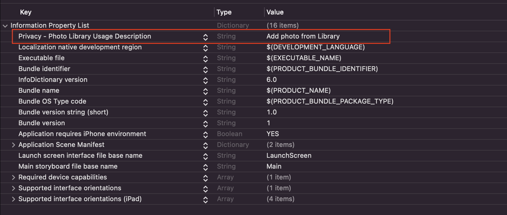
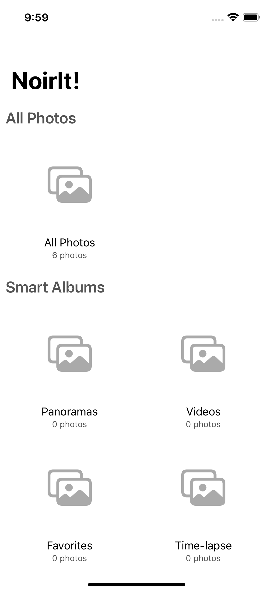

# PhotoKit

[Demo App](https://github.com/ducanh2211/IOS-Docs/tree/main/UIKit/PhotoKit/DisplayImageApp)

Là framework cho phép truy cập và lấy ra được media từ user library.

> Note: Nếu như không cần user cấp quyền truy cập vào toàn bộ library, hoặc không muốn custom photo picker, hoặc app chỉ cần read-access để truy cập vào library thì nên sử dụng `PHPickerViewController` (thay thế `UIImagePickerController` từ IOS 14). `PHPickerViewController` hỗ trợ search, chọn nhiều photo và video. Hơn nữa nó được quản lý bởi hệ thống trong 1 process riêng nên user không cần cấp quyền truy cập vì nó là private.

```swift
class AlbumCollectionViewController: UICollectionViewController {

  var sections: [AlbumCollectionSectionType] = [.allPhotos, .smartAlbums, .userCollections]

  override func viewDidLoad() {
    super.viewDidLoad()
    
    self.getPermissionIfNecessary { granted in
      guard granted else { return }
      self.fetchAssets()
      DispatchQueue.main.async {
        self.collectionView.reloadData()
      }
    }
  }
  
}

extension AlbumCollectionViewController: UICollectionViewDatasource {
  ...
}
```

 
### Bước 1: Request Authorization
 
Để có thể gửi request authorization đầu tiên cần config file Info.plist
Thêm key `NSPhotoLibraryUsageDescription` và nhập description.




```swift
func getPermissionIfNecessary(completionHandler: @escaping (Bool) -> Void) {
  // 1
  guard PHPhotoLibrary.authorizationStatus(for: PHAccessLevel.readWrite) == .authorized else {
    completionHandler(true)
    return
  } 
  
  // 2
  PHPhotoLibrary.requestAuthorization(for: .readWrite) { status in
    switch status {
      case .authorized:
        completionHandler(true)
      case .notDetermined, .restricted, .denied, .limited:
        completionHandler(false)
      @unknown default:
        completionHandler(false)
    }
  }
}
```

Giải thích: 
1. Check xem photo library đã được authorized chưa, nếu chưa thì sẽ gửi request. 
2. Gửi request authorization với read-write access level tới user library (nếu chỉ cần thêm thì dùng `.addOnly`).

> Note: Nên handle những case khác ngoài `.authorized`.

### Bước 2: Fetching Asset và Asset Collections

#### Asset là gì?

- Mặc dù chúng ta muốn lấy image để hiển thị, tuy nhiên khi làm việc với `PhotoKit` thì chúng ta sẽ thao tác chủ yếu với `PHAssset`.
- `PHAsset` đại diện cho 1 image hoặc 1 video. Nó là immutable, chứa metadata của image, không bao gồm image nhưng lại cung cấp thông tin cần thiết để lấy được image. 
- Tại sao lại cần `PHAsset`? Bời vì ảnh trong library bao gồm: still image (ảnh tĩnh), live photo, video nên không thể giới hạn trong  `UIImage`. Hơn nữa image cũng bao gồm `metadata` chứa ngày chụp, ngày chỉnh sửa, vị trí địa lý, favorite, trạng thái hidden.
- Bên cạnh đó còn có: `PHAssetCollection` chứa collection assets đại diện cho `user album`, `smart album`, `momments` và `PHCollectionList`. 

#### Fetching assets

```swift
var allPhotos = PHFetchResult<PHAsset>()
var smartAlbums = PHFetchResult<PHAssetCollection>()
var userCollections = PHFetchResult<PHAssetCollection>()
```

Giải thích:
- Chúng ta tạo ra 3 properties để lưu trữ giá trị khi fetch asset từ library.
- `PHFetchResult` có thể được coi như là một array đặc biệt chuyên dùng để handle fetching data, caching data hoặc re-fetch data. 

```swift
func fetchAssets() {
  // 1
  let allPhotosOptions = PHFetchOptions()
  allPhotosOptions.sortDescriptors = [
    NSSortDescriptor(key: "creationDate", ascending: false)
  ]
  
  // 2
  allPhotos = PHAsset.fetchAssets(with: allPhotosOptions)
      
  // 3
  smartAlbums = PHAssetCollection.fetchAssetCollections(
    with: PHAssetCollectionType.smartAlbum,
    subtype: PHAssetCollectionSubtype.albumRegular,
    options: nil)
  
  // 4
  userCollections = PHAssetCollection.fetchAssetCollections(
    with: PHAssetCollectionType.album,
    subtype: PHAssetCollectionSubtype.albumRegular,
    options: nil)
}
```

Giải thích:
1. Tạo ra `PHFetchOptions` để fetch assets. Có một số properties cần chú ý:
  -  `predicate: NSPredicate`: `NSPredicate(format: "mediaType = %d", PHAssetMediaType.video.rawValue)` sẽ fetch tất cả asset thuộc type video.
  - `sortDescriptors: [NSSortDescriptor]`: `NSSortDescriptor(key: "creationDate", ascending: true)` sẽ fetch tất cả asset tăng dần theo ngày khởi tạo.
  - `fetchLimit: Int`: số lượng assets tối đa khi fetch.
  > Note: `key` và `format` trong `sortDescriptors` và `predicate` là property của `PHAsset`.   
2. Fetch assets dựa trên `allPhotosOptions` thuộc tất cả các type `PHAssetMediaType` (image, audio, video). Nếu muốn cụ thể type thì có thể dùng method `fetchAssets(with mediaType: PHAssetMediaType, options: PHFetchOptions?) -> PHFetchResult<PHAsset>`.
3. Fetch collection assets, thuộc type `smartAlbum` loại album được tự động tạo ra do system.
4. Fetch collection assets, thuộc type `album` loại album được user tạo ra.

### Bước 3: Display images

#### Configure collection view cell

```swift
func collectionView(_ collectionView: UICollectionView, cellForItemAt indexPath: IndexPath) -> UICollectionViewCell {
  // 1
  let cell = collectionView.dequeueReusableCell(
    withReuseIdentifier: AlbumCollectionViewCell.reuseIdentifier,
    for: indexPath) as! AlbumCollectionViewCell
  
  // 2
  var coverAsset: PHAsset?
  let sectionType = sections[indexPath.section]
  
  switch sectionType {
  // 3
  case .allPhotos:
    coverAsset = allPhotos.firstObject
    cell.update(title: sectionType.description, count: allPhotos.count)
  // 4
  case .smartAlbums, .userCollections:
    let collection = (sectionType == .smartAlbums)
      ? smartAlbums[indexPath.item]
      : userCollections[indexPath.item]
    let fetchedAssets = PHAsset.fetchAssets(in: collection, options: nil)
    coverAsset = fetchedAssets.firstObject
    cell.update(title: collection.localizedTitle, count: fetchedAssets.count)
  }
  
  // 5
  guard let asset = coverAsset else { return cell }
  cell.photoView.fetchImageAsset(asset, targetSize: cell.bounds.size) { success in
    cell.photoView.isHidden = !success
    cell.emptyView.isHidden = success
  }
  
  return cell
}
```

Giải thích:
1. Dequeue cell.
2. `coverAsset` được dùng làm ảnh bìa cho từng album trong mỗi `section`.
3. Case `.allPhotos`: lấy ra `PHAsset` object đầu tiên từ `allPhotos` thuộc kiểu `PHFetchResult<PHAsset>`. Sau đó configure cell với method `update(title:count:)`.
4. Xử lý case `.smartAlbums` và `.userCollections` giống nhau vì đều là `PHFetchResult<PHAssetCollection>`:
  - Method `PHAsset.fetchAssets(in assetCollection: PHAssetCollection, options: PHFetchOptions?)` sẽ fetch về `PHFetchResult<PHAsset>` trong `asset collection`.
  - Sau đó, giống với (3) lại lấy ra object `PHAsset` đầu tiên và configure cell.
5. `fetchImageAsset()` là một custom function dùng để fetch image từ `PHAsset` (phần sau sẽ rõ).


Kết quả sau khi run code, tuy là data đã trả về do số lượng photos trong mỗi group đều thay đổi. Tuy nhiên, chúng ta lại không hề thấy bất cứ image nào. Vậy làm sao để hiển thị image? Phần tiếp sẽ rõ.

#### Display image

```swift
extension UIImageView {
  func fetchImageAsset(_ asset: PHAsset?,
                       targetSize size: CGSize,
                       contentMode: PHImageContentMode = .aspectFill,
                       options: PHImageRequestOptions? = nil,
                       completionHandler: ((Bool) -> Void)?) {
    
    guard let asset = asset else {
      completionHandler?(false)
      return
    }
    
    let resultHandler: (UIImage?, [AnyHashable: Any]?) -> Void = { image, info in
      self.image = image
      completionHandler?(true)
    }
    
    PHImageManager.default().requestImage(
      for: asset,
      targetSize: size,
      contentMode: contentMode,
      options: options,
      resultHandler: resultHandler)
  }
}
```

Giải thích:
- Function `fetchImageAsset()` dùng để fetch image từ asset được truyền vào.
- `targetSize`: size image mà bạn mong muốn (system sẽ return size gần với target size).
- `contentMode`:
- `options`: cần chú ý tới `isSynchronous` và `deliveryMode` (2 cái này có ảnh hưởng tới nhau).

  

Giải thích `PHImageRequestOptions`:
- `isSynchronous`: default là false, method `requestImage()` sẽ return ngay lập tức và không block thread hiện tại 
- `deliveryMode`: 
  - `.opportunistic` (default): Nếu `isSynchronous` là `false` thì `resultHandler` sẽ được gọi 2 lần, lần đầu là với image có chất lượng ảnh thấp và lần gọi sau đó khi image có chất lượng cao đã sẵn sàng. Nếu `isSynchronous` là `true` thì `resultHandler` sẽ được gọi duy nhất 1 lần.
  - `.highQualityFormat`: sẽ đợi cho đến khi return được image có chất lượng cao nhất và `resultHandler` chỉ được gọi 1 lần duy nhất. 
  - `.fastFormat`: nếu như image chất lượng cao chưa sẵn sàng thì sẽ return image chất lượng thấp và `resultHandler` chỉ được gọi 1 lần duy nhất.  
  
> Note: 
- Nếu `isSynchronous` là `true` thì `deliveryMode` sẽ tự động được set là `.highQualityFormat`, việc set thủ công `deliveryMode` lúc này là không có ý nghĩa.
- Nếu `deliveryMode` là `.fastFormat` thì `isSynchronous` bắt buộc phải là `false`.


## Reference: 

[Getting started with PhotoKit Kodeco](https://www.kodeco.com/11764166-getting-started-with-photokit#toc-anchor-011).

