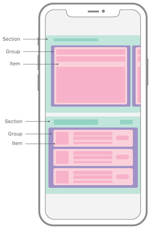

# UICollectionView

Có 2 cách để tạo layout:
- Flow layout (cách truyền thống) `UICollectionViewFlowLayout`
- Compositional layout (API mới) `UICollectionViewCompositionalLayout`

## Flow layout (hồi sau sẽ rõ)

## Compositional layout 

 

Hình ảnh trên là ví dụ điển hình cho AppStore của Apple được design dựa trên compositional layout.

Để tìm hiểu được compositional layout thì chúng ta cần phải hiểu được 4 key concepts sau đây:
- Size - NSCollectionLayoutSize 
- Item - NSCollectionLayoutItem 
- Group - NSCollectionLayoutGroup 
- Section - NSCollectionLayoutSection

### Size

Mọi thành phần trong collection view (item, group, section) đều có size, được tạo từ width và height. 
  
```swift
open class NSCollectionLayoutSize : NSObject, NSCopying {
    public convenience init(widthDimension width: NSCollectionLayoutDimension, heightDimension height: NSCollectionLayoutDimension)
    open var widthDimension: NSCollectionLayoutDimension { get }
    open var heightDimension: NSCollectionLayoutDimension { get }
}

let size = NSCollectionLayoutSize(widthDimension: .fractionalWidth(0.4), heightDimension: .fractionalHeight(1.0))
```

`NSCollectionLayoutDimension` là class dùng để xác định kích thước.

```swift
open class NSCollectionLayoutDimension : NSObject, NSCopying {
    // Xác định kích thước theo tỷ lệ phân số so với width của group mẹ.
    open class func fractionalWidth(_ fractionalWidth: CGFloat) -> Self

    // Xác định kích thước theo tỷ lệ phân số so với height của group mẹ.
    open class func fractionalHeight(_ fractionalHeight: CGFloat) -> Self
    
    // Xác định kích thước theo con số cố định. 
    open class func absolute(_ absoluteDimension: CGFloat) -> Self
    
    // Ước lượng kích thước theo con số truyền vào. Kích thước cụ thể sẽ được tự động căn chỉnh khi content được render. 
    open class func estimated(_ estimatedDimension: CGFloat) -> Self
}
```

Ví dụ:

```swift
let itemSize = NSCollectionLayoutSize(widthDimension: .fractionalWidth(0.4), heightDimension: .fractionalHeight(1.0))
let item = NSCollectionLayoutItem(layoutSize: itemSize)
```

- Đoạn code trên sẽ tạo 1 item với kích thước là `itemSize`.
- Width của item `.fractionalWidth(0.4)` tương đương 0.4 width của group chứa nó.
- Height của item `.fractionalHeight(1.0)` tương đương 1.0 height của group chứa nó 

### Item

Về cơ bản thì item giống như 1 cell, nhưng nó cũng có thể là 1 số view khác như header, footer...

```swift
open class NSCollectionLayoutItem : NSObject, NSCopying {
    public convenience init(layoutSize: NSCollectionLayoutSize)
    open var contentInsets: NSDirectionalEdgeInsets
    open var edgeSpacing: NSCollectionLayoutEdgeSpacing?
}

public struct NSDirectionalEdgeInsets {
    public init(top: CGFloat, leading: CGFloat, bottom: CGFloat, trailing: CGFloat)
}

open class NSCollectionLayoutEdgeSpacing : NSObject, NSCopying {
    public convenience init(leading: NSCollectionLayoutSpacing?, top: NSCollectionLayoutSpacing?, trailing: NSCollectionLayoutSpacing?, bottom: NSCollectionLayoutSpacing?)
}

open class NSCollectionLayoutSpacing : NSObject, NSCopying {
    open class func flexible(_ flexibleSpacing: CGFloat) -> Self // i.e. >=
    open class func fixed(_ fixedSpacing: CGFloat) -> Self // i.e. ==
}
```

- Item được khởi tạo từ NSCollectionLayoutSize
- 2 properties cần chú ý trong Item là `contentInsets` và `edgeSpacing` (đến phần Group sẽ có ví dụ giải thích)

### Group

Dùng để chứa các items con.  
Là subclass của `NSCollectionLayoutItem`.  
Container của group có thể là 1 section hoặc 1 group khác (điều đặc biệt).

```swift
open class NSCollectionLayoutGroup : NSCollectionLayoutItem, NSCopying {

    // Tạo group có `count` items có size bằng nhau được xếp theo chiều ngang. Dùng `interItemSpacing`
    // để tạo khoảng cách giữa các item theo trục chính của group (horizontal)
    // 
    //   +------+--+------+--+------+
    //   |~~~~~~|  |~~~~~~|  |~~~~~~|
    //   |~~~~~~|  |~~~~~~|  |~~~~~~|
    //   |~~~~~~|  |~~~~~~|  |~~~~~~|
    //   +------+--+------+--+------+
    //            ^        ^
    //            |        |
    //    +-----------------------+
    //    |  Inter Item Spacing   |
    //    +-----------------------+
    //
    open class func horizontal(layoutSize: NSCollectionLayoutSize, subitem: NSCollectionLayoutItem, count: Int) -> Self
    
    // Tạo group mà trong đó các item trong array [subitems] sẽ được lặp lại cho đến khi khoảng trống
    // theo chiều ngang (horizontal) bị lấp hết, các item sau sẽ tự động được đẩy xuống group mới.
    // NOTE: các khoảng trống còn lại sau khi layout items sẽ được phân bổ nêú sử dụng flexible `interItemSpacing`.   
    open class func horizontal(layoutSize: NSCollectionLayoutSize, subitems: [NSCollectionLayoutItem]) -> Self
    
    // Tương tự đối với horizontal, chỉ khác là trục chính sẽ là vertical.
    open class func vertical(layoutSize: NSCollectionLayoutSize, subitem: NSCollectionLayoutItem, count: Int) -> Self
    
    open class func vertical(layoutSize: NSCollectionLayoutSize, subitems: [NSCollectionLayoutItem]) -> Self
}
```

#### Sử dụng `NSCollectionLayoutGroup.horizontal(layoutSize:, subitems:)` để tạo group 

Ví dụ 1:

```swift
private func createLayout() -> UICollectionViewLayout {
    let itemSize = NSCollectionLayoutSize(widthDimension: .fractionalWidth(0.4), heightDimension: .fractionalHeight(1))
    let item = NSCollectionLayoutItem(layoutSize: itemSize)
    
    let groupSize = NSCollectionLayoutSize(widthDimension: .fractionalWidth(1), heightDimension: .absolute(60))
    let group = NSCollectionLayoutGroup.horizontal(layoutSize: groupSize, subitems: [item])
    group.interItemSpacing = NSCollectionLayoutSpacing.fixed(20)
    
    let section = NSCollectionLayoutSection(group: group)
    section.interGroupSpacing = 10
    
    let layout = UICollectionViewCompositionalLayout(section: section)
    return layout
}
```


Giải thích:
- Group size lúc này sẽ được so với container của nó là collection view. 
- Group được tạo bởi `NSCollectionLayoutGroup.horizontal(layoutSize:, subitems:)`.
Theo comment trong class `NSCollectionLayoutGroup` khi này mỗi item sẽ được layout cho đến khi
spacing còn lại của group không thể chứa -> có 2 items với with luôn luôn cố định là 40% width của group.
- `group.interItemSpacing = NSCollectionLayoutSpacing.fixed(20)` set khoảng cách theo chiều ngang của các item trong group bằng 20.
- `section.interGroupSpacing = 10` set khoảng cách giữa các group theo trục của section (vertical) bằng 10.

Ví dụ 2:
Kết hợp với ***fixed*** `edgeSpacing` và `interItemSpacing`

```swift
private func createLayout() -> UICollectionViewLayout {
    let itemSize = NSCollectionLayoutSize(widthDimension: .fractionalWidth(0.4), heightDimension: .fractionalHeight(1))
    let item = NSCollectionLayoutItem(layoutSize: itemSize)
    item.edgeSpacing = NSCollectionLayoutEdgeSpacing(leading: .fixed(15), top: nil, trailing: nil, bottom: nil)
    
    let groupSize = NSCollectionLayoutSize(widthDimension: .fractionalWidth(1), heightDimension: .absolute(60))
    let group = NSCollectionLayoutGroup.horizontal(layoutSize: groupSize, subitems: [item])
    group.interItemSpacing = NSCollectionLayoutSpacing.fixed(20)
    
    let section = NSCollectionLayoutSection(group: group)
    section.interGroupSpacing = 10
    
    let layout = UICollectionViewCompositionalLayout(section: section)
    return layout
}
```


Giải thích:
- Kích thước chiều ngang màn hình iphone 13 là `390pt`
- Width của mỗi item là `40% * 390 = 156` 
- `group.interItemSpacing = .fixed(20)`: 2 item cách nhau `20pt`
- `item.edgeSpacing?.leading = .fixed(15)`: item1 sẽ cách leading của group `15pt`, item2 sẽ cách item1 `20+15pt` và khoảng cách còn lại là `28pt`

Ví dụ 3: 
Kết hợp với ***flexible*** `edgeSpacing` và `interItemSpacing`

```swift
private func createLayout() -> UICollectionViewLayout {
    let itemSize = NSCollectionLayoutSize(widthDimension: .fractionalWidth(0.4), heightDimension: .fractionalHeight(1))
    let item = NSCollectionLayoutItem(layoutSize: itemSize)
    
    // Miễn sao edgeSpacing leading trong khoảng .flexible(0...29) thì đều cho ra kết quả giống nhau.
    // .flexible(29) tương dương với leading edgeSpacing của mỗi item sẽ >= 29.
    item.edgeSpacing = NSCollectionLayoutEdgeSpacing(leading: .flexible(29), top: nil, trailing: nil, bottom: nil)
    
    let groupSize = NSCollectionLayoutSize(widthDimension: .fractionalWidth(1), heightDimension: .absolute(60))
    let group = NSCollectionLayoutGroup.horizontal(layoutSize: groupSize, subitems: [item])
    group.interItemSpacing = NSCollectionLayoutSpacing.fixed(20)
    
    let section = NSCollectionLayoutSection(group: group)
    section.interGroupSpacing = 10
    
    let layout = UICollectionViewCompositionalLayout(section: section)
    return layout
}
```


Giải thích:
- Giống hệt với VD2 nhưng chỉ thay đổi 1 điểm duy nhất `item.edgeSpacing?.leading = .flexible(29)`
- Width của mỗi item vẫn là `156pt` -> spacing còn lại là `390 - 156*2 - 20 = 78pt`
- Vì leading egdeSpacing của mỗi item phải `>= 29` và bằng nhau nên nó sẽ bằng đúng `78/2 = 29pt`
- Điều này tương tự khi tư thay đổi giá trị của **flexible** từ 0...29 vì flexible sẽ luôn lấy tối đa spacing mà nó có thể lấy
nên sẽ luôn là `29pt`
- *Nhưng*, nếu giá trị **flexbile** > 29 (ví dụ 30pt) thì điều gì sẽ xảy ra? 
Câu trả lời là khi này group sẽ không có đủ spacing cho 2 items vì spacing tối thiểu là `156*2 + 20 + 30*2 = 392 > 390`
nên group sẽ tự động đẩy item thứ 2 xuống thành 1 group riêng và khi này mỗi group chỉ còn duy nhất 1 item    

Kết quả:

```swift
private func createLayout() -> UICollectionViewLayout {
    let itemSize = NSCollectionLayoutSize(widthDimension: .fractionalWidth(0.4), heightDimension: .fractionalHeight(1))
    let item = NSCollectionLayoutItem(layoutSize: itemSize)
    
    // Miễn sao edgeSpacing leading trong khoảng .flexible(0...29) thì đều cho ra kết quả giống nhau.
    // .flexible(29) tương dương với leading edgeSpacing của mỗi item sẽ >= 29.
    item.edgeSpacing = NSCollectionLayoutEdgeSpacing(leading: .flexible(30), top: nil, trailing: nil, bottom: nil)
    
    let groupSize = NSCollectionLayoutSize(widthDimension: .fractionalWidth(1), heightDimension: .absolute(60))
    let group = NSCollectionLayoutGroup.horizontal(layoutSize: groupSize, subitems: [item])
    group.interItemSpacing = NSCollectionLayoutSpacing.fixed(20)
    
    let section = NSCollectionLayoutSection(group: group)
    section.interGroupSpacing = 10
    
    let layout = UICollectionViewCompositionalLayout(section: section)
    return layout
}
```


#### Sử dụng `NSCollectionLayoutGroup.horizontal(layoutSize:, subitem:, count:)` để tạo group 

Ví dụ 4:

```swift
private func createLayout() -> UICollectionViewLayout {
    // `widthDimension` của item lúc này sẽ không có tác dụng
    let itemSize = NSCollectionLayoutSize(widthDimension: .fractionalWidth(0.4), heightDimension: .fractionalHeight(1))
    let item = NSCollectionLayoutItem(layoutSize: itemSize)
    
    let groupSize = NSCollectionLayoutSize(widthDimension: .fractionalWidth(1), heightDimension: .absolute(60))
    let group = NSCollectionLayoutGroup.horizontal(layoutSize: groupSize, subitem: item, count: 2)
    group.interItemSpacing = NSCollectionLayoutSpacing.fixed(20)
    
    let section = NSCollectionLayoutSection(group: group)
    section.interGroupSpacing = 10
    
    let layout = UICollectionViewCompositionalLayout(section: section)
    return layout
}
```


Giải thích: 
- Kích thước chiều ngang màn hình iphone 13 là `390pt`
- Width của mỗi item là `(390 - 20)/2 = 185` 
- *Mặc dù*, item width được set là `.fractionalWidth(0.4)` nhưng nó không có tác dụng, điều này tương tự với `.absolute`, `.estimated`, `.fractionalHight`

Ví dụ 5:

```swift
private func createLayout() -> UICollectionViewLayout {
    // `widthDimension` của item lúc này sẽ không có tác dụng
    let itemSize = NSCollectionLayoutSize(widthDimension: .fractionalWidth(0.4), heightDimension: .fractionalHeight(1))
    let item = NSCollectionLayoutItem(layoutSize: itemSize)
    item.edgeSpacing = NSCollectionLayoutEdgeSpacing(leading: .fixed(60), top: nil, trailing: nil, bottom: nil)
    
    let groupSize = NSCollectionLayoutSize(widthDimension: .fractionalWidth(1), heightDimension: .absolute(60))
    let group = NSCollectionLayoutGroup.horizontal(layoutSize: groupSize, subitem: item, count: 2)
    group.interItemSpacing = NSCollectionLayoutSpacing.fixed(20)
    
    let section = NSCollectionLayoutSection(group: group)
    section.interGroupSpacing = 10
    
    let layout = UICollectionViewCompositionalLayout(section: section)
    return layout
}
```


Giải thích: 
- Số lượng item trong 1 group sẽ được cố định theo `count`
- Việc tạo group bằng method `count` sẽ phân bổ spacing cho các item bằng nhau và luôn luôn cố định.
Nếu có `group.interItemSpacing` thì size của item sẽ luôn bằng `(group - interItemSpacing)/count`
- Nếu set thêm `item.edgeSpacing` thì sẽ làm cho việc hiển thị item bị lỗi, item sẽ bị cắt khỏi màn hình.
Nên việc set thêm `edgeSpacing` cho item khi sử dụng method `count` là không nên.

Ví dụ 6:

```swift
private func createLayout() -> UICollectionViewLayout {
    // Large item
    let largeItemSize = NSCollectionLayoutSize(widthDimension: .fractionalWidth(0.5), heightDimension:.fractionalHeight(1.0))
    let largeItem = NSCollectionLayoutItem(layoutSize: largeItemSize)
    largeItem.contentInsets = NSDirectionalEdgeInsets(top: 5, leading: 5, bottom: 5, trailing: 5)
    
    // Small item
    let smallItemSize = NSCollectionLayoutSize(widthDimension: .fractionalWidth(0.5), heightDimension:.fractionalHeight(1.0))
    let smallItem = NSCollectionLayoutItem(layoutSize: smallItemSize)
    smallItem.contentInsets = NSDirectionalEdgeInsets(top: 5, leading: 5, bottom: 5, trailing: 5)
    
    // Inner group
    let innerGroupSize = NSCollectionLayoutSize(widthDimension: .fractionalWidth(1.0), heightDimension:.fractionalHeight(0.5))
    let innerGroup = NSCollectionLayoutGroup.horizontal(layoutSize: innerGroupSize, subitems: [smallItem])
    
    // Outer group
    let outerGroupSize = NSCollectionLayoutSize(widthDimension: .fractionalWidth(0.5), heightDimension:.fractionalHeight(1.0))
    let outerGroup = NSCollectionLayoutGroup.vertical(layoutSize: outerGroupSize, subitems: [innerGroup])
    
    // Final group
    let finalGroupSize = NSCollectionLayoutSize(widthDimension: .fractionalWidth(1.0), heightDimension:.fractionalHeight(0.3))
    let finalGroup = NSCollectionLayoutGroup.horizontal(layoutSize: finalGroupSize, subitems: [largeItem,outerGroup])
    
    // Section
    let section = NSCollectionLayoutSection(group: finalGroup)
    
    // Layout
    let layout = UICollectionViewCompositionalLayout(section: section)
    return layout
}
```


Giải thích: 
- `Final group` chứa 2 items: 1 `large item` và 1 `outer group`
- `Outer group` chứa 2 items: 2 `inner group` 
- `Inner group` chứ 2 items: 2 `small item`

### Section

Section giống với section trong flow layout

```swift
open class NSCollectionLayoutSection : NSObject, NSCopying {
    public convenience init(group: NSCollectionLayoutGroup)
    open var contentInsets: NSDirectionalEdgeInsets
    open var interGroupSpacing: CGFloat
    open var orthogonalScrollingBehavior: UICollectionLayoutSectionOrthogonalScrollingBehavior
}
```

Điều cần chú ý ở đâu là property `orthogonalScrollingBehavior`: nó cho phép chúng ta tạo được những layout cực phức tạp. Ví dụ: AppStore có collection view cuộn dọc nhưng các section lại có thể cuộn ngang (trái ngược với collection view). Để làm được tính năng này với `FlowLayout` chúng ta cần lồng các collection view con vào trong từng section của collection view mẹ. Nhưng với `CompositionalLayout` thì chỉ cần sử dụng `orthogonalScrollingBehavior`.

Ví dụ 1:
```swift
private func listSection() -> NSCollectionLayoutSection {
    let itemSize = NSCollectionLayoutSize(widthDimension: .fractionalWidth(1.0), heightDimension: .fractionalHeight(1.0))
    let item = NSCollectionLayoutItem(layoutSize: itemSize)
    item.contentInsets = NSDirectionalEdgeInsets(top: 8, leading: 8, bottom: 8, trailing: 8)
    
    let groupSize = NSCollectionLayoutSize(widthDimension: .fractionalWidth(1.0), heightDimension: .absolute(50))
    let group = NSCollectionLayoutGroup.horizontal(layoutSize: groupSize, subitems: [item])
    return NSCollectionLayoutSection(group: group)
}
    
private func gridSection() -> NSCollectionLayoutSection {
    let itemSize = NSCollectionLayoutSize(widthDimension: .fractionalWidth(0.3), heightDimension: .fractionalHeight(1.0))
    let item = NSCollectionLayoutItem(layoutSize: itemSize)
    item.contentInsets = NSDirectionalEdgeInsets(top: 8, leading: 8, bottom: 8, trailing: 8)
    
    let groupSize = NSCollectionLayoutSize(widthDimension: .fractionalWidth(1.0), heightDimension: .fractionalHeight(0.3))
    let group = NSCollectionLayoutGroup.horizontal(layoutSize: groupSize, subitem: item, count: 3)
    
    let section = NSCollectionLayoutSection(group: group)
    section.orthogonalScrollingBehavior = .groupPaging
    return section
}
    
private func createLayout() -> UICollectionViewLayout {
    return UICollectionViewCompositionalLayout { sectionIndex, layoutEnviroment -> NSCollectionLayoutSection? in
        switch Section(rawValue: sectionIndex) {
        case .main:
            return self.listSection()
        case .second:
            return self.gridSection()
        default:
            return nil
        }
    }
}
```


Giải thích: 
- `UICollectionViewCompositionalLayout(sectionProvider: @escaping UICollectionViewCompositionalLayoutSectionProvider)` nhận 1 closure để khởi tạo.
Dùng trong trường hợp collection view có nhiều section có layout khác nhau.
- Section 1 có layout như bình thường giống với các ví dụ trên.
- Section 2 được set `section.orthogonalScrollingBehavior = .groupPaging` nên nó sẽ cuộn ngang (ngược với collection view) và mỗi group sẽ có hành vi như là 1 page.

### Layout

Khi kết hợp 4 thành phần trên chúng ta sẽ ra được compositional layout của collection view.

```swift
open class UICollectionViewCompositionalLayout : UICollectionViewLayout {
    public init(section: NSCollectionLayoutSection)
    public init(section: NSCollectionLayoutSection, configuration: UICollectionViewCompositionalLayoutConfiguration)
    public init(sectionProvider: @escaping UICollectionViewCompositionalLayoutSectionProvider)
    public init(sectionProvider: @escaping UICollectionViewCompositionalLayoutSectionProvider, configuration: UICollectionViewCompositionalLayoutConfiguration)
    @NSCopying open var configuration: UICollectionViewCompositionalLayoutConfiguration
}

open class UICollectionViewCompositionalLayoutConfiguration : NSObject, NSCopying {
    open var scrollDirection: UICollectionView.ScrollDirection 
    open var interSectionSpacing: CGFloat
    open var boundarySupplementaryItems: [NSCollectionLayoutBoundarySupplementaryItem]
    open var contentInsetsReference: UIContentInsetsReference
}

public typealias UICollectionViewCompositionalLayoutSectionProvider = (Int, NSCollectionLayoutEnvironment) -> NSCollectionLayoutSection?
``` 

Compositional Layout có thể nhận 1 `NSCollectionLayoutSection` để khởi tạo. Tuy nhiên trong trường hợp các section có layout khác nhau thì cần phải sử dụng tới `init(sectionProvider:)`.  
`SectionProvider` là một closure sẽ được gọi lần đầu tiên `n` lần ứng với `n` section. Sau đó, mỗi khi `NSCollectionLayoutEnvironment` thay đổi thì closure này sẽ được gọi lại.

### NSCollectionLayoutBoundarySupplementaryItem

Để có thể tạo được header, footer cho collection view hay section thì chúng ta sẽ dùng đến class `NSCollectionLayoutBoundarySupplementaryItem`

```swift
open class NSCollectionLayoutBoundarySupplementaryItem : NSCollectionLayoutSupplementaryItem, NSCopying {
    //
    //                                            +------------------------------------------+
    //   +----------------------+                 |Boundary Supplementary Item               |
    //   |                      |<----------------|* alignment: [.top, .leading]             |
    //   +----------------------+                 |* absoluteOffset: CGPoint(x:0.0, y:-10.0) |
    //                                            +------------------------------------------+
    //   +----------------------------------+
    //   |                                  |
    //   |                                  |
    //   |                                  |
    //   |                                  |
    //   |                                  |      +--------------------------------+
    //   |                                  |<-----|        Section Geometry        |
    //   |                                  |      +--------------------------------+
    //   |                                  |
    //   |                                  |
    //   |                                  |
    //   |                                  |
    //   +----------------------------------+
    //
    public convenience init(layoutSize: NSCollectionLayoutSize, elementKind: String, alignment: NSRectAlignment)
    public convenience init(layoutSize: NSCollectionLayoutSize, elementKind: String, alignment: NSRectAlignment, absoluteOffset: CGPoint)
}
```

Ví dụ 1:

```swift
private func createLayout() -> UICollectionViewLayout {
    // Large item
    let largeItemSize = NSCollectionLayoutSize(widthDimension: .fractionalWidth(0.5), heightDimension:.fractionalHeight(1.0))
    let largeItem = NSCollectionLayoutItem(layoutSize: largeItemSize)
    largeItem.contentInsets = NSDirectionalEdgeInsets(top: 5, leading: 5, bottom: 5, trailing: 5)
    
    // Small item
    let smallItemSize = NSCollectionLayoutSize(widthDimension: .fractionalWidth(0.5), heightDimension:.fractionalHeight(1.0))
    let smallItem = NSCollectionLayoutItem(layoutSize: smallItemSize)
    smallItem.contentInsets = NSDirectionalEdgeInsets(top: 5, leading: 5, bottom: 5, trailing: 5)
    
    // Inner group
    let innerGroupSize = NSCollectionLayoutSize(widthDimension: .fractionalWidth(1.0), heightDimension:.fractionalHeight(0.5))
    let innerGroup = NSCollectionLayoutGroup.horizontal(layoutSize: innerGroupSize, subitems: [smallItem])
    
    // Outer group
    let outerGroupSize = NSCollectionLayoutSize(widthDimension: .fractionalWidth(0.5), heightDimension:.fractionalHeight(1.0))
    let outerGroup = NSCollectionLayoutGroup.vertical(layoutSize: outerGroupSize, subitems: [innerGroup])
    
    // Final group
    let finalGroupSize = NSCollectionLayoutSize(widthDimension: .fractionalWidth(1.0), heightDimension:.fractionalHeight(0.3))
    let finalGroup = NSCollectionLayoutGroup.horizontal(layoutSize: finalGroupSize, subitems: [largeItem,outerGroup])
    
    // Section
    let section = NSCollectionLayoutSection(group: finalGroup)
    
    // Supplementary items
    let supplementaryItemSize = NSCollectionLayoutSize(widthDimension: .fractionalWidth(1.0), heightDimension: .absolute(100))
    let supplementaryItem = NSCollectionLayoutBoundarySupplementaryItem(layoutSize: supplementaryItemSize, elementKind:UICollectionView.elementKindSectionHeader, alignment: .top)
    supplementaryItem.contentInsets = NSDirectionalEdgeInsets(top: 5, leading: 5, bottom: 5, trailing: 5)
    section.boundarySupplementaryItems = [supplementaryItem]
    
    // Layout
    let layout = UICollectionViewCompositionalLayout(section: section)
    return layout
}
```


# Reference

1. [All you need to know about UICollectionViewCompositionalLayout](https://medium.com/@dn070287gav/all-what-you-need-to-know-about-uicollectionviewcompositionallayout-f3b2f590bdbe)
2. [Getting Started with UICollectionViewCompositionalLayout](https://lickability.com/blog/getting-started-with-uicollectionviewcompositionallayout/#supplementary-items)
3. [How to expand and contract height of a UITableView cell when tapped](https://fluffy.es/how-to-expand-tableview-cell/)
4. [How to make Expandable TableView using Swift](https://johncodeos.com/how-to-make-expandable-tableview-using-swift/)
