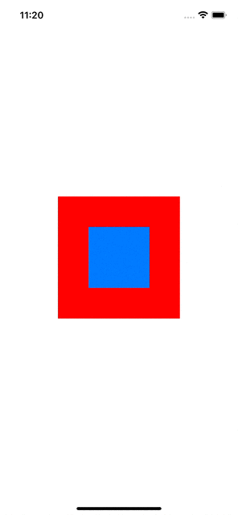
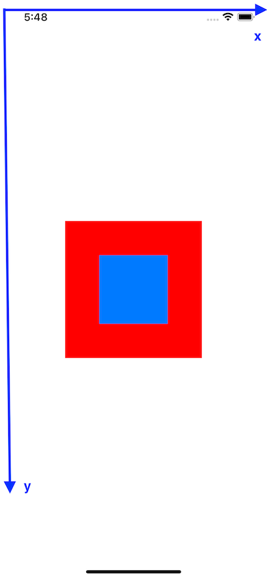

# 1. CGAffineTransform

`transform` property của view dùng để thay đổi cách nó được draw trên screen. Nó giúp thay đổi size, location, orientation của view mà không ***thực sự*** làm thay đổi `bounds` và `center`.

> Quy tắc đặt ra là: Không được phép thay đổi `frame` của 1 view mà có `transform` khác `.identity`

Là 1 ma trận 2 chiều đùng để biến đổi view: rotate (xoay), scale (tỷ lệ), translate (dịch chuyển).

```sh
Là dạng ma trận 3x3 khi ở dạng đầy đủ (3D)
[ a   b   0
  c   d   0
  tx  ty  1 ]

transform.identity có dạng:

[ 1   0   0
  0   1   0
  0   0   1 ]
```

Translation 

```sh
[ 1   0   0
  0   1   0
  tx  ty  1 ]
```

Khi thay đổi `tx`, `ty` thì view sẽ được dịch chuyển theo trục x và y tương ứng. 

Ví dụ:

```swift
// Cả 3 cách đều cho ra 1 output

view.transform = view.transform.translatedBy(x: 100, y: 200)

view.transform = CGAffineTransform(translationX: 100, y: 200)

view.transform.tx = 100
view.transform.ty = 200
```


Scale

```sh

```

Giá trị `a` hoặc `d` âm sẽ làm cho view bị flip (lật ngược lại)

```swift
pinkView.transform.d = -1
```


Hàm init .init(a:b:c:d:tx:ty) trong đó:
- a: 

- tx: 

Những method và initializer đáng chú ý: 
- `CGAffineTransform.identity`: không có apply transformation (reset view về trạng thái ban đầu).
- `CGAffineTransform(translationX:y:)`: tạo 1 ma trận dùng để dịch chuyển view theo trục `x` hoặc `y`.
- `CGAffineTransform(scaleX:y:)`: tạo 1 ma trận dùng để scale view theo trục `x` hoặc `y`.
- `CGAffineTransform(rotationAngle:)`: tạo 1 ma trận dùng để xoay view theo 1 góc xoay quanh `center`.
- `concatenating(_:)`: tạo ra 1 ma trận mới bằng cách kết hợp 2 ma trận sẵn có (chú ý thứ tự kết hợp ảnh hưởng đến kết quả, VD: t1.concatenating(t2) khác t2.concatenating(t1)).
- `translatedBy(x:y:)`: tạo 1 ma trận mới bằng cách dịch chuyển ma trận cũ.
- `scaledBy(x:y:)`: tạo 1 ma trận mới bằng cách scale ma trận cũ.
- `rotated(by:)`: tạo 1 ma trận mới bằng cách rotate ma trận cũ. 

```swift
@objc func redViewTapped() {
  let scale = CGAffineTransform(scaleX: 0.5, y: 0.5) // 1
  
  UIView.animateKeyframes(withDuration: 1, delay: 0) {
  
    UIView.addKeyframe(withRelativeStartTime: 0, relativeDuration: 0.75) {
      self.redView.transform = scale.concatenating(CGAffineTransform(rotationAngle: .pi / 4)) // 2
    }
    
    UIView.addKeyframe(withRelativeStartTime: 0.75, relativeDuration: 0.25) {
      if !self.shouldInvertAnimation {
        self.redView.transform = self.redView.transform.translatedBy(x: 300, y: 0) // 3
        self.shouldInvertAnimation.toggle()
      }
      else {
        self.redView.transform = .identity // 4
        self.shouldInvertAnimation.toggle()
      }
    }
  }
}
```



Giải thích:
1. Tạo 1 scale transformation làm cho view nhỏ đi 1 nửa cả width và height.
2. Tạo mới 1 ma trận xoay view pi/4 (45 độ) theo chiều kim đồng hồ.
3. Dịch chuyển view theo trục x 300pt.
4. Reset view về vị trí và hình dáng ban đầu.

> Note:
>
> Để có thể tạo được nhiều transformation trên cùng 1 view chúng ta bắt buộc phải dùng tới method `concatenating(_:)` hoặc `translatedBy(x:y:)`, `scaledBy(x:y:)`, `rotated(by:)` để tạo ra 1 ma trận dựa trên ma trận cũ. Nếu chúng ta gán lại property `transform` của view bằng 1 `CGAffineTransform` mới nó sẽ thay thế hoàn toàn `transform` cũ. Cùng xem ví dụ sau để thấy rõ.

```swift
@objc func redViewTapped() {
  let scale = CGAffineTransform(scaleX: 0.5, y: 0.5) 

  UIView.animate(withDuration: 1, delay: 0) {
    self.redView.transform = scale
    self.redView.transform = CGAffineTransform(translationX: 0, y: 200)
  }
}
```


### Chú ý:

```swift
override func viewDidLoad() {
    super.viewDidLoad()
    view.backgroundColor = .purple
    
    DispatchQueue.main.asyncAfter(deadline: .now() + 1) {
        let scale = CGAffineTransform(scaleX: 0.5, y: 0.5)
        let transform = self.brownView.transform
        self.brownView.transform = transform.concatenating(scale)
        self.view.layoutIfNeeded()
    }
    
    DispatchQueue.main.asyncAfter(deadline: .now() + 1.5) {
        let move = CGAffineTransform(translationX: 0, y: 500)
        let transform = self.brownView.transform
        print("DEBUG: \(transform)")
        print("DEBUG: \(transform.translatedBy(x: 0, y: 500))")
        print("DEBUG: \(transform.concatenating(move))")
        self.brownView.transform = transform.translatedBy(x: 0, y: 500)
        self.view.layoutIfNeeded()
    }
}
```

```sh
// console in ra
DEBUG: CGAffineTransform(a: 0.5, b: 0.0, c: 0.0, d: 0.5, tx: 0.0, ty: 0.0)
DEBUG: CGAffineTransform(a: 0.5, b: 0.0, c: 0.0, d: 0.5, tx: 0.0, ty: 250.0)
DEBUG: CGAffineTransform(a: 0.5, b: 0.0, c: 0.0, d: 0.5, tx: 0.0, ty: 500.0)
```

Output TH1: `self.brownView.transform = transform.translatedBy(x: 0, y: 500)`


Giải thích: 

Lúc này `transform` của `brownView` = `CGAffineTransform(a: 0.5, b: 0.0, c: 0.0, d: 0.5, tx: 0.0, ty: 250.0)`

Tức là `brownView` chỉ được dịch chuyển y 250pt = 0.5 * 500 (chưa biết giải thích sao lun).

Output TH2: `self.brownView.transform = transform.concatenating(move)`


Giải thích: 

Lúc này `transform` của `brownView` = `CGAffineTransform(a: 0.5, b: 0.0, c: 0.0, d: 0.5, tx: 0.0, ty: 500.0)`

Tức là `brownView` chỉ được dịch chuyển y 500pt. Điều này được thực hiện bằng method `concatenating`. Nó sẽ nhân các ma trận với nhau để tạo ma trận mới

-> Ma trận mới: `CGAffineTransform(a: 0.5, b: 0.0, c: 0.0, d: 0.5, tx: 0.0, ty: 0.0)` * `CGAffineTransform(a: 1.0, b: 0.0, c: 0.0, d: 1.0, tx: 0.0, ty: 500.0)` = `CGAffineTransform(a: 0.5, b: 0.0, c: 0.0, d: 0.5, tx: 0.0, ty: 500.0)`


# 2. UIPanGestureRecognizer

```swift
class ViewController: UIViewController {
  lazy var redView: UIView = {
    let view = UIView()
    view.backgroundColor = .red
    view.translatesAutoresizingMaskIntoConstraints = false
    view.addGestureRecognizer(UIPanGestureRecognizer(target: self, action: #selector(redViewDragging(_:))))
    return view
  }()
  
  lazy var blueView: UIView = {
    let view = UIView()
    view.backgroundColor = .systemBlue
    view.translatesAutoresizingMaskIntoConstraints = false
    return view
  }()
  
  override func viewDidLoad() {
    super.viewDidLoad()
    view.backgroundColor = .systemBackground
    view.addSubview(redView)
    redView.addSubview(blueView)
    
    NSLayoutConstraint.activate([
      redView.widthAnchor.constraint(equalToConstant: 200),
      redView.heightAnchor.constraint(equalToConstant: 200),
      redView.centerXAnchor.constraint(equalTo: view.centerXAnchor),
      redView.centerYAnchor.constraint(equalTo: view.centerYAnchor),
      
      blueView.widthAnchor.constraint(equalToConstant: 100),
      blueView.heightAnchor.constraint(equalToConstant: 100),
      blueView.centerXAnchor.constraint(equalTo: redView.centerXAnchor),
      blueView.centerYAnchor.constraint(equalTo: redView.centerYAnchor)
    ])
  }
  
  @objc func redViewDragging(_ gesture: UIPanGestureRecognizer) {
    // 1
    guard let gestureView = gesture.view else {
      return
    }
    
    // 2
    let translation = gesture.translation(in: gestureView.superview)
    
    // 3
    gestureView.center = CGPoint(
      x: gestureView.center.x + translation.x,
      y: gestureView.center.y + translation.y
    )
      
    // 4
    gesture.setTranslation(CGPoint.zero, in: gestureView.superview)
  }
}
```

Kết quả: 


Giải thích:
1. Truy cập vào view gắn liền với gesture.
2. `translation` là 1 CGPoint chỉ ra pan gesture đã dịch chuyển được bao xa so với toạ độ gốc (tương đối so 1 view bất kỳ, trong ví dụ là `superview`).
3. Dịch chuyển `center` của view.
4. Reset lại `translation` về (0, 0). Thử bỏ qua dòng code này và chạy thử thì bạn sẽ thấy sự khác biệt *to lớn* như thế nào.

## 2.1. Translation

Đây là 1 method *cực kỳ quan trọng* khi động đến pan gesture, cùng tìm hiểu cơ chế hoạt động của method này nhé ae.


Giống với ví dụ trên cùng, `redView` cũng sẽ di chuyển trong superview là `view`.

`Origin point`(gốc toạ độ (0, 0)) của translation là điểm đầu tiên mà user chạm vào và bắt đầu kéo view.  

`translation(in:)` sẽ return lại giá trị của 1 điểm so với `origin point`. Ví dụ như điểm "A" sẽ có giá trị x, y đều âm còn điểm "B" sẽ có x,y đều dương.

Vậy trả lời cho câu hỏi: tại sao không có reset translation về zero thì view sẽ di chuyển không như ý muốn?

Bời vì, method `redViewDragging(_:)` sẽ được pan gesture gọi lại liên tục (test thử code sẽ thấy). Giả sử chúng ta kéo view được khoảng 2pt theo trục x thì method `translation(in:)` sẽ return CGPoint(x: 2, y: 0) và khi đó `center` mới của view sẽ tăng lên 2pt , có phải vậy không?. Thực tế là ***không***, vì method được gọi lại liên tục nên `center` của view sẽ bị cộng dồn liên tục, view tăng 2pt nhưng center tăng (0.1 + 0.2 + ... + 1.9 + 2.0)pt => dẫn đến view bị kéo đi *rất rất xa* trong thực tế.

Để đồng bộ view và pan gesture, chúng ta cần gọi `gesture.setTranslation(CGPoint.zero, in: gestureView.superview)` method này sẽ reset translation về (0, 0) sau mỗi lần gọi.

> Note:
> 
> Nếu không reset translation về (0, 0) thì `origin point` sẽ luôn luôn là điểm gốc ban đầu không thay đổi cho đến khi user end pan gesture (thả tay ra). Khi này translation sẽ được tự động reset về (0, 0).

## 2.2. Velocity

```swift
    let velocity = gesture.velocity(in: gestureView.superview)
```

Là vận tốc của pan gesture nhưng lại được tính theo CGPoint, tương đương với khoảng cách / 1 giây. VD: `velocity` = 1000 tương đương với pan gesture đi được 1000pt trong vòng 1 giây.

Thường dùng để check xem user kéo nhanh hay chậm. Ví dụ: trong màn profile Instagram nếu user quẹt đủ nhanh thì sẽ dismiss luôn controller

## 2.3. Location

`location(in view: UIView?) -> CGPoint`

Là vị trí của điểm chạm tay so với gốc toạ độ của parameter `view`.

```swift
  let blueView = gesture.view!
  let location = gesture.location(in: blueView.superview)
```


```swift
  let blueView = gesture.view!
  let location = gesture.location(in: self.view)
```



Trong ví dụ 1, `location` được xét theo superview của `blueView` ( là `redView`) nên trục toạ độ sẽ được tính theo `redView`.

Trong ví dụ 2, `location` được xét theo `view` của view controller nên trục toạ độ lại là toàn bộ `view` (là cả screen).

## 2.4. Gesture state

```swift
    var state: UIGestureRecognizer.State
    
    enum State {
      case possible = 0
      case began = 1
      case changed = 2
      case ended = 3
      case cancelled = 4
      case failed = 5
    }
```

## 2.5. Ví dụ

Dùng `UIPanGestureRecognizer` để `dismiss` view controller

```swift
class ViewController: UIViewController {
  lazy var redView: UIView = {
    let view = UIView()
    view.backgroundColor = .red
    view.translatesAutoresizingMaskIntoConstraints = false
    return view
  }()
  
  lazy var blueView: UIView = {
    let view = UIView()
    view.backgroundColor = .systemBlue
    view.translatesAutoresizingMaskIntoConstraints = false
    return view
  }()
  
  var redViewYConstraints: NSLayoutConstraint!
  var viewOriginCenter = CGPoint.zero
  
  override func viewDidLoad() {
    super.viewDidLoad()
    view.backgroundColor = .systemBackground
    view.addSubview(redView)
    redView.addSubview(blueView)
    
    view.addGestureRecognizer(UIPanGestureRecognizer(target: self, action: #selector(redViewDragging(_:))))
    
    NSLayoutConstraint.activate([
      redView.widthAnchor.constraint(equalToConstant: 200),
      redView.heightAnchor.constraint(equalToConstant: 200),
      redView.centerXAnchor.constraint(equalTo: view.centerXAnchor),
      redView.centerYAnchor.constraint(equalTo: view.centerYAnchor),
      
      blueView.widthAnchor.constraint(equalToConstant: 100),
      blueView.heightAnchor.constraint(equalToConstant: 100),
      blueView.centerXAnchor.constraint(equalTo: redView.centerXAnchor),
      blueView.centerYAnchor.constraint(equalTo: redView.centerYAnchor)
    ])
  }
  
  @objc func redViewDragging(_ gesture: UIPanGestureRecognizer) {
    guard let gestureView = gesture.view else {
      return
    }
    
    let screenSize = UIScreen.main.bounds.size
    let translation = gesture.translation(in: gestureView.superview)
    let velocity = gesture.velocity(in: gestureView.superview)
    
    let xFromCenter = gestureView.center.x - self.viewOriginCenter.x
    let yFromCenter = gestureView.center.y - self.viewOriginCenter.y

    switch gesture.state {
        
      case .began:
        self.viewOriginCenter = gestureView.center
        
      
      case .changed:
        if yFromCenter > 180 {
          gestureView.center = CGPoint(
            x: gestureView.center.x + translation.x/10,
            y: gestureView.center.y + translation.y/10
          )
        }
        else {
          gestureView.center = CGPoint(
            x: gestureView.center.x + translation.x,
            y: gestureView.center.y + translation.y
          )
        }

        let scale = max(1 - abs(yFromCenter) / (2 * screenSize.height), 0.9)
        
        gestureView.transform = CGAffineTransform(scaleX: scale, y: scale)
        
        gesture.setTranslation(CGPoint.zero, in: gestureView.superview)
        
      case .ended:
        if yFromCenter > 120 || velocity.x > 1200 || velocity.y > 1200 {
          self.dismiss(animated: true)
        }
        else {
          UIView.animate(withDuration: 0.5, delay: 0) {
            gestureView.center = self.viewOriginCenter
            gestureView.transform = CGAffineTransform.identity
          }
        }
        
      default:
        break
    }
    
  }
}
```

# Reference

1. [Dragging views around in Swift](https://holyswift.app/dragging-views-around-in-swift/)
2. [Pan gesture: why need setTranslation to zero?](https://stackoverflow.com/questions/29558622/pan-gesture-why-need-settranslation-to-zero)
3. [Handling pan gestures](https://developer.apple.com/documentation/uikit/touches_presses_and_gestures/handling_uikit_gestures/handling_pan_gestures)
4. [How to use UIPanGestureRecognizer to move object?](https://stackoverflow.com/questions/6672677/how-to-use-uipangesturerecognizer-to-move-object-iphone-ipad)
