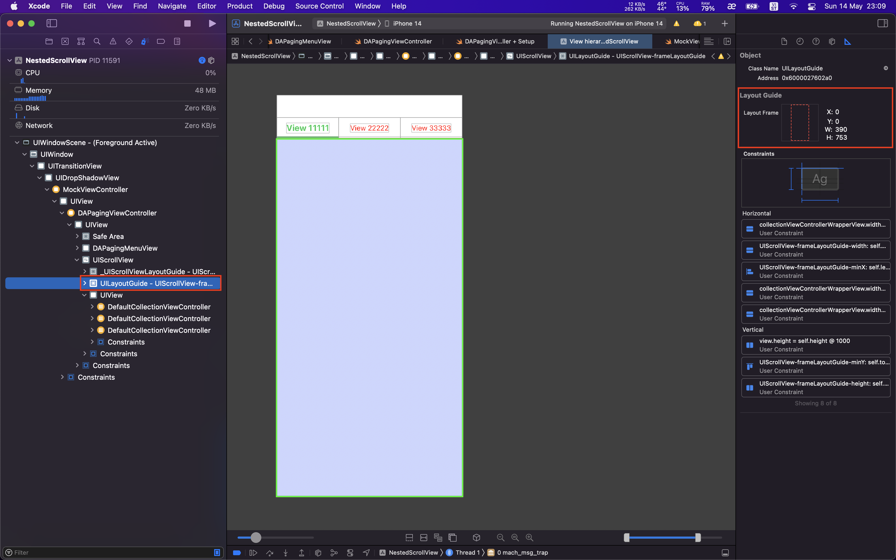
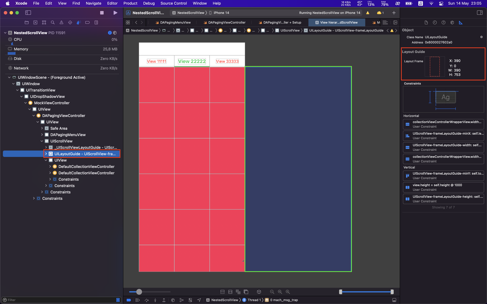
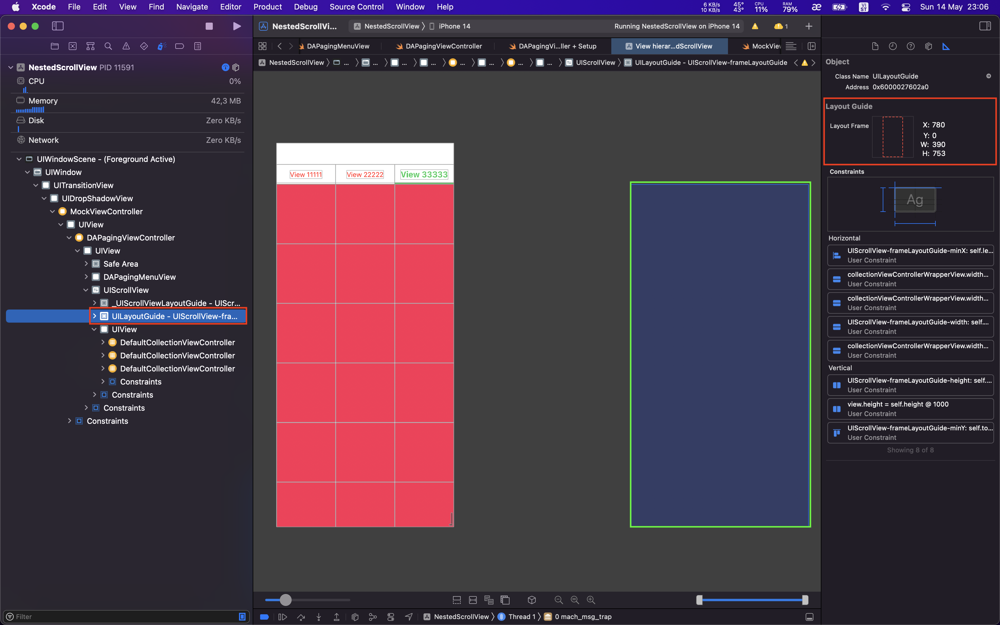
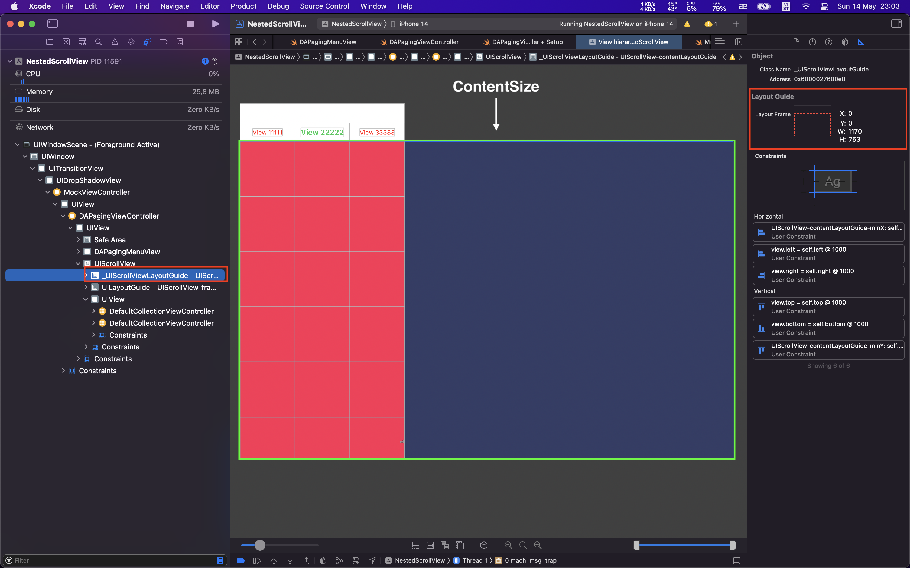

# UIScrollView

## 1. Lý thuyết

2 điều quan trọng nhất để lyaout 1 `scrollview` là: `frame` và `scrollable content`.
- `frame` dùng để xác định vị trí của `scrollview` so với superview.
- `scrollable content` dùng để xác định 1 vùng giới hạn mà scrollview cho phép user có thể scroll để đọc content.

Nếu như thiếu 1 trong 2 thì khi layout scroll view chắc chắn sẽ xảy ra lỗi. 

> Note:
>
> Lỗi hay gặp là scrollable content width and scrollable content height are ambigious.

## 2. Tạo scrollview với storyboard

Từ IOS 11, Apple đã thêm 2 properties mới giúp việc thiết lập scroll view dễ dàng hơn: 

`frameLayoutGuide`:

- Chỉ ra position (x, y) và size (width, height) của scroll view so với superview của nó. 
- Có thể hiểu đây chính là frame của phần visible content của scroll view.
- 

`contentLayoutGuide`: chỉ ra size (width, height) của scrollable content của scroll view. Hay còn được biết đến là `contentSize`.

## 3. Tạo scrollview với code

# Reference

1. [How to use scroll view in Interface Builder / Storyboard](https://fluffy.es/scrollview-storyboard-xcode-11/)
2. [Easier Scrolling With Layout Guides](https://useyourloaf.com/blog/easier-scrolling-with-layout-guides/)
